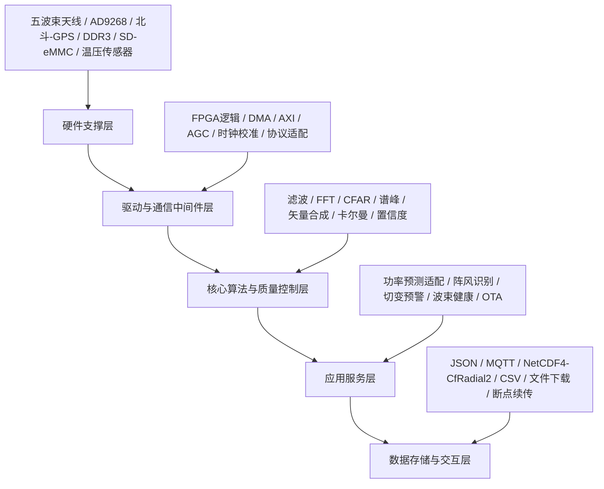
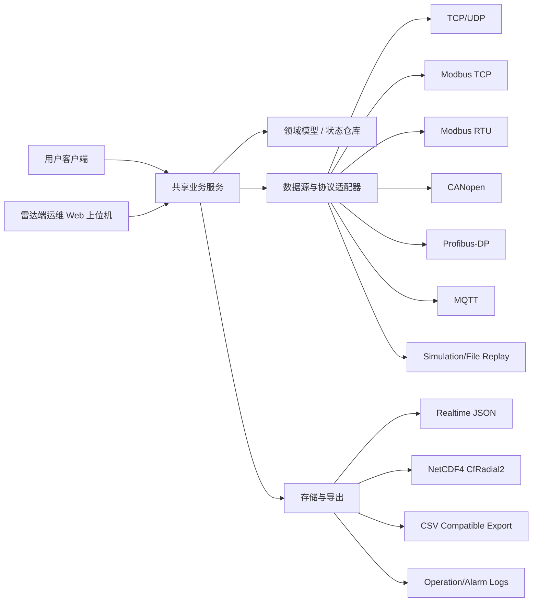
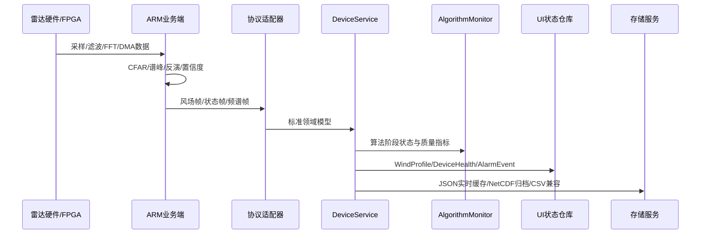
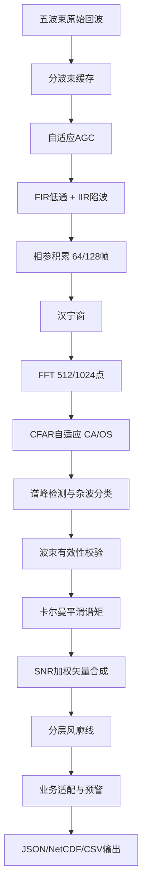

# 测风雷达双端上位机重新设计方案

## 1. 设计定位

本设计以《测风雷达软件开发架构优化与算法流程整合方案-修订.docx》为主要需求来源，以《20220530 机舱雷达5.1手册V1.0.0(3).pdf》中的 Molas NL 客户端、数据产品、故障维护、通信协议为参考，重新设计整个测风雷达上位机。

上位机不再只是“连接设备并显示几条曲线”的调试工具，而是拆分为两套协同系统：

1. **用户客户端**：面向风场用户、值班人员和业务人员，主要负责看数据、看趋势、看报表、下发常规操作。
2. **雷达端运维 Web 上位机**：部署在雷达内部工业主板上，通过浏览器访问，面向运维人员和工程师，主要负责调试、配置、诊断、维护和升级。

两端共享同一套领域模型、协议适配和数据定义，但入口、权限和使用场景不同。它们共同覆盖五波束测风雷达的新架构要求，以及旧手册中成熟的客户端使用习惯、数据字段和故障排查逻辑。

### 1.1 设计目标

1. 支持五波束协同探测，覆盖 0°/72°/144°/216°/288° 五个方位波束。
2. 支持 30m-1000m 测量范围，10m/20m 距离分辨率，15/30 层及扩展到 5-50 层风场输出。
3. 支持脉宽 0.15us、重频 20kHz、带宽 10MHz、512/1024 点积累、16bit ADC、约 150MHz 采样率等参数展示与配置。
4. 支持 FPGA/ARM 异构处理链路的状态监控：采样、AGC、滤波、FFT、DMA、CFAR、参数反演、业务适配。
5. 支持风速、风向、湍流强度、风切变、风速梯度、谱峰、CNR、置信度、波束健康度等数据产品。
6. 支持 JSON 实时数据、NetCDF4/CfRadial2 v2.1 归档、CSV 导出，保留旧客户端 CSV 和通信字段兼容能力。
7. 支持以太网、MQTT、Modbus TCP、Modbus RTU、CANopen、Profibus-DP、LoRa 补盲的统一接入抽象。
8. 支持现场安装调试、参数配置、网络配置、FTP/文件下载、日志、告警、OTA、维护计划与故障诊断。
9. 支持连续 7 天稳定运行、无数据丢失、盲区率 <= 0.5%、单模块故障性能保留 80%、故障切换延迟 <= 200ms。
10. 支持跨平台部署，客户端优先 Windows 10/11 和 Ubuntu 22.04；雷达端优先工业 Linux 或嵌入式 Linux，技术路线为 C++17 + Qt6 + Web 服务。

### 1.2 设计原则

1. 业务模型先行：所有界面、通信和存储都围绕统一的雷达领域模型，而不是直接操作裸字节或 UI 表格。
2. 实时链路与文件链路分离：实时数据用于监控和告警，归档数据用于追溯、分析和交付。
3. 设备协议可插拔：不同通信协议由独立适配器负责，进入上位机后统一转换为标准数据模型。
4. 可观测性内建：每个数据帧、每个处理阶段、每个波束、每个模块都应有状态、质量和时间戳。
5. 安全配置分级：普通操作员只能查看和常规配置，工程师才能修改控制指令、校准、OTA 和底层协议参数。
6. 现场优先：界面要适合风场现场调试，关键信息大、明确、可快速判断，不依赖深层菜单。
7. 兼容旧系统：保留旧手册中的连接、雷达信息、风速信息、雷达数据、功率谱、文件管理、设置等使用路径，但重新组织为更完整的信息架构。
8. 双端解耦：客户端与雷达端共享业务模型，但 UI、部署和权限分离，避免把维护能力暴露给普通用户。

## 2. 当前仓库问题与重构方向

当前仓库是一个轻量 Qt 上位机雏形，主要文件包括：

1. `src/main.cpp`：同时承担主窗口、界面布局、语言切换、数据解析、业务计算和状态更新。
2. `src/communication/protocolparser.*`：自定义 AA55/55AA 帧协议构建与解析。
3. `src/communication/networkmanager.*`：TCP/UDP 连接、心跳、统计和数据记录。
4. `simulation/`：仿真 TCP 服务与数据库接入示例。

主要问题：

1. UI、通信、协议解析、业务模型耦合，后续扩展会迅速失控。
2. 风场数据结构过于简化，只能表达少量层数和基本风速风向，无法覆盖五波束、多层、CNR、谱峰、状态位、置信度、NetCDF 等要求。
3. 只抽象了 TCP/UDP，未覆盖 Modbus、CANopen、Profibus、MQTT、文件回放、仿真源等实际接入。
4. CRC 校验目前被禁用，不适合真实设备。
5. 中文字符串出现编码损坏，说明源文件编码、构建环境和字体策略需要统一。
6. 缺少清晰的界面模块、权限模型、日志模型、告警模型和数据导出模型。

重构方向：

1. 保留 Qt6/C++17 技术路线。
2. 将 `main.cpp` 拆分为应用壳、页面、组件、服务、数据模型、协议适配器。
3. 新增统一领域模型 `RadarDevice`、`BeamState`、`RangeGate`、`WindProfile`、`SpectrumFrame`、`DeviceHealth`、`AlarmEvent`、`DataProduct`。
4. 通过 `IDataSource` 抽象接入真实雷达、仿真服务器、文件回放和历史归档。
5. 通过 `IProtocolAdapter` 抽象 AA55 自定义协议、Modbus TCP、Modbus RTU、CANopen、Profibus-DP、MQTT。
6. 将旧客户端页面升级为九个主工作区：总览、风场、波束、频谱、算法链路、设备健康、参数配置、数据中心、维护诊断。

## 3. 总体架构

### 3.1 五层业务架构



上位机覆盖 B-E 层的可视化、配置、诊断和数据管理，同时读取 A 层硬件状态。

### 3.2 双端软件架构



### 3.3 推荐目录结构

```text
src/
  app/
    Application.cpp
    AppContext.h
    SettingsRegistry.h
  domain/
    RadarTypes.h
    RadarDevice.h
    WindProfile.h
    BeamState.h
    SpectrumFrame.h
    DeviceHealth.h
    AlarmEvent.h
    DataProduct.h
  services/
    DeviceService.h/.cpp
    AcquisitionService.h/.cpp
    AlgorithmMonitorService.h/.cpp
    AlarmService.h/.cpp
    ExportService.h/.cpp
    MaintenanceService.h/.cpp
    OtaService.h/.cpp
    TimeSyncService.h/.cpp
  communication/
    IDataSource.h
    IProtocolAdapter.h
    TcpDataSource.h/.cpp
    UdpDataSource.h/.cpp
    SerialDataSource.h/.cpp
    MqttDataSource.h/.cpp
    FrameProtocolAdapter.h/.cpp
    ModbusTcpAdapter.h/.cpp
    ModbusRtuAdapter.h/.cpp
    CanOpenAdapter.h/.cpp
    ProfibusAdapter.h/.cpp
  storage/
    RealtimeJsonWriter.h/.cpp
    NetCdfWriter.h/.cpp
    CsvExporter.h/.cpp
    LogRepository.h/.cpp
    FileReplaySource.h/.cpp
  python/
    pyart-service/
      app/
      adapters/
      algorithms/
      schemas/
      main.py
  client/
    desktop/
      MainWindow.h/.cpp
      pages/
      widgets/
  radar-web/
    server/
      RadarHttpServer.h/.cpp
      RadarSessionManager.h/.cpp
      AuthService.h/.cpp
      WebApiController.h/.cpp
      WebSocketHub.h/.cpp
    frontend/
      web-app/
        src/
          pages/
          components/
          stores/
  ui/
    MainWindow.h/.cpp
    navigation/
    pages/
      DashboardPage.h/.cpp
      WindFieldPage.h/.cpp
      BeamPage.h/.cpp
      SpectrumPage.h/.cpp
      AlgorithmPage.h/.cpp
      DeviceHealthPage.h/.cpp
      SettingsPage.h/.cpp
      DataCenterPage.h/.cpp
      MaintenancePage.h/.cpp
    widgets/
      StatusBadge.h/.cpp
      MetricCard.h/.cpp
      TrendChart.h/.cpp
      WindRoseWidget.h/.cpp
      RangeGateTable.h/.cpp
      AlarmList.h/.cpp
      BeamHealthGrid.h/.cpp
      SpectrumPlot.h/.cpp
```

### 3.4 技术栈定版

这是本方案最终采用的技术路线，不再留多个平行选项：

1. **客户端**
   - 语言：C++17
   - 框架：Qt6 Widgets
   - 图表：Qt Charts 或自定义绘图控件
   - 通信：Qt Network
   - 作用：面向普通用户和业务人员的桌面客户端

2. **雷达端运维 Web 上位机**
   - 后端语言：C++17
   - 后端框架：Qt6 + HTTP/WebSocket 服务层
   - 前端语言：TypeScript
   - 前端框架：Vue 3
   - 图表：ECharts
   - 作用：部署在工业主板上，通过浏览器访问，给运维人员和工程师使用

3. **共享核心库**
   - 语言：C++17
   - 内容：领域模型、协议解析、数据校验、告警码、导出格式、仿真回放

4. **Python 算法服务**
   - 语言：Python 3.11
   - 算法库：Py-ART、NumPy、SciPy、xarray
   - 作用：承接离线算法验证、归档后处理、谱矩衍生量计算、质量评估和部分高级雷达产品生成
   - 集成方式：作为独立算法服务运行，通过本机 HTTP/gRPC 或标准输入输出协议与 C++ 主系统通信
   - 边界：不进入实时硬链路，不替代 FPGA/ARM 在线主算法，不直接持有 UI 对象

5. **通信方式**
   - 页面配置和查询：HTTP/REST
   - 实时数据和告警推送：WebSocket
   - 设备接入：TCP、UDP、Modbus TCP、Modbus RTU、CANopen、Profibus-DP、MQTT

6. **部署形态**
   - 客户端独立安装在业务电脑上
   - 雷达端服务部署在工业主板上
   - 浏览器输入雷达 IP + 账号密码即可进入运维控制台
   - Py-ART 服务优先部署在雷达端工业主板或离线分析工作站，按场景启用

7. **为什么这样定**
   - 现有仓库已经是 C++/Qt 起步，直接保留最省风险
   - 雷达端需要 Web 访问，前端单独用 Vue 3 最适合浏览器体验
   - 共享核心库能避免客户端和雷达端重复写协议和数据模型
   - Py-ART 适合承接成熟雷达算法能力，尤其适合离线处理、产品生成和算法验证
   - 这种拆法最容易先做通主链路，再逐步扩展功能

## 4. 核心领域模型

### 4.1 雷达设备模型 `RadarDevice`

字段：

1. `deviceId`：雷达编号。
2. `model`：设备型号。
3. `firmwareVersion`：固件版本。
4. `hardwareVersion`：硬件版本。
5. `ipAddress`、`netmask`、`gateway`、`macAddress`。
6. `timeSource`：NTP、北斗、GPS、本机、手动。
7. `workMode`：待机、初始化、运行、测量、调试、故障、维护。
8. `uptimeMs`：运行时长。
9. `activeProfile`：当前参数方案。
10. `connectionState`：离线、连接中、在线、数据超时、协议错误。

### 4.2 波束模型 `BeamState`

五波束固定定义：

| 波束 | 方位角 | 角色 | 关键监控 |
| --- | ---: | --- | --- |
| LOS1 | 0° | 前向基准波束 | CNR、RWS、谱峰、相位 |
| LOS2 | 72° | 侧向波束 | CNR、RWS、谱峰、相位 |
| LOS3 | 144° | 侧后向波束 | CNR、RWS、谱峰、相位 |
| LOS4 | 216° | 侧后向波束 | CNR、RWS、谱峰、相位 |
| LOS5 | 288° | 侧向波束 | CNR、RWS、谱峰、相位 |

字段：

1. `beamId`：LOS1-LOS5。
2. `azimuthDeg`：方位角。
3. `enabled`：是否启用。
4. `status`：正常、弱信号、遮挡、相位异常、通信异常、插值补偿、禁用。
5. `cnrDbByGate[]`：各距离门 CNR。
6. `rwsByGate[]`：各距离门视向风速。
7. `spectrumPeakByGate[]`：谱峰位置与强度。
8. `phaseErrorDeg`：相位偏差。
9. `confidenceByGate[]`：各层置信度。
10. `lastUpdateTime`。

### 4.3 距离层模型 `RangeGate`

字段：

1. `gateIndex`：层号。
2. `distanceM`：水平测量距离。
3. `heightM`：对应高度。
4. `windSpeedMps`。
5. `windDirectionDeg`。
6. `radialWindSpeedMps[5]`。
7. `cnrDb[5]`。
8. `turbulenceIntensity`。
9. `verticalShear`。
10. `horizontalShear`。
11. `veerDegPerM`。
12. `windGradient`。
13. `confidence`：0-100。
14. `statusFlags`：有效、无效、插值、低 CNR、遮挡、超限。

### 4.4 风廓线模型 `WindProfile`

字段：

1. `timestampUtc`。
2. `timeQuality`：同步、插值、本机时间、时间异常。
3. `rangeResolutionM`：10 或 20。
4. `gateCount`：15、30 或扩展。
5. `hubHeightM`。
6. `lidarHeightM`。
7. `rollDeg`、`tiltDeg`。
8. `hubWindSpeedMps`。
9. `hubWindDirectionDeg`。
10. `rawsMps`：轴线投影风速。
11. `rangeGates[]`。
12. `beamStates[5]`。
13. `qualitySummary`：整体质量、低 CNR 比例、盲区率、有效层数。
14. `warnings[]`：阵风、切变、遮挡、波束失效、时钟异常。

### 4.5 设备健康模型 `DeviceHealth`

保留旧手册中 PU 8 个指示灯与故障位，并扩展到新五层架构。

1. 通信：上位机连接、OH-PU、FPGA-ARM、现场总线、MQTT、LoRa。
2. 光学/射频：激光器/发射链路、接收链路、波束遮挡、CNR 长期异常。
3. 电源：OH 电压、电流，PU 电压、电流，DU 电源参数。
4. 温控：CPU、FPGA、环控 TEC、加热片、风扇、散热。
5. 姿态：Roll、Tilt、相位一致性、姿态超限。
6. 存储：SD/eMMC 容量、写入错误率、归档状态。
7. 时间：NTP、北斗/GPS、IEEE1588，同步误差。
8. 安全：防雷、OTA 签名、权限、审计。

### 4.6 告警模型 `AlarmEvent`

字段：

1. `alarmId`。
2. `severity`：提示、一般、重要、严重。
3. `source`：设备、波束、算法、通信、存储、配置、环境。
4. `code`：兼容旧手册 iLidarFault Bit0-Bit15。
5. `title`。
6. `description`。
7. `recommendedAction`。
8. `firstSeen`、`lastSeen`。
9. `acknowledgedBy`、`acknowledgedAt`。
10. `resolvedAt`。
11. `relatedDataFrameId`。

## 5. 数据流设计

### 5.1 实时采集链路



### 5.2 上位机内部事件总线

建议使用 Qt signal/slot + 明确的应用状态仓库，不直接让页面订阅网络字节流。

核心事件：

1. `ConnectionStateChanged`
2. `FrameReceived`
3. `WindProfileUpdated`
4. `SpectrumFrameUpdated`
5. `DeviceHealthUpdated`
6. `AlgorithmStageUpdated`
7. `AlarmRaised`
8. `AlarmResolved`
9. `ConfigRead`
10. `ConfigWriteResult`
11. `ExportProgressChanged`
12. `OtaProgressChanged`

### 5.3 质量控制链路

每一帧风场数据进入 UI 前必须经过质量控制：

1. 时间戳检查：与本机/NTP/北斗时间差。
2. 层数检查：是否符合当前配置。
3. 距离检查：30-1000m，分辨率 10m/20m。
4. 物理范围检查：风速 0.2-50m/s，风向 360°，视向风速兼容负值。
5. 波束有效性：有效波束数 >= 3 时允许插值补全。
6. CNR 阈值：低 CNR 层标注为低置信度，不直接隐藏。
7. 突变检查：10s 内风速突变 > 3m/s 标记阵风。
8. 切变检查：风切变指数 > 0.2 标记预警。
9. 姿态检查：Roll/Tilt 超限或相位差 > 5° 标记设备或安装风险。
10. 输出置信度：高、中、低三级和 0-100 数值并存。

## 6. 通信与协议设计

### 6.1 统一接入接口 `IDataSource`

```cpp
class IDataSource : public QObject {
public:
    virtual void connectSource(const ConnectionConfig& config) = 0;
    virtual void disconnectSource() = 0;
    virtual bool sendBytes(const QByteArray& bytes) = 0;
    virtual ConnectionState state() const = 0;

signals:
    void bytesReceived(QByteArray bytes);
    void stateChanged(ConnectionState state);
    void errorOccurred(SourceError error);
};
```

实现：

1. `TcpDataSource`：调试服务器、自定义硬件 TCP、Modbus TCP。
2. `UdpDataSource`：广播发现、低延迟遥测。
3. `SerialDataSource`：Modbus RTU、RS485 调试。
4. `CanOpenDataSource`：CANopen 总线。
5. `ProfibusDataSource`：通过 DP 网关或驱动接口接入。
6. `MqttDataSource`：远程监控平台。
7. `FileReplaySource`：历史文件回放和测试。

### 6.2 统一协议接口 `IProtocolAdapter`

```cpp
class IProtocolAdapter {
public:
    virtual QList<DomainEvent> parse(const QByteArray& bytes) = 0;
    virtual QByteArray buildCommand(const DeviceCommand& command) = 0;
    virtual ProtocolHealth health() const = 0;
};
```

适配器：

1. `FrameProtocolAdapter`：当前 AA55/55AA 自定义帧。
2. `ModbusTcpAdapter`：参考手册附件 G。
3. `ModbusRtuAdapter`：参考手册附件 E。
4. `CanOpenAdapter`：参考手册附件 F。
5. `ProfibusAdapter`：参考手册附件 D。
6. `JsonMqttAdapter`：实时 JSON / MQTT。

### 6.3 自定义帧协议改造

保留当前帧结构：

```text
Header(0xAA55) + Length + Command + Sequence + Payload + CRC16 + Tail(0x55AA)
```

必须改造：

1. 恢复 CRC 校验，并在 UI 中显示 CRC 错误率。
2. 接收缓冲区必须支持半包、粘包、坏帧跳过、最大帧长限制。
3. Length 定义必须统一，禁止客户端和服务端使用不同解释。
4. 所有多字节数值明确字节序，建议统一 big-endian。
5. Payload 必须版本化，例如 `payloadVersion`。
6. 风场数据帧拆分为 `WindProfileFrame`、`BeamFrame`、`SpectrumFrame`、`HealthFrame`、`AlgorithmFrame`。

### 6.4 兼容旧手册通信字段

上位机需支持旧数据点映射：

1. `LidarID`
2. `iIndex`
3. `iTimestamp`
4. `iTilt`
5. `iRoll`
6. `iD[10]`
7. `iRWS[10]`
8. `iVeer[10]`
9. `iRAWS[10]`
10. `iT[10]`
11. `iHWShub[10]`
12. `iDirectionHub[10]`
13. `iVshear[10]`
14. `iHshear[10]`
15. `iCNR[10]`
16. `iRWSstatus`
17. `iRAWSstatus`
18. `iTIstatus`
19. `iHWShubstatus`
20. `iDirHubstatus`
21. `iLOS`
22. `iLidarFault`

新系统内部统一扩展为 5 波束和 15/30/50 层，旧 10 截面数据作为兼容 profile。

## 7. 算法链路设计

### 7.1 算法处理阶段



### 7.2 上位机展示的算法指标

1. 采样阶段：ADC 通道、主备切换、采样率、缓存占用。
2. 时钟阶段：北斗/GPS/NTP 状态、同步偏差、动态校准次数。
3. AGC 阶段：当前增益、步长、弱信号提升、增益突变告警。
4. 预处理阶段：滤波标记、噪声抑制、相参积累帧数。
5. FFT 阶段：FFT 点数、频率分辨率、处理耗时。
6. CFAR 阶段：CA/OS 模式、虚警率、杂波类型。
7. 谱峰阶段：峰值频率、峰值强度、峰宽、可信度。
8. 反演阶段：风速、风向、湍流、切变、插值补偿。
9. 业务阶段：阵风识别、切变预警、功率预测适配、偏航建议。
10. 性能阶段：FPGA <= 10us/帧、DMA <= 0.5us、ARM <= 5ms/帧、业务适配 <= 1min。

### 7.3 上位机不重复 FPGA/ARM 的职责

上位机负责展示、配置、回放、诊断和轻量验证，不应把实时核心信号处理从设备端搬到 PC 端。PC 端可以做：

1. 文件回放算法验证。
2. 参数敏感性分析。
3. 谱图和风场可视化。
4. 离线质量评估。
5. 与测风塔数据对比。
6. 生成测试报告。

### 7.4 Py-ART 集成策略

部分雷达数据处理模块采用 `Py-ART` 的成熟算法能力集成到上位机体系中，但集成方式必须遵守“实时链路不受影响、算法服务独立运行、输入输出标准化”三条原则。

1. `Py-ART` 主要承担这些工作：
   - 归档数据读取与标准化。
   - 反射率、径向速度、谱宽等雷达产品的离线处理与校验。
   - 去杂波、质量控制、掩膜生成、插值和网格化。
   - 多时次产品拼接、统计分析和研究型算法验证。
   - NetCDF/CfRadial 数据再加工与产品导出。
2. `Py-ART` 不承担这些工作：
   - 设备端每帧实时主处理。
   - FPGA/ARM 在线信号链替代。
   - UI 线程直接调用的长耗时计算。
   - 未经封装直接读写 Qt 领域对象。
3. 推荐调用路径：
   - C++ 主系统把标准化后的归档帧、回放帧或任务参数写入任务请求。
   - Python `pyart-service` 执行算法。
   - 结果以 JSON 元数据 + NetCDF/NPZ/CSV 文件路径形式返回。
   - C++ 侧再把结果映射回 `WindProfile`、`SpectrumFrame`、`DataProduct` 等统一模型。
4. 推荐场景：
   - 算法链路页的离线复算。
   - 数据中心的批处理导出。
   - 维护诊断页的质量复核。
   - 报表页的高级统计产品生成。
5. 不推荐场景：
   - 10ms 级实时闭环控制。
   - 直接参与设备心跳、告警、协议收发。
   - 依赖 Python 环境才能完成基础风场显示。

### 7.5 Py-ART 服务接口约束

为避免 C++ 和 Python 两边各说各话，Py-ART 服务必须统一任务协议。

1. 输入任务最少包含：
   - `taskId`
   - `taskType`
   - `inputFormat`
   - `inputPath` 或 `inputFrames`
   - `algorithmProfile`
   - `outputDir`
2. 输出结果最少包含：
   - `taskId`
   - `success`
   - `summary`
   - `products`
   - `warnings`
   - `errorCode`
   - `elapsedMs`
3. `taskType` 建议至少包括：
   - `offline-qc`
   - `spectrum-recheck`
   - `wind-product-regenerate`
   - `grid-and-export`
   - `research-validation`
4. `algorithmProfile` 建议做成模板化配置：
   - `default`
   - `field-debug`
   - `high-noise`
   - `archive-export`
   - `research`

### 7.6 C++ 与 Python 的职责边界

1. C++ 负责设备接入、实时展示、任务调度、权限控制、日志审计和结果落库。
2. Python 负责算法执行、科学计算和文件级产品生成。
3. 共享核心库负责统一输入输出模型，避免 Python 结果直接穿透到页面。
4. 如果 Python 服务不可用，上位机基础功能必须仍可运行，只是高级离线算法能力降级。

## 8. 界面总体设计

### 8.1 导航结构

客户端主窗口采用左侧纵向导航 + 顶部全局状态栏 + 中央工作区 + 右侧可折叠告警抽屉。

雷达端 Web 页面采用顶部登录态栏 + 左侧功能导航 + 中央工作区 + 右侧告警/日志抽屉。浏览器打开雷达 IP 后先进入登录页，登录后进入运维控制台。

主导航：

1. 总览
2. 风场
3. 波束
4. 频谱
5. 算法链路
6. 设备健康
7. 参数配置
8. 数据中心
9. 维护诊断
10. 系统设置

顶部状态栏：

1. 雷达编号/型号。
2. 当前连接状态。
3. 当前工作模式。
4. 当前时间源与同步误差。
5. 实时帧率。
6. 数据质量。
7. 严重告警数。
8. 用户角色。

### 8.2 视觉风格

1. 风格：工业监控台，清晰、克制、高密度但不拥挤。
2. 主色：深青色用于主操作和正常状态。
3. 告警色：红色严重、橙色重要、黄色提示、蓝色信息、绿色正常。
4. 背景：浅灰工作区，白色模块面板。
5. 字体：中文使用 Microsoft YaHei UI / Noto Sans CJK，英文 Segoe UI。
6. 图表：曲线、频谱、风玫瑰、热力图、状态矩阵使用一致的颜色语义。
7. 布局：所有关键数值卡片固定高度，避免数据刷新导致跳动。
8. 夜间模式：现场调试可切换暗色主题。
9. 客户端更偏“业务清爽”，雷达端更偏“运维密度”，两者共用同一套视觉语义但不完全同款页面。

## 9. 各界面逻辑设计

### 9.1 总览页

目标：让用户 10 秒内判断“雷达是否在线、数据是否可信、是否有风险”。

布局：

1. 第一行关键指标卡：
   - 轮毂高度风速
   - 轮毂高度风向
   - 整体置信度
   - 有效层数
   - 当前盲区率
   - 严重告警数
2. 第二行：
   - 左侧：实时风速趋势，支持 1min/10min/1h。
   - 中间：风向罗盘/风玫瑰。
   - 右侧：五波束健康矩阵。
3. 第三行：
   - 分层风场表。
   - 当前告警列表。
   - 数据链路状态。

交互逻辑：

1. 未连接时显示连接向导：选择数据源、IP/端口、协议、连接按钮。
2. 连接中显示设备发现、握手、版本读取、参数同步四步进度。
3. 在线后自动订阅风场、状态、频谱摘要。
4. 点击波束健康矩阵中的 LOS 可跳转到波束页并过滤对应波束。
5. 点击告警可打开维护诊断页并定位故障树。
6. 严重告警出现时顶部状态栏变红，但不遮挡数据。

### 9.2 风场页

目标：查看 30-1000m 分层风廓线、切变、湍流和空间分布。

视图：

1. 分层风廓线图：距离/高度为纵轴，风速为横轴。
2. 风向廓线图：距离/高度为纵轴，风向角为横轴。
3. 湍流强度图。
4. 垂直/水平风切变图。
5. 置信度热力图。
6. 分层数据表。

筛选：

1. 距离范围：30-1000m。
2. 分辨率：10m/20m。
3. 时间窗口：实时、1min、10min、自定义。
4. 数据类型：实时、平均、回放。
5. 质量过滤：全部、高置信度、中高置信度、仅有效层。

表格字段：

1. 层号
2. 距离
3. 高度
4. 风速
5. 风向
6. 湍流强度
7. 垂直风切变
8. 水平风切变
9. 风向变化率
10. CNR 均值
11. 有效波束数
12. 置信度
13. 状态

交互逻辑：

1. 鼠标悬停任意层，所有图表同步高亮。
2. 双击层打开“层详情”：五波束 RWS、CNR、谱峰、状态位。
3. 低置信度层不隐藏，使用斜纹或淡色标注。
4. 切变指数 > 0.2 自动生成预警标记。
5. 支持导出当前视图为 CSV/PNG/PDF 报告。

### 9.3 波束页

目标：诊断五波束是否一致、是否遮挡、是否弱信号、是否相位异常。

布局：

1. 顶部五波束状态卡：LOS1-LOS5。
2. 中部 CNR 随距离曲线，可多波束叠加。
3. 中部视向风速 RWS 随距离曲线。
4. 右侧相位差、有效层数、谱峰稳定性、插值补偿比例。
5. 底部波束事件时间线。

交互逻辑：

1. 可启用/禁用单个波束显示，但禁用显示不等于向设备下发禁用。
2. 工程师模式允许发送波束切换、波束校准、相位校准命令。
3. 若有效波束 < 3，风场页整体质量降级并显示原因。
4. 若某波束 CNR 长期低于阈值，提示检查遮挡、窗口镜、天气或光路。
5. 支持对比五波束在同一距离层的谱峰。

### 9.4 频谱页

目标：替代旧客户端“功率谱”页面，提供更强的谱峰和杂波诊断。

布局：

1. 五波束功率谱小 multiples。
2. 选中波束的大频谱图。
3. 距离层选择器。
4. 谱峰标注：主峰、次峰、噪声底、CFAR 阈值。
5. 杂波类型标注：均匀杂波、非均匀杂波、遮挡、弱回波。
6. 频谱瀑布图：时间 x 频率，颜色为功率。

交互逻辑：

1. 支持锁定某个距离层查看连续频谱。
2. 支持切换线性/dB 坐标。
3. 支持显示 FFT 点数、频率分辨率、窗函数、积累帧数。
4. 当谱峰不稳定时，联动算法链路页显示 CFAR 模式和谱矩状态。
5. 支持保存当前频谱帧，用于研发复盘。

### 9.5 算法链路页

目标：把需求文档中的全链路算法流程可视化，面向研发和测试。

布局：

1. 顶部流程图：采集、AGC、滤波、积累、FFT、CFAR、谱峰、反演、业务适配、输出。
2. 每个阶段显示：
   - 状态
   - 输入帧率
   - 输出帧率
   - 处理耗时
   - 错误计数
   - 最近更新时间
3. 右侧性能约束：
   - FPGA 预处理/FFT <= 10us/帧
   - DMA <= 0.5us
   - ARM 参数反演 <= 5ms/帧
   - 业务适配 <= 1min
4. 底部参数和质量指标趋势。

交互逻辑：

1. 阶段超时自动标红。
2. 点击阶段打开详情抽屉。
3. 支持比较当前参数与默认参数。
4. 支持导出算法链路日志。
5. 工程师模式允许调整 AGC、FFT、CFAR、滤波系数在线更新。

### 9.6 设备健康页

目标：统一旧客户端“雷达信息”和 PU 指示灯，并扩展到完整健康监测。

布局：

1. 设备信息：
   - IP
   - 型号
   - 编号
   - 固件版本
   - 运行时长
   - 时间戳
   - 对时方式
2. 姿态：
   - Roll
   - Tilt
   - 相位一致性
   - 姿态趋势
3. PU 8 指示灯模拟：
   - Warm
   - PB
   - CNR
   - OE
   - Temp
   - Power
   - COM
   - Mode
4. 五层架构健康：
   - 硬件支撑层
   - 驱动中间件层
   - 核心算法层
   - 应用服务层
   - 数据存储交互层
5. 故障位：
   - Bit0 数据有效异常
   - Bit1 初始化中
   - Bit2 OH-PU 通信异常
   - Bit3 湿度异常
   - Bit4 温度异常
   - Bit5 通信异常
   - Bit6 风扇异常
   - Bit7 散热异常
   - Bit8 激光器异常
   - Bit9 主控制器异常
   - Bit10 PU 异常
   - Bit11 NTP 同步异常
   - Bit12 存储异常
   - Bit13 姿态异常
   - Bit14 CNR 长期异常
   - Bit15 其他异常

交互逻辑：

1. 每个指示灯可点击查看旧手册解释、可能原因、处理建议。
2. 告警可确认、备注、关闭，所有操作进入审计日志。
3. 支持一键生成“现场状态包”：设备信息、最近数据、告警、日志、参数快照。
4. 支持设备重启，但必须二次确认并记录操作者。

### 9.7 参数配置页

目标：整合旧客户端“设置”页并分组治理，避免危险指令误操作。

分组：

1. 测量参数
   - 测量范围
   - 距离分辨率
   - 距离层数
   - 轮毂高度
   - 雷达高度
   - 刷新周期
   - 平均时间 T1/T2/T3
   - 湍流强度阈值 Min Avg-TI
2. 雷达波形参数
   - 脉宽
   - 重频
   - 带宽
   - 积累点数
   - FFT 点数
   - AGC 范围
3. 算法参数
   - CFAR 模式
   - 虚警率
   - 卡尔曼参数
   - 插值策略
   - 置信度阈值
4. 网络参数
   - IP
   - 子网掩码
   - 网关
   - 端口
   - Modbus TCP 地址
   - MQTT Broker
5. 对时参数
   - NTP 服务器
   - 北斗/GPS
   - IEEE1588
   - 本机校时
6. 数据上传
   - FTP/SFTP
   - MQTT
   - 上传周期 10/30/60min
   - 文件命名规则
7. 安全与 OTA
   - 固件包
   - 数字签名
   - 版本校验
   - 回滚策略

交互逻辑：

1. 读取设备参数后才允许编辑。
2. 修改后进入“待下发”状态，用户可比较差异。
3. 下发前执行参数合法性检查。
4. 网络参数修改成功后提示需要重连，并提供自动切换本机连接配置的向导。
5. 危险参数需要工程师权限和二次确认。
6. 支持保存参数模板、导入模板、恢复默认。
7. 支持“仿真模式参数”和“真实设备参数”隔离。

### 9.8 数据中心页

目标：替代旧客户端“文件管理”，统一实时、统计、归档、导出、回放。

功能：

1. 数据检索：
   - 时间范围
   - 数据类型：实时、1min、10min、算法日志、频谱、状态、告警
   - 数据质量过滤
   - 波束过滤
2. 文件列表：
   - 文件名
   - 开始时间
   - 结束时间
   - 大小
   - 数据完整性
   - 有效率
   - 格式
   - 下载状态
3. 下载设置：
   - 本地保存路径
   - 全部下载
   - 断点续传
   - 校验
4. 导出：
   - CSV 兼容旧格式
   - JSON 实时格式
   - NetCDF4/CfRadial2
   - PNG 图表
   - PDF 报告
5. 回放：
   - 选择历史文件作为数据源
   - 速度 0.25x/1x/4x/逐帧
   - 跳转到指定时间

交互逻辑：

1. 查询期间显示进度，避免界面冻结。
2. 大文件下载必须支持暂停/继续。
3. 导出前显示字段预览。
4. NetCDF 导出必须写入 `maintenance_log`、设备信息、参数快照、质量摘要。
5. 文件名兼容旧规则：
   - `WindSpeedYYYYMMDD.csv`
   - `WindSpeedTenMinuteYYYYMMDD.csv`
   - `RT-MolasNL-XXXX-TTmin-YYYYMMDD-hhmmss.csv`
   - `Avg-MolasNL-XXXX-YYYYMMDD.csv`

### 9.9 维护诊断页

目标：把旧手册中的故障排查和维护计划变为可执行工作流。

模块：

1. 故障树：
   - 客户端连接异常
   - 现场总线通信异常
   - 数存单元工控机故障
   - 航插线缆异常
   - 激光器光学器件故障
   - FPGA 通信异常
   - 主控制器通信异常
   - 温控/风扇/散热异常
   - 存储异常
   - 姿态异常
2. 维护计划：
   - A/B/C/D 维护类型
   - 年度维护计划
   - 螺钉检查
   - 航插线缆检查
   - 清理窗口镜
   - 清理风道
   - 更换窗口镜
   - 更换 PU/OH
3. 现场检查：
   - PU 指示灯检查
   - 客户端连接检查
   - 输出数据有效性检查
   - Roll/Tilt 检查
   - 力矩检查
   - 机舱密封检查
4. 记录：
   - 维护人员
   - 时间
   - 项目
   - 结果
   - 图片/附件
   - 备注

交互逻辑：

1. 从告警进入时自动定位对应故障树节点。
2. 每个诊断步骤提供“通过/失败/跳过”。
3. 失败后给出下一步建议。
4. 支持生成维护报告。
5. 支持离线维护记录，联网后同步。

### 9.10 系统设置页

内容：

1. 语言：中文/英文。
2. 主题：浅色/深色/现场高对比。
3. 单位：m/s、deg、dB、m、us、ms。
4. 权限：操作员、工程师、管理员。
5. 日志级别：错误、警告、信息、调试、原始帧。
6. 本地缓存路径。
7. 数据保留周期。
8. 自动重连策略。
9. 心跳周期。
10. UI 刷新率。
11. 仿真数据源配置。

## 9.11 两端职责边界

### 9.11.1 客户端

客户端保留给最终用户或风场业务人员使用，功能边界如下：

1. 查看实时风速、风向、湍流、切变和趋势。
2. 查看风场总览、频谱摘要和基础设备状态。
3. 下载数据、导出报表、做历史回放。
4. 进行少量安全的基础控制，例如开始/停止查看、切换展示维度、选择时间窗口。
5. 不暴露危险参数，不直接提供底层协议配置，不直接执行 OTA 和恢复出厂。

### 9.11.2 雷达端运维 Web 上位机

雷达端部署在工业主板上，功能边界如下：

1. 登录鉴权和权限分级。
2. 设备发现与连接状态管理。
3. 参数读取、修改和下发。
4. 现场总线、网络、时钟和存储诊断。
5. 原始帧、频谱、波束、健康灯和故障位查看。
6. 日志、告警、维护计划、OTA 和现场状态包导出。
7. 不面向普通用户开放，必须登录后使用。

## 9.12 访问与部署方式

1. 测试阶段：雷达端 Web 服务可先在开发电脑或工控机上运行，电脑浏览器通过同网段 IP 访问。
2. 交付阶段：Web 服务部署到雷达内部工业主板，浏览器输入雷达 IP 即可访问。
3. 客户端可独立部署在用户电脑上，也可以作为测试/业务入口保留。
4. 雷达端与客户端共享后端领域模型和协议库，减少重复开发。
5. 账号密码由雷达端统一管理，支持本地账户和可扩展的企业认证模式。

## 9.13 页面清单定版

### 9.13.1 客户端页面

1. 总览页
2. 风场页
3. 波束页
4. 频谱摘要页
5. 数据中心页
6. 报表页
7. 基础设置页
8. 连接与回放页

### 9.13.2 雷达端 Web 页面

1. 登录页
2. 总览页
3. 实时风场页
4. 波束诊断页
5. 频谱分析页
6. 协议与连接页
7. 参数配置页
8. 告警与日志页
9. 维护诊断页
10. OTA 升级页
11. 用户与权限页
12. 数据导出页
13. 系统设置页

## 9.14 权限清单定版

### 9.14.1 角色定义

1. 只读用户：只能看数据和导出。
2. 操作员：可以做常规控制、查询、下载和确认告警。
3. 运维工程师：可以改参数、做诊断、看原始数据、执行维护操作。
4. 管理员：可以管理用户、权限、OTA 和系统级设置。

### 9.14.2 权限边界

1. 客户端默认面向只读用户和操作员。
2. 雷达端 Web 默认面向运维工程师和管理员。
3. 危险操作必须二次确认，并写入审计日志。
4. 登录失败次数过多要临时锁定账号。
5. 运维级页面必须隐藏到登录后，不能被匿名访问。
6. 常规用户看不到底层协议参数、固件升级和恢复出厂选项。

## 9.15 参考工程吸收策略

### 9.15.1 北京理工睿行 1.5.113

这个工程更适合作为**客户端侧**的参考，重点吸收这些能力：

1. 多窗口和多页面的组织方式。
2. WPF 风格的界面分区思路。
3. 风场图、视频、地图、列表、报表这类综合界面的布局经验。
4. 第三方控件组合方式，例如图表、停靠布局、弹窗、媒体播放、导出等。
5. 业务客户端的“看数据、查历史、出报表、做回放”的交互习惯。

对本项目的价值：

1. 帮助客户端做得更像成熟产品，而不是简单数据面板。
2. 让客户端的信息层次更清晰，适合最终用户。
3. 让报表、导出、回放、历史分析这些业务功能更完整。

### 9.15.2 mmw_module_lib

这个工程更适合作为**雷达端**和**共享核心库**的参考，重点吸收这些能力：

1. 雷达采集参数和波形参数的定义方式。
2. 采集主循环、帧控制、缓存和输出处理的时序。
3. 温度读取、芯片状态、输出模块和 TCP 发送流程。
4. 内存中原始数据布局和帧结构定义。
5. 落盘和网络采集数据格式的定义方法。

对本项目的价值：

1. 帮助雷达端 Web 上位机直接对接工业主板和雷达采集链路。
2. 让共享核心库里的采集、缓存、输出、温度和帧解析部分有现成参考。
3. 便于把“调试 CLI”升级成“浏览器可访问的运维服务”。
4. 有助于统一实时数据格式、落盘格式和网络采集格式。

### 9.15.3 吸收原则

1. 客户端侧优先参考北京理工睿行的交互和页面组织。
2. 雷达端侧优先参考 mmw_module_lib 的采集流程和帧输出。
3. 两套工程都只作为参考，不直接照搬界面或命令行形态。
4. 最终实现必须统一到本方案定义的双端架构、共享核心库和权限体系中。

## 9.16 雷达端登录与会话

雷达端 Web 上位机要做成“浏览器输入 IP 就能进，但必须先登录”的形态。它的核心是把访问控制放在雷达端本机，而不是放在外部电脑。

### 9.16.1 登录流程

1. 用户在浏览器输入雷达 IP，打开登录页。
2. 用户输入账号和密码。
3. 服务端校验账号、密码和权限等级。
4. 校验成功后，返回会话令牌或会话 Cookie。
5. 前端进入控制台，同时拉取基础状态、权限菜单和首页数据。
6. 后续每次请求都带上会话信息。

### 9.16.2 会话策略

1. 登录后创建会话，包含用户 ID、角色、到期时间和可访问页面。
2. 会话空闲超时后自动退出。
3. 会话过期后必须重新登录。
4. 支持主动注销。
5. 支持多用户并发访问，但危险操作要防止冲突。

### 9.16.3 安全要求

1. 密码不能明文保存，至少要做哈希存储。
2. 登录接口要防暴力尝试，失败次数过多要锁定。
3. 账号角色要和功能权限绑定。
4. 危险接口必须做权限校验，不能只靠前端隐藏按钮。
5. 浏览器访问雷达 IP 时，未登录只能看到登录页或基础提示页。
6. 设备配置、OTA、恢复出厂、协议修改等接口必须二次确认。

### 9.16.4 页面进入顺序

1. 登录页
2. 总览页
3. 实时风场页
4. 波束诊断页
5. 频谱分析页
6. 参数配置页
7. 告警与日志页
8. 维护诊断页
9. OTA 升级页
10. 用户与权限页

## 9.17 共享核心库边界

共享核心库是客户端和雷达端共同使用的“底层标准件”。它不负责展示页面，只负责统一数据和规则。

### 9.17.1 必放内容

1. 雷达设备模型。
2. 波束模型。
3. 风场和分层模型。
4. 告警码和状态位定义。
5. 自定义帧协议解析。
6. Modbus / CANopen / Profibus / MQTT 数据映射。
7. 数据导出格式定义。
8. 数据完整性和质量规则。
9. 仿真数据和回放数据适配。

### 9.17.2 不放内容

1. 页面布局。
2. 按钮点击逻辑。
3. 路由跳转。
4. 具体 UI 控件样式。
5. 浏览器登录表单。
6. 客户端桌面窗口代码。

### 9.17.3 调用关系

1. 客户端调用共享核心库，显示风场、状态、历史和报表。
2. 雷达端后端调用共享核心库，接协议、做验证、出数据。
3. Web 前端不直接碰协议字节，只通过后端 API 获取领域数据。
4. 共享核心库中的规则必须在两端保持一致，避免同一条数据在两个端显示不一样。

## 9.18 雷达端 Web 详细 UI

雷达端 Web 的 UI 原则是“高密度、强状态、强诊断、少装饰”。页面默认以深色或高对比主题优先，保证在机舱、机柜间、夜间现场都能快速读图。

### 9.18.1 登录页

布局：

1. 居中登录卡片，左侧放设备标识和当前雷达型号，右侧放账号密码表单。
2. 表单字段：用户名、密码、记住我、语言切换。
3. 按钮：登录、重置、查看网络状态。
4. 底部显示当前雷达 IP、服务状态、版本号。

交互：

1. 回车直接登录。
2. 连续失败时提示剩余次数。
3. 登录成功后跳转总览页。
4. 无权限账号登录后只显示其可访问页面。

### 9.18.2 总览页

布局：

1. 顶部状态条：连接状态、时间源、同步误差、用户角色、严重告警数。
2. 第一行 6 个指标卡：当前风速、风向、湍流、切变、有效层数、整体置信度。
3. 中部左侧：实时风场趋势折线图。
4. 中部中间：风向罗盘/风玫瑰。
5. 中部右侧：五波束健康矩阵。
6. 底部：最新告警列表 + 最近操作记录。

交互：

1. 点击指标卡可联动跳转到对应页面。
2. 风场趋势支持 1min、10min、1h 切换。
3. 告警列表支持按等级过滤。
4. 风玫瑰支持鼠标悬停查看具体数值。

### 9.18.3 实时风场页

布局：

1. 左上：时间窗口选择、分辨率选择、层数选择。
2. 右上：导出按钮、暂停刷新、自动滚动开关。
3. 中间主图：分层风廓线图。
4. 右侧辅助图：风向廓线、切变图、置信度热力图。
5. 底部：分层数据表。

交互：

1. 点击某一层，右侧弹出层详情。
2. 表格行高亮与图表联动。
3. 低置信度层以浅色或斜纹标记。
4. 支持截屏导出、CSV 导出、PDF 导出。

### 9.18.4 波束诊断页

布局：

1. 顶部五个波束状态卡，每张卡显示波束编号、状态、CNR、相位差、有效层数。
2. 中部：五个波束的 CNR 曲线叠加图。
3. 中部下方：五个波束的视向风速曲线叠加图。
4. 右侧：波束健康时间线、遮挡概率、插值补偿比例。
5. 底部：波束故障说明和建议处理动作。

交互：

1. 点击某个波束只显示该波束相关曲线。
2. 支持波束启用/禁用的可视化切换，但实际下发需二次确认。
3. 波束异常时自动显示可能原因：遮挡、弱回波、相位异常、连接异常。

### 9.18.5 频谱分析页

布局：

1. 上方：波束选择、距离层选择、FFT 点数、窗函数、CFAR 模式。
2. 中部：大频谱图。
3. 右侧：谱峰参数面板，显示主峰、次峰、噪声底、阈值线。
4. 下方：频谱瀑布图。
5. 底部：谱峰事件日志。

交互：

1. 鼠标悬停显示频率、功率、阈值差。
2. 锁定某一层后连续观察该层频谱变化。
3. 支持保存当前频谱帧。
4. 谱峰不稳定时自动提示检查遮挡或低 CNR。

### 9.18.6 协议与连接页

布局：

1. 左侧：连接方式列表，显示 TCP、UDP、Modbus TCP、Modbus RTU、CANopen、Profibus、MQTT。
2. 中间：当前连接配置表单。
3. 右侧：协议状态、心跳状态、错误计数、最近帧时间。
4. 底部：原始帧查看器和连接日志。

交互：

1. 支持连接、断开、重连、扫描设备。
2. 支持显示协议版本和设备地址。
3. 原始帧可按十六进制/结构化两种方式查看。

### 9.18.7 参数配置页

布局：

1. 左侧分组导航：测量参数、波形参数、算法参数、网络参数、对时参数、上传参数、安全参数。
2. 中间：表单区域。
3. 右侧：参数校验结果、差异对比、当前值和建议值。
4. 底部：下发按钮、恢复默认、保存模板。

交互：

1. 修改后先进入“待下发”状态。
2. 下发前自动做合法性检查。
3. 网络参数变更成功后提示重连。
4. 危险参数必须双确认。

### 9.18.8 告警与日志页

布局：

1. 上方：告警等级筛选、来源筛选、时间筛选、确认/关闭按钮。
2. 中部左侧：告警列表。
3. 中部右侧：告警详情、处理建议、关联数据帧。
4. 下方：操作日志和原始事件日志。

交互：

1. 选中告警后自动定位对应设备或页面。
2. 支持确认、备注、关闭。
3. 告警处理全程进入审计日志。

### 9.18.9 维护诊断页

布局：

1. 左侧：故障树导航。
2. 中部：诊断步骤列表。
3. 右侧：PU 指示灯模拟、硬件健康、建议动作。
4. 底部：维护记录和附件上传。

交互：

1. 每个步骤支持通过、失败、跳过。
2. 失败后自动给出下一步建议。
3. 可生成维护报告和现场状态包。

### 9.18.10 OTA 升级页

布局：

1. 升级包选择区。
2. 版本比对区。
3. 升级步骤进度条。
4. 回滚策略区。
5. 升级日志区。

交互：

1. 上传包后先校验签名。
2. 校验通过后再允许升级。
3. 升级过程显示上传、校验、写入、重启、回连、确认。

### 9.18.11 用户与权限页

布局：

1. 用户列表。
2. 角色列表。
3. 权限矩阵。
4. 登录失败和锁定记录。

交互：

1. 管理员可新增、禁用、重置密码。
2. 权限修改后立即生效或按策略重登录生效。

### 9.18.12 数据导出页

布局：

1. 数据类型选择。
2. 时间范围选择。
3. 文件格式选择。
4. 导出路径和任务队列。

交互：

1. 支持 CSV、JSON、NetCDF4、PDF。
2. 支持断点续传和后台导出。

### 9.18.13 系统设置页

布局：

1. 主题、语言、刷新率、心跳周期、缓存路径、日志级别。
2. 设备重连策略和本地存储策略。
3. 仿真源配置和浏览器会话策略。

交互：

1. 适合管理员统一维护。
2. 修改后提供预览和恢复。

## 9.19 客户端详细 UI

客户端 UI 的原则是“给业务人员看得顺、看得快、操作少”。它比雷达端更轻一点，但仍然要有清晰的层次和完整的业务闭环。

### 9.19.1 总览页

布局：

1. 顶部：连接状态、雷达名称、数据时间、用户角色。
2. 第一行：风速、风向、湍流、切变、置信度、有效层数。
3. 中部左侧：实时趋势图。
4. 中部右侧：风玫瑰和五波束摘要。
5. 底部：最新数据表和小型告警栏。

交互：

1. 点击指标切换到对应分析页。
2. 支持快速查看实时与历史切换。

### 9.19.2 风场页

布局：

1. 分层风廓线主图。
2. 风向和湍流辅助图。
3. 下方表格展示每层数据。

交互：

1. 支持按时间窗口查看。
2. 支持导出当前风场视图。
3. 支持鼠标悬停显示单层详情。

### 9.19.3 波束页

布局：

1. 五波束状态卡。
2. 波束曲线叠加图。
3. 简化版健康提示区。

交互：

1. 面向业务用户，只展示关键状态。
2. 不暴露底层校准按钮。

### 9.19.4 频谱摘要页

布局：

1. 当前波束频谱摘要图。
2. 谱峰稳定性提示。
3. 数据有效性提示。

交互：

1. 只做查看和简单对比。
2. 不放复杂参数调整。

### 9.19.5 数据中心页

布局：

1. 时间范围选择。
2. 数据类型选择。
3. 文件列表。
4. 下载和导出按钮。
5. 回放入口。

交互：

1. 支持按天、按小时、按文件检索。
2. 支持下载、导出、回放。

### 9.19.6 报表页

布局：

1. 报表模板选择。
2. 时间范围选择。
3. 数据摘要。
4. 预览和导出。

交互：

1. 输出适合风场汇报的 PDF 或图片报表。
2. 报表尽量自动生成，不要求用户手工拼图。

### 9.19.7 基础设置页

布局：

1. 单位、语言、刷新率、缓存路径、默认时间窗口。
2. 连接配置和自动重连。

交互：

1. 所有修改都以安全和易用为主。
2. 不提供危险参数入口。

### 9.19.8 连接与回放页

布局：

1. 连接到雷达或仿真源的配置区。
2. 历史文件选择区。
3. 回放进度和倍速控制区。

交互：

1. 支持切换在线/离线/回放三种模式。
2. 回放时页面仍沿用同一套数据展示逻辑。

## 9.20 组件级 UI 规范

这一节定义的是“页面里具体有哪些组件”，方便后续直接拆前端任务。

### 9.20.1 通用组件

1. 顶部状态条：显示连接状态、当前时间源、同步误差、用户角色、告警计数。
2. 侧边导航栏：显示页面入口、当前激活状态、权限可见性。
3. 指标卡：显示一个关键数值、一个单位、一个状态颜色、一个小趋势箭头。
4. 图表容器：统一承载趋势图、风玫瑰、频谱、热力图、瀑布图。
5. 表格容器：统一承载分层数据、日志、告警、用户、文件列表。
6. 详情抽屉：点击某个卡片或告警后，从右侧展开详细信息。
7. 二次确认弹窗：用于危险操作、参数下发、OTA、恢复默认。
8. 导出任务条：显示导出进度、剩余时间、文件状态。
9. 连接状态徽标：显示在线、离线、连接中、错误、超时。

### 9.20.2 客户端通用组件

1. 实时风场趋势折线图。
2. 分层风廓线图。
3. 频谱摘要图。
4. 数据检索栏。
5. 报表模板选择器。
6. 回放控制条。

### 9.20.3 雷达端 Web 通用组件

1. 登录表单。
2. 会话超时提示条。
3. 协议状态面板。
4. 原始帧查看器。
5. 参数差异对比面板。
6. 告警时间线。
7. PU 指示灯模拟面板。
8. OTA 步骤进度条。
9. 权限矩阵表。

### 9.20.4 组件复用原则

1. 客户端和雷达端都要复用同一套图表语义。
2. 图表容器、表格容器、详情抽屉、确认弹窗应尽量统一实现。
3. 客户端 UI 可以更轻，雷达端 UI 可以更密，但底层组件逻辑尽量一致。
4. 用户看到的颜色语义必须一致：绿正常、黄提示、橙重要、红严重、蓝信息。

## 9.21 页面跳转与状态流转

### 9.21.1 客户端跳转逻辑

1. 启动后进入总览页。
2. 点击总览中的风速、风向、频谱、告警可跳到对应分析页。
3. 数据中心可进入文件详情和回放页。
4. 报表页可从总览或数据中心进入。
5. 基础设置页只负责轻量配置，不影响危险控制。

### 9.21.2 雷达端 Web 跳转逻辑

1. 未登录时只能访问登录页。
2. 登录成功后进入总览页。
3. 从总览页可跳到实时风场、波束诊断、频谱分析、告警与日志。
4. 频谱和波束相关页面之间可以互相联动。
5. 告警详情可直接定位到对应的波束、参数页或维护诊断页。
6. 参数配置页修改后，结果可回跳到总览页查看是否生效。
7. OTA 结束后自动回到系统设置页或总览页。

### 9.21.3 状态流转

1. 连接状态：离线 -> 连接中 -> 在线 -> 超时/错误 -> 在线或离线。
2. 登录状态：未登录 -> 已登录 -> 空闲超时 -> 重新登录。
3. 数据状态：无数据 -> 采集中 -> 有效数据 -> 低置信度 -> 告警。
4. 参数状态：未修改 -> 已修改待下发 -> 已下发 -> 已生效或失败回滚。
5. 导出状态：待处理 -> 处理中 -> 成功/失败。
6. OTA 状态：待上传 -> 已上传 -> 已校验 -> 写入中 -> 重启中 -> 回连确认 -> 完成/回滚。

### 9.21.4 交互联动

1. 告警列表点击后，相关波束和页面自动高亮。
2. 风场页点击某层，波束页和频谱页自动定位到对应层。
3. 参数配置成功后，总览页和系统状态同步刷新。
4. 用户切换页面时，保留当前时间窗口和筛选条件，减少重复操作。
5. 回放模式下，所有页面保持同一回放时间轴。

## 9.22 共享核心数据结构

这一节定义的是客户端、雷达端 Web 和协议层共同使用的数据对象。它们不属于页面，也不属于某个单独工程，而是整个系统的统一语言。

### 9.22.1 `RadarDevice`

| 字段 | 类型 | 含义 | 说明 |
| --- | --- | --- | --- |
| `deviceId` | string | 设备编号 | 雷达唯一标识 |
| `model` | string | 型号 | 设备型号 |
| `firmwareVersion` | string | 固件版本 | 雷达端版本信息 |
| `hardwareVersion` | string | 硬件版本 | 工业主板/雷达硬件版本 |
| `ipAddress` | string | IP 地址 | 用于浏览器访问和网络连接 |
| `netmask` | string | 子网掩码 | 网络配置 |
| `gateway` | string | 网关 | 网络配置 |
| `timeSource` | enum | 对时方式 | NTP/北斗/GPS/手动 |
| `workMode` | enum | 工作模式 | 待机/初始化/运行/测量/故障/维护 |
| `connectionState` | enum | 连接状态 | 离线/连接中/在线/超时/错误 |
| `uptimeMs` | number | 运行时长 | 毫秒 |

### 9.22.2 `BeamState`

| 字段 | 类型 | 含义 | 说明 |
| --- | --- | --- | --- |
| `beamId` | enum | 波束编号 | LOS1-LOS5 |
| `azimuthDeg` | number | 方位角 | 0/72/144/216/288 |
| `enabled` | bool | 是否启用 | 仅表示显示或设备侧状态 |
| `status` | enum | 波束状态 | 正常/弱信号/遮挡/相位异常/通信异常 |
| `cnrDbByGate` | number[] | 分层 CNR | 每层一组 |
| `rwsByGate` | number[] | 分层视向风速 | 每层一组 |
| `spectrumPeakByGate` | object[] | 谱峰信息 | 频率、功率、宽度 |
| `phaseErrorDeg` | number | 相位偏差 | 用于诊断 |
| `confidenceByGate` | number[] | 分层置信度 | 0-100 |

### 9.22.3 `RangeGate`

| 字段 | 类型 | 含义 | 说明 |
| --- | --- | --- | --- |
| `gateIndex` | number | 层号 | 从 1 开始 |
| `distanceM` | number | 距离 | 水平测量距离 |
| `heightM` | number | 高度 | 对应高度层 |
| `windSpeedMps` | number | 风速 | 反演结果 |
| `windDirectionDeg` | number | 风向 | 反演结果 |
| `radialWindSpeedMps` | number[5] | 五波束视向风速 | 原始观测量 |
| `cnrDb` | number[5] | 五波束 CNR | 信噪比 |
| `turbulenceIntensity` | number | 湍流强度 | 业务字段 |
| `verticalShear` | number | 垂直风切变 | 业务字段 |
| `horizontalShear` | number | 水平风切变 | 业务字段 |
| `veerDegPerM` | number | 风向变化率 | 业务字段 |
| `confidence` | number | 置信度 | 0-100 |
| `statusFlags` | bitset | 状态位 | 有效/插值/低 CNR/遮挡/超限 |

### 9.22.4 `WindProfile`

| 字段 | 类型 | 含义 | 说明 |
| --- | --- | --- | --- |
| `timestampUtc` | string | 时间戳 | 统一 UTC 或设备时间 |
| `timeQuality` | enum | 时间质量 | 同步/插值/本机/异常 |
| `rangeResolutionM` | number | 距离分辨率 | 10 或 20 |
| `gateCount` | number | 层数 | 15/30/扩展 |
| `hubHeightM` | number | 轮毂高度 | 业务参数 |
| `lidarHeightM` | number | 雷达高度 | 业务参数 |
| `rollDeg` | number | 横滚角 | 姿态参数 |
| `tiltDeg` | number | 俯仰角 | 姿态参数 |
| `hubWindSpeedMps` | number | 轮毂高度风速 | 业务输出 |
| `hubWindDirectionDeg` | number | 轮毂高度风向 | 业务输出 |
| `rawsMps` | number | 轴线投影风速 | 业务输出 |
| `rangeGates` | RangeGate[] | 分层数据 | 主要数据数组 |
| `beamStates` | BeamState[] | 波束状态 | 五波束状态数组 |
| `qualitySummary` | object | 质量摘要 | 有效层数、盲区率、低 CNR 比例 |
| `warnings` | AlarmEvent[] | 预警列表 | 当前关联预警 |

### 9.22.5 `DeviceHealth`

| 字段 | 类型 | 含义 | 说明 |
| --- | --- | --- | --- |
| `communication` | object | 通信状态 | OH-PU、FPGA-ARM、总线、MQTT |
| `optics` | object | 光学状态 | 激光器、窗口、遮挡、回波 |
| `power` | object | 电源状态 | 电压、电流、供电异常 |
| `thermal` | object | 温控状态 | CPU、FPGA、风扇、散热、TEC |
| `attitude` | object | 姿态状态 | Roll/Tilt、相位一致性 |
| `storage` | object | 存储状态 | 容量、错误率、归档状态 |
| `timeSync` | object | 对时状态 | NTP、北斗/GPS、IEEE1588 |
| `safety` | object | 安全状态 | 防雷、OTA 签名、权限审计 |
| `faultBits` | bitset | 故障位 | 与旧手册故障位兼容 |

### 9.22.6 `AlarmEvent`

| 字段 | 类型 | 含义 | 说明 |
| --- | --- | --- | --- |
| `alarmId` | string | 告警编号 | 唯一标识 |
| `severity` | enum | 严重级别 | 提示/一般/重要/严重 |
| `source` | enum | 来源 | 设备/波束/算法/通信/存储/配置/环境 |
| `code` | string | 告警码 | 兼容故障位或业务码 |
| `title` | string | 标题 | 告警名称 |
| `description` | string | 描述 | 告警解释 |
| `recommendedAction` | string | 建议动作 | 处理建议 |
| `firstSeen` | string | 首次时间 | 首次触发 |
| `lastSeen` | string | 最近时间 | 最近触发 |
| `acknowledgedBy` | string | 确认人 | 操作者 |
| `resolvedAt` | string | 解决时间 | 关闭时间 |
| `relatedDataFrameId` | string | 关联数据帧 | 便于复盘 |

### 9.22.7 `ConnectionConfig`

| 字段 | 类型 | 含义 | 说明 |
| --- | --- | --- | --- |
| `sourceType` | enum | 数据源类型 | TCP/UDP/串口/文件回放/MQTT |
| `host` | string | 主机地址 | IP 或域名 |
| `port` | number | 端口 | 网络参数 |
| `baudRate` | number | 波特率 | 串口参数 |
| `timeoutMs` | number | 超时时间 | 连接与读写超时 |
| `reconnectIntervalMs` | number | 重连间隔 | 自动重连策略 |
| `protocolType` | enum | 协议类型 | 自定义帧/Modbus/CANopen/Profibus |
| `cacheSizeMb` | number | 缓存大小 | 文件或网络缓存 |

### 9.22.8 `UserSession`

| 字段 | 类型 | 含义 | 说明 |
| --- | --- | --- | --- |
| `userId` | string | 用户编号 | 登录账号对应 ID |
| `role` | enum | 角色 | 只读/操作员/工程师/管理员 |
| `token` | string | 会话令牌 | 登录后返回 |
| `issuedAt` | string | 签发时间 | 会话起点 |
| `expiresAt` | string | 到期时间 | 空闲超时或固定超时 |
| `permissions` | string[] | 可访问功能 | 页面和接口级权限 |
| `ipAddress` | string | 登录来源 | 便于审计 |

### 9.22.9 协议帧统一字段

| 字段 | 类型 | 含义 | 说明 |
| --- | --- | --- | --- |
| `frameHeader` | uint16 | 帧头 | 固定 0xAA55 |
| `length` | uint16 | 长度 | 命令+序号+负载+CRC |
| `command` | uint16 | 命令码 | 区分查询、控制、数据 |
| `sequence` | uint32 | 序号 | 用于确认和乱序处理 |
| `payload` | bytes | 负载 | 版本化数据块 |
| `crc16` | uint16 | 校验 | 必须启用 |
| `frameTail` | uint16 | 帧尾 | 固定 0x55AA |

## 9.23 典型数据示例

### 9.23.1 `RadarDevice` 示例

```json
{
  "deviceId": "RADAR-0001",
  "model": "Molas-NL-RevB",
  "firmwareVersion": "5.1.0",
  "hardwareVersion": "IND-BOARD-2.0",
  "ipAddress": "192.168.100.2",
  "netmask": "255.255.255.0",
  "gateway": "192.168.100.1",
  "timeSource": "gps",
  "workMode": "measuring",
  "connectionState": "online",
  "uptimeMs": 9876543
}
```

### 9.23.2 `BeamState` 示例

```json
{
  "beamId": "LOS1",
  "azimuthDeg": 0,
  "enabled": true,
  "status": "normal",
  "phaseErrorDeg": 0.3,
  "confidenceByGate": [95, 94, 93, 91],
  "cnrDbByGate": [12.4, 11.8, 10.9, 9.7],
  "rwsByGate": [8.1, 8.2, 8.0, 7.9],
  "spectrumPeakByGate": [
    { "gateIndex": 1, "peakFrequencyHz": 120.5, "peakPowerDb": 31.2, "peakWidthHz": 18.0 }
  ]
}
```

### 9.23.3 `RangeGate` 示例

```json
{
  "gateIndex": 1,
  "distanceM": 30,
  "heightM": 120,
  "windSpeedMps": 8.42,
  "windDirectionDeg": 182.5,
  "radialWindSpeedMps": [1.97, 1.66, 1.81, 1.97, 2.42],
  "cnrDb": [12.3, 11.9, 11.7, 10.8, 10.5],
  "turbulenceIntensity": 0.12,
  "verticalShear": 0.04,
  "horizontalShear": 0.01,
  "veerDegPerM": 0.002,
  "confidence": 95,
  "statusFlags": ["valid", "high_confidence"]
}
```

### 9.23.4 `WindProfile` 示例

```json
{
  "timestampUtc": "2026-07-09T10:00:00.000Z",
  "timeQuality": "gps",
  "rangeResolutionM": 10,
  "gateCount": 30,
  "hubHeightM": 100,
  "lidarHeightM": 90,
  "rollDeg": 0.02,
  "tiltDeg": -0.01,
  "hubWindSpeedMps": 8.42,
  "hubWindDirectionDeg": 182.5,
  "rawsMps": 8.36,
  "qualitySummary": {
    "validGates": 28,
    "lowCnrRatio": 0.07,
    "blindRatio": 0.01,
    "confidence": 93
  },
  "rangeGates": [],
  "beamStates": [],
  "warnings": []
}
```

### 9.23.5 `DeviceHealth` 示例

```json
{
  "communication": {
    "ohPuLink": "normal",
    "fpgaArmLink": "normal",
    "fieldbus": "normal",
    "mqtt": "normal"
  },
  "optics": {
    "laserState": "normal",
    "windowStatus": "clean",
    "occlusion": "none"
  },
  "power": {
    "ohVoltage": 24.0,
    "ohCurrent": 1.8,
    "duVoltage": 12.0,
    "duCurrent": 0.9
  },
  "thermal": {
    "cpuTemp": 48.0,
    "fpgaTemp": 52.0,
    "fanState": "normal"
  },
  "attitude": {
    "rollDeg": 0.02,
    "tiltDeg": -0.01,
    "phaseConsistency": "normal"
  },
  "storage": {
    "usageRatio": 0.42,
    "errorRate": 0.000001,
    "archiveState": "normal"
  },
  "timeSync": {
    "source": "gps",
    "offsetUs": 0.8,
    "state": "locked"
  },
  "safety": {
    "surgeProtection": "normal",
    "otaSignature": "valid",
    "auditState": "enabled"
  },
  "faultBits": []
}
```

### 9.23.6 `AlarmEvent` 示例

```json
{
  "alarmId": "ALM-20260709-0001",
  "severity": "important",
  "source": "beam",
  "code": "BEAM_CNR_LOW",
  "title": "LOS2 低信噪比",
  "description": "LOS2 在多个距离层出现持续低 CNR。",
  "recommendedAction": "检查窗口镜、遮挡物和天气条件。",
  "firstSeen": "2026-07-09T09:58:00.000Z",
  "lastSeen": "2026-07-09T10:00:00.000Z",
  "acknowledgedBy": "operator01",
  "resolvedAt": "",
  "relatedDataFrameId": "F-100233"
}
```

### 9.23.7 `ConnectionConfig` 示例

```json
{
  "sourceType": "tcp",
  "host": "192.168.100.2",
  "port": 1000,
  "baudRate": 115200,
  "timeoutMs": 3000,
  "reconnectIntervalMs": 5000,
  "protocolType": "custom_frame",
  "cacheSizeMb": 1024
}
```

### 9.23.8 `UserSession` 示例

```json
{
  "userId": "engineer01",
  "role": "engineer",
  "token": "eyJhbGciOi...",
  "issuedAt": "2026-07-09T10:00:00.000Z",
  "expiresAt": "2026-07-09T12:00:00.000Z",
  "permissions": [
    "dashboard:view",
    "diagnosis:view",
    "parameter:write",
    "ota:execute"
  ],
  "ipAddress": "192.168.100.110"
}
```

## 10. 数据格式设计

### 10.1 实时 JSON

```json
{
  "schema": "wind_lidar.realtime.v1",
  "device_id": "RADAR-0001",
  "timestamp": "2026-07-09T10:00:00.000Z",
  "time_quality": "gps",
  "profile": {
    "range_resolution_m": 10,
    "gate_count": 30,
    "hub_height_m": 100,
    "lidar_height_m": 90,
    "hub_wind_speed_mps": 8.42,
    "hub_wind_direction_deg": 182.5,
    "confidence": 93
  },
  "beams": [
    {
      "id": "LOS1",
      "azimuth_deg": 0,
      "status": "normal",
      "phase_error_deg": 0.3
    }
  ],
  "gates": [
    {
      "index": 1,
      "distance_m": 30,
      "wind_speed_mps": 8.1,
      "wind_direction_deg": 180.2,
      "turbulence_intensity": 0.12,
      "vertical_shear": 0.04,
      "horizontal_shear": 0.01,
      "confidence": 95,
      "status": "valid"
    }
  ],
  "warnings": []
}
```

### 10.2 NetCDF4/CfRadial2 归档

必须包含：

1. 全局属性：设备编号、固件版本、参数模板、位置、时间源。
2. 维度：time、range、beam。
3. 变量：
   - wind_speed
   - wind_direction
   - radial_wind_speed
   - cnr
   - turbulence_intensity
   - vertical_shear
   - horizontal_shear
   - veer
   - confidence
   - beam_status
   - quality_flag
4. `maintenance_log` 组：维护、告警、参数修改、OTA、重启。
5. 压缩：deflate，目标压缩比 3:1。

### 10.3 CSV 兼容导出

保留旧手册字段，并扩展新字段。旧字段包括：

1. `Timestamp`
2. `Los`
3. `Distance`
4. `HubHeight`
5. `LidarHeight`
6. `Roll`
7. `Tilt`
8. `CNR`
9. `RWS`
10. `RAWS`
11. `HWS(hub)`
12. `DIR(hub)`
13. `Veer`
14. `VShear`
15. `HShear`
16. `Ti`
17. `HWShigh`
18. `HWSlow`
19. `DIRhigh`
20. `DIRlow`
21. 各类 status / AVL 字段

新扩展字段：

1. `BeamStatus`
2. `Confidence`
3. `ClutterType`
4. `PeakFrequency`
5. `PeakPower`
6. `AlgorithmStage`
7. `QualityFlag`
8. `WarningCode`

## 11. 权限与安全

### 11.1 角色

| 角色 | 权限 |
| --- | --- |
| 观察员 | 查看总览、风场、状态、导出普通数据 |
| 操作员 | 连接设备、开始/停止测量、下载文件、确认告警 |
| 工程师 | 修改测量/算法/网络参数、校准、查看原始帧、导出诊断包 |
| 管理员 | 用户管理、OTA、恢复默认、危险控制指令、系统策略 |

### 11.2 危险操作

以下操作必须二次确认、记录审计日志：

1. 系统重启。
2. 停止测量。
3. 写入网络参数。
4. 写入波形参数。
5. 写入算法参数。
6. OTA 升级。
7. 恢复出厂设置。
8. 清理设备端数据。

### 11.3 OTA 策略

1. 固件包必须校验数字签名。
2. 升级前保存参数快照。
3. 升级过程显示阶段：上传、校验、写入、重启、回连、版本确认。
4. 失败必须支持回滚或提示人工恢复。
5. OTA 日志进入 `maintenance_log`。

## 12. 性能与可靠性设计

### 12.1 UI 性能

1. 数据接收线程与 UI 线程分离。
2. 高频数据先进入缓冲与聚合，UI 按 10-30fps 刷新。
3. 频谱瀑布图使用环形缓冲。
4. 大文件下载、NetCDF 写入、PDF 报告生成放入后台任务。
5. 图表最多保留可视窗口数据，历史数据由存储层分页读取。

### 12.2 通信可靠性

1. 自动重连。
2. 心跳超时。
3. 序列号检查。
4. CRC 错误统计。
5. 半包粘包处理。
6. 原始帧可选落盘。
7. 协议适配器错误隔离，坏帧不影响连接。

### 12.3 数据可靠性

1. 实时数据进入内存环形缓冲。
2. 关键数据异步写入本地缓存。
3. 网络中断时支持断点续传。
4. 导出文件带校验。
5. NetCDF 写入失败时保留临时文件并提示恢复。

## 13. 测试设计

### 13.1 单元测试

1. 帧解析：正常帧、半包、粘包、坏 CRC、错误长度、噪声前缀。
2. 协议映射：Modbus/CANopen/Profibus 字段到领域模型。
3. 风场质量控制：阈值、置信度、插值、低 CNR、切变预警。
4. 参数合法性：范围、组合约束、危险参数。
5. CSV/JSON/NetCDF 导出字段。

### 13.2 集成测试

1. 仿真 TCP 服务 -> 上位机 -> UI。
2. 文件回放 -> 算法链路 -> 导出。
3. Modbus TCP 数据点 -> 领域模型。
4. 断线重连与断点续传。
5. OTA 模拟升级。

### 13.3 现场验收

1. 连续运行 7 天无数据丢失。
2. 风速 RMSE <= 0.06m/s。
3. 风向误差 <= 0.6°。
4. 湍流强度误差 <= 3%。
5. 风切变指数误差 <= 5%。
6. 盲区率 <= 0.5%。
7. 波束故障检测准确率 >= 98%。
8. 单模块故障性能保留 >= 80%。
9. 切换延迟 <= 200ms。
10. JSON/NetCDF/CSV 字段完整性 100%。

## 14. 迁移实施计划

### 阶段 1：架构拆分

1. 新建 `domain/`、`services/`、`ui/pages/`。
2. 从 `main.cpp` 拆出 `MainWindow`。
3. 建立 `RadarDevice`、`WindProfile`、`BeamState`、`DeviceHealth`。
4. 修复源文件编码，统一 UTF-8。
5. 保留当前 TCP 仿真连接，作为第一条数据源。

### 阶段 2：通信与协议重构

1. 引入 `IDataSource`。
2. 引入 `IProtocolAdapter`。
3. 重写自定义帧解析，恢复 CRC。
4. 实现文件回放源。
5. 实现 Modbus TCP 映射。

### 阶段 3：核心页面

1. 总览页。
2. 风场页。
3. 波束页。
4. 频谱页。
5. 设备健康页。

### 阶段 4：配置、数据和维护

1. 参数配置页。
2. 数据中心页。
3. 维护诊断页。
4. 权限与审计。
5. OTA 流程。

### 阶段 5：归档与报告

1. JSON 实时输出。
2. CSV 兼容导出。
3. NetCDF4/CfRadial2 归档。
4. 诊断包。
5. 测试报告。

## 15. 验收清单

### 15.1 功能验收

1. 可连接真实设备、仿真源和回放文件。
2. 可显示五波束状态。
3. 可显示 30-1000m 分层风场。
4. 可显示风速、风向、湍流、切变、CNR、置信度。
5. 可显示频谱和谱峰。
6. 可显示算法链路处理耗时。
7. 可配置测量、网络、对时、上传、算法参数。
8. 可下载和导出数据。
9. 可诊断通信、光学、温控、电源、姿态、存储故障。
10. 可生成诊断包和维护记录。

### 15.2 工程验收

1. UI、协议、业务、存储分层清晰。
2. `main.cpp` 不再承载业务逻辑。
3. 每个协议适配器可以单独测试。
4. 每个页面只依赖 ViewModel，不直接解析网络字节。
5. 中文无乱码。
6. CRC 校验启用。
7. 单元测试覆盖核心协议和质量控制。
8. 仿真源可稳定回放。

### 15.3 用户体验验收

1. 新用户能在 3 步内连接雷达。
2. 总览页能快速判断数据是否可信。
3. 告警能直接给出下一步处理建议。
4. 参数修改有差异预览和回滚。
5. 数据导出过程清晰可追踪。
6. 现场高对比模式可读。

## 16. 关键设计结论

1. 上位机应从“单窗口调试程序”升级为“双端系统”。
2. 客户端面向用户，雷达端 Web 面向运维，职责分开但模型统一。
3. 需求文档中的五层架构应直接映射到软件模块和算法链路页。
4. 五波束、多层风场、置信度和波束健康是新系统的核心，不应作为附加字段临时拼接。
5. 通信协议必须适配多来源、多格式，并在进入 UI 前统一为领域模型。
6. 数据导出必须同时满足旧 CSV 兼容和新 JSON/NetCDF4/CfRadial2 合规。
7. 维护诊断应成为雷达端 Web 上位机的一等功能，而不是文档外的人工流程。
8. 后续开发应先完成架构拆分和数据模型，再逐步替换界面和协议。

## 17. 模块级设计

### 17.1 客户端模块

客户端模块目标是“让普通用户看懂、看快、看稳”。它不承担复杂权限配置，也不承担底层协议配置。

#### 17.1.1 应用壳模块 `ClientApp`

职责：

1. 启动应用。
2. 初始化主题、语言、用户偏好。
3. 加载主窗口和默认页面。
4. 提供全局错误捕获和崩溃提示。

输入：

1. 本地配置文件。
2. 上一次会话状态。
3. 用户选择的语言和主题。

输出：

1. 主窗口。
2. 全局状态仓库。

#### 17.1.2 主窗口模块 `ClientMainWindow`

职责：

1. 承载左侧导航、顶部状态条、中央内容区。
2. 维护页面切换和保持筛选条件。
3. 提供全局消息提示和二次确认入口。

页面组成：

1. 导航区。
2. 状态区。
3. 内容区。
4. 通知区。

#### 17.1.3 数据浏览模块 `ClientDataBrowser`

职责：

1. 显示实时风场和历史风场。
2. 管理时间窗口、分辨率和层数。
3. 调用导出和回放逻辑。

输入：

1. WindProfile。
2. RangeGate 列表。
3. 导出任务状态。

输出：

1. 图表。
2. 表格。
3. 报表预览。

#### 17.1.4 数据中心模块 `ClientDataCenter`

职责：

1. 检索历史数据。
2. 管理下载任务。
3. 处理文件列表、完整性和回放入口。

边界：

1. 只面向业务用户。
2. 不提供危险配置。

#### 17.1.5 报表模块 `ClientReport`

职责：

1. 按模板生成 PDF/图片报表。
2. 汇总某一时间段的风场摘要、告警和趋势。
3. 提供打印和导出。

#### 17.1.6 简单设置模块 `ClientSettings`

职责：

1. 保存单位、语言、刷新率、缓存路径。
2. 管理自动重连。
3. 记录上次连接目标。

#### 17.1.7 客户端页面与 ViewModel 映射

1. 总览页 -> DashboardViewModel
2. 风场页 -> WindFieldViewModel
3. 波束页 -> BeamSummaryViewModel
4. 频谱摘要页 -> SpectrumSummaryViewModel
5. 数据中心页 -> DataCenterViewModel
6. 报表页 -> ReportViewModel
7. 基础设置页 -> SettingsViewModel
8. 连接与回放页 -> ConnectionReplayViewModel

### 17.2 雷达端 Web 模块

雷达端 Web 模块目标是“让工程师能查、能改、能诊断、能回滚”。它运行在工业主板上，面向的是有权限的人。

#### 17.2.1 Web 服务壳模块 `RadarWebServer`

职责：

1. 启动 HTTP/WebSocket 服务。
2. 装载路由、鉴权、配置、日志。
3. 初始化设备连接与共享核心库。
4. 对外暴露健康检查接口。

#### 17.2.2 鉴权模块 `AuthService`

职责：

1. 处理登录、注销、会话刷新。
2. 校验用户名、密码、角色。
3. 管理锁定策略和超时策略。

关键点：

1. 密码哈希存储。
2. 登录失败限制。
3. 权限按页面和接口双层控制。

#### 17.2.3 会话模块 `SessionService`

职责：

1. 保存登录后的用户状态。
2. 生成访问令牌。
3. 管理超时、刷新、注销。

#### 17.2.4 API 控制模块 `WebApiController`

职责：

1. 提供参数读取和写入。
2. 提供状态查询。
3. 提供导出任务。
4. 提供用户和权限管理。
5. 提供维护诊断接口。

#### 17.2.5 实时推送模块 `WebSocketHub`

职责：

1. 推送风场实时数据。
2. 推送告警。
3. 推送设备健康状态。
4. 推送导出和 OTA 进度。

#### 17.2.6 运维模块 `MaintenanceService`

职责：

1. 管理故障树和维护记录。
2. 生成现场状态包。
3. 提供故障诊断步骤。

#### 17.2.7 OTA 模块 `OtaService`

职责：

1. 上传升级包。
2. 校验签名。
3. 写入升级。
4. 回连确认。
5. 回滚恢复。

#### 17.2.8 参数模块 `ConfigService`

职责：

1. 读取当前参数。
2. 校验参数合法性。
3. 写入设备。
4. 维护参数模板和差异对比。

#### 17.2.9 日志与审计模块 `LogAuditService`

职责：

1. 记录登录、配置、告警、OTA、导出和重启。
2. 提供筛选和导出。
3. 关联操作人与操作目标。

#### 17.2.10 雷达端页面与 ViewModel 映射

1. 登录页 -> LoginViewModel
2. 总览页 -> DashboardViewModel
3. 实时风场页 -> RealtimeWindViewModel
4. 波束诊断页 -> BeamDiagnosisViewModel
5. 频谱分析页 -> SpectrumAnalysisViewModel
6. 协议与连接页 -> ProtocolLinkViewModel
7. 参数配置页 -> ParameterConfigViewModel
8. 告警与日志页 -> AlarmLogViewModel
9. 维护诊断页 -> MaintenanceViewModel
10. OTA 升级页 -> OtaViewModel
11. 用户与权限页 -> UserPermissionViewModel
12. 数据导出页 -> ExportViewModel
13. 系统设置页 -> SystemSettingViewModel

### 17.3 共享核心模块

#### 17.3.1 领域模型模块 `DomainCore`

职责：

1. 定义所有共享对象。
2. 保持字段和枚举一致。
3. 让客户端和雷达端看到同一套业务定义。

#### 17.3.2 协议适配模块 `ProtocolCore`

职责：

1. 解析自定义帧。
2. 映射 Modbus/CANopen/Profibus/MQTT。
3. 统一输出成领域事件。

#### 17.3.3 质量控制模块 `QualityCore`

职责：

1. 检查时间戳、层数、距离、CNR、姿态。
2. 给数据打标志位和置信度。
3. 决定是否进入业务展示。

#### 17.3.4 导出模块 `ExportCore`

职责：

1. 输出 JSON。
2. 输出 CSV。
3. 输出 NetCDF4/CfRadial2。
4. 输出诊断包数据摘要。

#### 17.3.5 回放模块 `ReplayCore`

职责：

1. 把历史文件当作虚拟数据源。
2. 支持步进、倍速、跳转、暂停。
3. 让客户端和雷达端共享回放能力。

### 17.4 数据流线程模型

#### 17.4.1 雷达端线程建议

1. 网络接入线程：负责收协议、做初步拆包。
2. 数据解析线程：负责转换领域模型。
3. 质量评估线程：负责打标、校验、告警。
4. Web 推送线程：负责发给前端。
5. 存储线程：负责写日志、归档、缓存。
6. OTA / 导出后台任务线程：负责慢任务。

#### 17.4.2 客户端线程建议

1. 数据接入线程：负责连接雷达或文件源。
2. UI 数据聚合线程：负责降频、合并、缓存。
3. 导出后台线程：负责报表和文件导出。
4. 回放线程：负责历史时间轴播放。

#### 17.4.3 线程协作原则

1. 网络线程不能直接操作 UI。
2. 大文件和耗时任务不能卡主界面。
3. 共享核心库不持有 UI 对象。
4. 线程间通过消息和数据对象传递，不直接跨线程改内存。
## 18. 接口与服务细化

这一章把“模块”落到“能调用什么接口、产出什么数据、依赖什么服务”的层面。目标是让前后端、雷达端和客户端都能按同一套契约开发，避免后期靠口头对齐。

### 18.1 雷达端 HTTP API 分层

雷达端所有外部可见能力都只通过 HTTP API 暴露，UI 只是消费这些接口的壳。

#### 18.1.1 认证类

1. `POST /api/auth/login`
   - 输入：用户名、密码、验证码可选、客户端标识。
   - 输出：访问令牌、刷新令牌、角色、过期时间、当前设备摘要。
   - 失败：密码错误、用户锁定、账号禁用、异常次数超限。
2. `POST /api/auth/logout`
   - 立即失效当前会话。
3. `POST /api/auth/refresh`
   - 用刷新令牌换取新访问令牌。
4. `GET /api/auth/me`
   - 返回当前用户信息、权限集合、会话状态。

#### 18.1.2 设备状态类

1. `GET /api/device/summary`
   - 返回设备在线状态、当前模式、软件版本、雷达类型、最近告警。
2. `GET /api/device/health`
   - 返回电源、通信、采集、伺服、存储、温度、风扇、时钟等健康项。
3. `GET /api/device/diagnostic-tree`
   - 返回故障树、子模块状态、建议处理步骤。
4. `GET /api/device/runtime`
   - 返回实时风场、波束、频谱、门控、质量、缓存状态。

#### 18.1.3 参数配置类

1. `GET /api/config/schema`
   - 返回参数模板、类型、范围、默认值、互斥关系。
2. `GET /api/config/current`
   - 返回当前参数快照。
3. `POST /api/config/validate`
   - 预校验一组配置，不写入设备。
4. `POST /api/config/apply`
   - 写入设备并返回执行结果、回滚点、重启要求。
5. `POST /api/config/rollback`
   - 回滚到上一个稳定版本或指定版本。

#### 18.1.4 日志告警类

1. `GET /api/logs/alarm`
   - 分页查询告警日志。
2. `GET /api/logs/audit`
   - 查询审计日志。
3. `GET /api/logs/system`
   - 查询系统运行日志。
4. `POST /api/logs/export`
   - 生成导出任务。

#### 18.1.5 维护升级类

1. `POST /api/ota/upload`
   - 上传升级包。
2. `POST /api/ota/start`
   - 启动升级并进入维护窗口。
3. `GET /api/ota/status`
   - 查询进度、版本、校验、回滚信息。
4. `POST /api/ota/rollback`
   - 在满足条件时回滚。

### 18.2 WebSocket 事件通道

WebSocket 只做“高频推送”和“任务进度推送”，不承载复杂写操作。

1. `wind.realtime`
   - 实时风速、风向、湍流强度、质量评分。
2. `beam.status`
   - 波束健康、门控状态、SNR、谱宽、回波质量。
3. `spectrum.snapshot`
   - 当前频谱快照、峰值、噪声底、异常标记。
4. `alarm.event`
   - 新告警、告警恢复、告警升级。
5. `device.health`
   - 设备心跳、温度、存储、链路状态变化。
6. `task.progress`
   - 导出、回放、OTA、配置写入等后台任务进度。
7. `session.notice`
   - 强制下线、权限变化、会话过期提示。

### 18.3 核心服务接口

#### 18.3.1 数据采集服务

输入：
1. 原始报文。
2. 协议类型。
3. 时间戳与来源标识。

输出：
1. 统一领域对象。
2. 原始报文索引。
3. 质量评估结果。

职责：
1. 完成接收、初步校验、字段归一。
2. 为后续算法提供稳定输入。

#### 18.3.2 风场计算服务

输入：
1. 已解析门控数据。
2. 当前标定参数。
3. 质量标记。

输出：
1. 风速。
2. 风向。
3. 垂直风、径向风、湍流、置信度。

职责：
1. 完成风场估计。
2. 对异常门控做剔除或降权。
3. 输出可解释中间量，便于诊断。

#### 18.3.3 诊断服务

输入：
1. 设备状态。
2. 参数状态。
3. 报文异常与历史日志。

输出：
1. 故障类别。
2. 疑似根因。
3. 建议处置动作。

#### 18.3.4 导出服务

输入：
1. 时间范围。
2. 数据类型。
3. 格式要求。

输出：
1. 文件或任务句柄。
2. 校验信息。
3. 任务状态。

#### 18.3.5 回放服务

输入：
1. 历史文件。
2. 回放速率。
3. 起止时间。

输出：
1. 按实时节奏推送的数据流。
2. 当前回放进度。
3. 跳转、暂停、恢复状态。

## 19. 页面组件树与交互细节

这一章把页面再拆一层，说明每个页面里到底有哪些组件、组件怎么联动、状态变化时谁更新。

### 19.1 雷达端登录页

组件树：
1. 顶部品牌区。
2. 登录表单区。
3. 服务器连接提示区。
4. 错误消息区。
5. 语言切换与版本信息区。

交互细节：
1. 输入框支持回车提交。
2. 密码框支持显隐切换。
3. 登录时按钮进入加载态。
4. 失败时保留用户名，不保留密码。
5. 连续失败时展示锁定倒计时。

### 19.2 总览页

组件树：
1. 顶部状态条。
2. 左侧导航。
3. 设备健康卡片组。
4. 实时风场主图。
5. 告警滚动条。
6. 最近事件列表。
7. 快捷操作区。

交互细节：
1. 卡片点击后进入对应详情页。
2. 风场图支持悬停显示精确值。
3. 告警条支持按级别过滤。
4. 快捷操作需二次确认。

### 19.3 实时风场页

组件树：
1. 时间轴控制条。
2. 风速风向图。
3. 垂直剖面图。
4. 数据质量面板。
5. 采样点明细表。
6. 右侧门控列表。

交互细节：
1. 支持固定最近 5 分钟、15 分钟、1 小时窗口。
2. 支持暂停实时刷新，冻结光标后查看历史点。
3. 支持选择某一门控查看原始回波摘要。

### 19.4 波束诊断页

组件树：
1. 波束总览图。
2. 单波束选择条。
3. 当前波束状态卡。
4. SNR 与谱宽图。
5. 回波质量趋势图。
6. 异常判定列表。

交互细节：
1. 选中波束后，右侧细节区同步刷新。
2. 异常判定支持按“严重/一般/提示”过滤。
3. 每个波束都能进入独立历史回放窗口。

### 19.5 频谱分析页

组件树：
1. 频谱曲线区。
2. 峰值标记层。
3. 噪声底展示层。
4. 门控叠加层。
5. 频点明细表。
6. 频谱对比窗。

交互细节：
1. 支持单次快照与连续滚动。
2. 支持两条频谱对比。
3. 支持人工标记干扰点。

### 19.6 协议与连接页

组件树：
1. 连接配置卡。
2. 通信状态灯。
3. 原始报文收发窗。
4. 协议解析树。
5. 心跳与超时统计。
6. 重连设置区。

交互细节：
1. 原始报文支持十六进制与文本切换。
2. 解析树支持逐层展开。
3. 所有连接参数修改后必须可测试，不直接覆盖正式连接。

### 19.7 参数配置页

组件树：
1. 参数分类导航。
2. 当前值表格。
3. 变更差异面板。
4. 校验结果面板。
5. 提交与回滚按钮组。

交互细节：
1. 有效范围越界时立即标红。
2. 互斥参数同时启用时显示冲突原因。
3. 提交前必须做“预校验”。

### 19.8 告警与日志页

组件树：
1. 告警筛选条。
2. 告警表格。
3. 详情抽屉。
4. 日志时间轴。
5. 导出按钮。
6. 联动跳转按钮。

交互细节：
1. 告警可按时间、级别、模块、状态筛选。
2. 支持从告警直接跳到对应设备诊断页面。
3. 支持导出当前筛选结果。

### 19.9 维护诊断页

组件树：
1. 故障树。
2. 模块健康矩阵。
3. 维护建议卡。
4. 历史处置记录。
5. 现场操作引导区。

交互细节：
1. 点击故障节点后，右侧显示根因链路。
2. 支持标记“已处理/待观察/误报”。

### 19.10 OTA 升级页

组件树：
1. 升级包信息区。
2. 签名校验区。
3. 上传进度区。
4. 写入进度区。
5. 回滚控制区。
6. 风险提示区。

交互细节：
1. 上传前必须显示版本差异。
2. 升级中禁止离开页面执行破坏性操作。
3. 升级失败自动生成日志包。

### 19.11 客户端页面补充

客户端每个页面都保持“只读、克制、可快速浏览”的原则。

1. 总览页只放核心指标，不放复杂配置。
2. 风场页强调趋势和对比。
3. 波束页强调异常分布。
4. 数据中心页强调检索、筛选、回放、下载。
5. 报表页强调一键生成。
6. 设置页只保留单位、主题、缓存、回放路径和连接项。

## 20. 异常场景与边界条件

这部分很关键，因为雷达上位机不是演示软件，现场真正麻烦的往往不是正常流程，而是“不正常但必然会发生”的那些情况。

### 20.1 连接异常

1. 雷达未在线。
2. 同网段但端口未开放。
3. 网络抖动导致心跳丢失。
4. 会话过期后继续操作。
5. 多端同时登录触发踢出。

处理原则：
1. 前端必须有清晰的离线态。
2. 后端必须返回可读原因码。
3. 自动重连不能吞掉用户输入。

### 20.2 数据异常

1. 报文丢包。
2. 乱序。
3. 校验失败。
4. 时间戳跳变。
5. 字段越界。
6. 算法结果无效。

处理原则：
1. 业务层显示“可疑”而不是直接显示错误数值。
2. 无效点要保留原始记录用于追查。
3. 页面不允许因单点异常整屏冻结。

### 20.3 参数异常

1. 用户输入超范围值。
2. 互斥参数同时打开。
3. 依赖项未满足。
4. 设备繁忙时写入。

处理原则：
1. 先校验再提交。
2. 先锁定再写入。
3. 失败要回显原因和建议。

### 20.4 升级异常

1. 上传中断。
2. 签名不一致。
3. 版本不兼容。
4. 写入过程中掉电或重启。

处理原则：
1. 必须有双份恢复路径。
2. 升级前生成回滚点。
3. 升级后做完整性复检。

### 20.5 回放异常

1. 回放文件损坏。
2. 时间段缺失。
3. 节点跳转超界。
4. 倍速播放缓存不足。

处理原则：
1. 回放界面显示文件结构完整性。
2. 缺失段要显式标出。
3. 播放控制不得卡死 UI。

## 21. 部署、启动与运行方式

### 21.1 雷达端部署

部署位置：
1. 工业主板本机。
2. 与雷达数据采集和控制系统同网段。
3. 作为浏览器访问的服务端。

启动顺序：
1. 系统服务启动。
2. 设备连接初始化。
3. 协议通道建立。
4. 核心缓存预热。
5. Web 服务对外开放。

运行要求：
1. 服务异常后应自动拉起。
2. 配置和日志需持久化。
3. 断网不影响本地运行。

### 21.2 客户端部署

部署位置：
1. 普通 Windows 电脑。
2. 可用于测试、运维、演示。

运行方式：
1. 直接连接雷达 IP。
2. 使用统一账号体系登录。
3. 可选择实时模式或回放模式。

### 21.3 现场网络方式

1. 雷达端提供固定 IP 或静态租约。
2. 客户端与雷达端保持同网段。
3. 浏览器输入雷达 IP 即可访问维护 Web。
4. 客户端则作为独立应用使用，不依赖浏览器。

### 21.4 配置文件建议

1. `app.yml`：端口、主题、语言、缓存。
2. `device.yml`：设备地址、协议、采样频率。
3. `security.yml`：密码策略、会话超时、审计开关。
4. `logging.yml`：日志级别、滚动策略、保留天数。
5. `export.yml`：导出格式、默认路径、文件命名规则。

### 21.5 运行态检查清单

1. 能否连到设备。
2. 能否登录。
3. 能否接收实时数据。
4. 能否切换页面而不丢状态。
5. 能否导出。
6. 能否回放。
7. 能否升级和回滚。
8. 能否重启后恢复历史配置。

## 22. 工程结构与构建系统

这一章专门补齐工程组织和构建层面的缺口，确保后续不是“先写页面再说”，而是从一开始就能分层构建。

### 22.1 顶层工程布局

推荐根目录结构：

1. `radar-core/`
   - 共享核心库，放领域模型、协议适配、算法基础、导出回放、质量控制。
2. `radar-client/`
   - 桌面客户端工程，面向最终用户。
3. `radar-web-server/`
   - 雷达端服务工程，提供 HTTP API、WebSocket 和设备接入能力。
4. `radar-web-frontend/`
   - 雷达端浏览器前端工程，负责运维页面。
5. `third_party/`
   - 第三方库统一放置和版本锁定说明。
6. `docs/`
   - 设计、接口、用户手册、运维手册。
7. `tests/`
   - 单元测试、集成测试、协议回放测试、UI 测试。

### 22.2 CMake 顶层组织

1. 根目录必须有 `CMakeLists.txt`。
2. 根项目只负责统一设置编译标准、选项、安装规则和子目录。
3. `radar-core` 输出静态库或对象库。
4. `radar-client` 输出可执行程序。
5. `radar-web-server` 输出可执行程序或服务组件。
6. `radar-web-frontend` 由前端构建系统单独打包，最终产物再嵌入服务端资源目录。

### 22.3 前后端集成方式

1. 前端推荐 `npm + Vite` 进行构建。
2. 前端静态资源在构建阶段输出到 `radar-web-server` 的资源目录。
3. 服务端启动时直接托管静态文件，不依赖开发服务器。
4. 开发阶段允许前端热更新连接独立开发端口，正式发布阶段切换为同源托管。

### 22.4 交叉编译与打包

1. 雷达端优先支持 `aarch64 Linux` 和 `x86_64 Linux`。
2. 客户端优先支持 `Windows 10/11`，可扩展 `Ubuntu 22.04`。
3. 交叉编译工具链必须单独配置，不与本机开发工具链混用。
4. 第三方库要区分“源码编译”和“预编译包”两种接入方式。
5. 打包产物中必须明确包含版本号、构建号、编译时间和 Git 提交号。

## 23. 依赖、版本与工具链

### 23.1 语言与框架版本

1. C++ 标准固定为 `C++17`。
2. Qt 版本建议固定为 `6.5.x`。
3. 客户端前端建议使用 `Vue 3 + TypeScript + Vite + ECharts 5.x`。
4. Node.js 建议固定 LTS 版本，不随个人机器变化漂移。

### 23.2 主要第三方库建议

1. `Qt6`
   - 用于桌面客户端和雷达端服务基础设施。
2. `Paho MQTT` 或等价库
   - 负责 MQTT 客户端接入。
3. `libmodbus`
   - 负责 Modbus TCP/RTU。
4. `canopen-stack` 或 `socketCAN` 方案
   - 负责 CANopen 通信接入。
5. `NetCDF4-C/C++`
   - 用于 CfRadial2/NetCDF 归档。
6. `nlohmann/json`
   - 用于 JSON 结构化数据。
7. `spdlog` 或同类库
   - 用于日志输出与滚动。

### 23.3 版本锁定策略

1. 所有第三方依赖必须在文档中固定主版本和推荐次版本。
2. 构建脚本中必须体现最小兼容版本要求。
3. 不允许“随系统自动升级”导致现场版本漂移。
4. 版本升级前必须有回归验证列表。

### 23.4 开发工具链

1. IDE：Qt Creator / Visual Studio / CLion 任选其一，但项目配置必须统一。
2. 前端：VS Code + ESLint + Prettier。
3. 文档：Markdown + Mermaid + 必要时的 Word/PDF 归档。
4. 调试：Qt 调试器、浏览器开发者工具、协议抓包工具。

## 24. 枚举、命令与协议编号

### 24.1 枚举策略

1. 所有枚举都必须有稳定数值，不依赖声明顺序。
2. UI 展示文案和枚举值必须分离。
3. 枚举新增时不能改变已有数值含义。

### 24.2 BeamState.status 建议补全

建议状态：
1. `Unknown`
2. `Initializing`
3. `Normal`
4. `WeakSignal`
5. `NoSignal`
6. `PhaseError`
7. `Timeout`
8. `Abnormal`
9. `Maintenance`

判定原则：
1. `WeakSignal` 由 CNR、谱峰和有效门控数量共同决定。
2. `PhaseError` 由相位突变、相位跳变和解算残差共同决定。
3. `Timeout` 由连续超时报文或心跳失联决定。

### 24.3 RangeGate.statusFlags 建议定义

建议位含义：
1. `0x01` 有效数据
2. `0x02` 低信噪比
3. `0x04` 相位异常
4. `0x08` 饱和
5. `0x10` 抖动
6. `0x20` 被剔除
7. `0x40` 估计值
8. `0x80` 保留

### 24.4 AlarmEvent.severity 建议定义

1. `Info`
2. `Warning`
3. `Major`
4. `Critical`
5. `Emergency`

触发原则：
1. `Info` 为观察提示。
2. `Warning` 为轻微异常，可继续运行。
3. `Major` 代表功能受影响。
4. `Critical` 代表关键链路受损。
5. `Emergency` 代表需要立即处理。

### 24.5 DeviceCommand 命令空间

建议命令分区：
1. `0x0100-0x01FF` 查询类。
2. `0x0200-0x02FF` 控制类。
3. `0x0300-0x03FF` 参数类。
4. `0x8100-0x81FF` 数据推送类。
5. `0x8200-0x82FF` 诊断类。
6. `0x8300-0x83FF` 扩展类。

### 24.6 协议协商机制

1. 首次连接先交换协议版本、payload 版本、能力位图。
2. 老版本不认识的新字段必须可忽略。
3. 必需字段缺失时返回明确错误码，而不是静默失败。
4. 旧字段和新字段并存时，以版本协商结果决定解释方式。

## 25. 页面布局、断点与响应式

### 25.1 客户端布局断点

1. `>= 1440px`：三栏信息密度模式。
2. `1200px - 1439px`：标准桌面模式。
3. `900px - 1199px`：压缩双栏模式。
4. `< 900px`：若支持小窗，则折叠为单栏。

### 25.2 雷达端 Web 布局断点

1. `>= 1600px`：高密度运维模式。
2. `1200px - 1599px`：标准维护模式。
3. `<= 1199px`：收缩导航与侧栏。

### 25.3 最小可用尺寸

1. 导航栏折叠阈值必须固定。
2. 图表最小宽度必须固定。
3. 告警抽屉最小宽度必须固定。
4. 表格在小尺寸下应切换到可横向滚动模式。

### 25.4 移动平板与触屏

1. 平板不作为主要目标，但雷达现场触屏必须可用。
2. 触屏模式要加大点击热区。
3. 关键按钮之间保留足够间距，避免误触。

## 26. 交互规范与快捷键

### 26.1 全局快捷键

1. `F5` 刷新当前数据。
2. `Ctrl+E` 导出当前视图。
3. `Ctrl+R` 重新连接或重载。
4. `Esc` 关闭抽屉或取消当前危险操作。

### 26.2 数据中心快捷键

1. `Space` 暂停/继续回放。
2. `←/→` 时间轴前进后退。
3. `Shift+←/→` 大步跳转。

### 26.3 雷达端运维快捷键

1. `Ctrl+Shift+O` 打开原始帧查看器。
2. `Ctrl+L` 聚焦登录/地址输入区域。
3. `Ctrl+K` 快速跳转到关键面板。

### 26.4 快捷键原则

1. 所有快捷键都不能覆盖浏览器或系统强绑定的危险组合。
2. 触发危险操作前必须有确认。
3. 关键快捷键必须在帮助页可查。

## 27. 国际化、单位与本地化

### 27.1 语言资源

1. 前端采用独立 i18n 资源文件。
2. 后端错误码不直接写死中文提示，返回 code + messageKey。
3. 需要支持中英切换的页面，文案不得硬编码在组件里。

### 27.2 单位体系

1. 风速默认 `m/s`。
2. 风向默认 `deg`。
3. 时间统一使用 UTC 存储，显示按本地时区转换。
4. 数字格式按语言设置显示小数点和千分位。

### 27.3 专业术语表

1. 维护一份雷达领域术语对照表。
2. 术语表用于界面、日志、手册和报表统一。
3. 新增术语必须先进入词表，再进入 UI 和文档。

## 28. 日志、缓存与离线

### 28.1 日志分层

1. 操作审计日志。
2. 系统运行日志。
3. 通信原始帧日志。
4. 告警历史日志。
5. Web 访问日志。

### 28.2 缓存策略

1. 实时风场采用环形缓存。
2. 频谱与波束细节采用分层缓存。
3. 导出和回放使用文件索引缓存。
4. 缓存上限和淘汰策略必须显式定义。

### 28.3 离线能力

1. 网络中断时允许查看本地最近缓存数据。
2. 本地缓存可导出但不可篡改配置。
3. 网络恢复后按序补传必要状态。

## 29. 配置热更新与回滚

### 29.1 热更新范围

1. 显示类参数可热更新。
2. 采样速率、门控范围等危险参数按策略热更新或重启生效。
3. 协议地址和安全策略变化必须经过校验。

### 29.2 变更通知

1. 参数变更后要广播到相关页面。
2. 对于需要重启的变更，必须在 UI 中明确标识。
3. 变更失败时自动恢复上一个稳定值。

### 29.3 回滚策略

1. 每次写入配置前生成快照。
2. 支持手动回滚和异常自动回滚。
3. 回滚必须记录审计信息。

## 30. 安全、审计与权限细化

### 30.1 权限颗粒度

1. 页面级权限。
2. 按按钮和操作类型的动作级权限。
3. 按数据范围的可见权限。
4. 按时间范围和导出范围的限制权限。

### 30.2 审计范围

1. 登录和退出。
2. 参数修改。
3. 导出、下载、回放。
4. OTA、重启、回滚。
5. 用户与权限变更。

### 30.3 审计字段

1. 操作人。
2. 操作时间。
3. 操作对象。
4. 操作前后差异。
5. 成功或失败结果。
6. 失败原因。

### 30.4 网络安全

1. 雷达端 Web 默认开启 HTTPS，至少预留切换能力。
2. WebSocket 使用安全通道。
3. 密码必须安全存储，不能明文或可逆保存。

## 31. 部署、备份与恢复

### 31.1 配置备份

1. 备份内容包括参数、用户、角色、任务和界面偏好。
2. 备份与恢复必须可单独执行。
3. 备份文件需要版本头和校验头。

### 31.2 数据备份

1. 历史数据按天或按任务归档。
2. 告警和审计日志分开保存。
3. 大文件导出结果要有独立清理策略。

### 31.3 恢复流程

1. 系统重启后优先恢复最近一次稳定配置。
2. 数据损坏时只恢复可校验部分。
3. 回滚失败时必须保留现场证据文件。

## 32. 可观测性与监控

### 32.1 监控指标

1. 数据接收速率。
2. 解析延迟。
3. 业务处理延迟。
4. 内存、CPU、磁盘占用。
5. Web 请求响应时间。
6. WebSocket 心跳延迟。

### 32.2 健康检查

1. 服务启动自检。
2. 设备连接自检。
3. 存储空间自检。
4. 核心线程存活自检。

### 32.3 告警联动

1. 监控异常进入告警系统。
2. 关键异常同时写审计和系统日志。
3. 监控数据可用于生成现场维护建议。

## 33. 版本管理与兼容策略

### 33.1 版本定义

1. 主版本表示架构级变化。
2. 次版本表示功能新增。
3. 修订版本表示缺陷修复。
4. 构建号表示每天构建和现场包追踪。

### 33.2 兼容原则

1. 新增字段不得破坏旧版解析。
2. 不认识的枚举值必须可降级处理。
3. 配置文件升级时必须支持默认值填充。
4. 数据格式升级要保留旧版导出兼容路径。

## 34. 单元测试设计

### 34.1 测试范围

1. 领域模型转换。
2. 协议解析与封包。
3. 质量控制判定。
4. 风场计算核心逻辑。
5. 导出格式生成。
6. 回放控制逻辑。
7. 参数校验与回滚。

### 34.2 测试策略

1. 每个核心模块都要有独立单测。
2. 异常分支要比正常分支更早补齐。
3. 协议解析类测试要用真实样本和伪造样本混合覆盖。

### 34.3 代码回归

1. 每次修改核心算法都要跑回归测试。
2. 协议库升级必须对旧报文集做兼容验证。
3. 导出格式变更必须对比历史结果文件。

## 35. 集成测试设计

### 35.1 端到端场景

1. 仿真 TCP 服务 -> 上位机 -> UI 的完整链路。
2. 文件回放 -> 算法链路 -> 导出文件。
3. Modbus TCP 数据点 -> 领域模型 -> 页面显示。
4. 断线重连与断点续传完整流程。
5. OTA 模拟升级完整流程。

### 35.2 压力与稳定性

1. 高频数据输入下的吞吐验证。
2. 多客户端同时连接下的会话验证。
3. 长时间运行下的内存和句柄泄漏验证。

### 35.3 测试数据准备

1. 正常风场样本。
2. 低信噪比样本。
3. 相位异常样本。
4. 丢包与乱序样本。
5. 升级和回滚样本。

## 36. 验收标准细化

### 36.1 功能验收

1. 能连接真实设备、仿真源和回放文件。
2. 能显示五波束及其健康状态。
3. 能显示 30-1000m 分层风场。
4. 能导出 JSON、CSV、NetCDF4/CfRadial2。
5. 能完成参数配置、诊断、回放和升级。

### 36.2 工程验收

1. UI、协议、业务、存储分层清晰。
2. 每个协议适配器都能单独测试。
3. 每个页面只依赖自己的 ViewModel。
4. 关键接口都有日志、错误码和审计记录。

### 36.3 体验验收

1. 新用户能在 3 步内连上雷达。
2. 总览页能快速判断设备是否可用。
3. 告警能直接给出下一步处理建议。

## 37. 性能指标细化

### 37.1 客户端性能

1. 页面刷新目标以可感知流畅为准，不以堆帧数炫技。
2. 高频数据要先进入缓存与聚合层。
3. 图表窗口和明细窗口不得明显卡顿。

### 37.2 雷达端性能

1. HTTP 请求响应时间必须可监控。
2. WebSocket 推送延迟必须可监控。
3. 核心内存和 CPU 占用必须设定上限目标。

### 37.3 数据性能

1. 实时链路要能丢弃过时数据，保住最新状态。
2. 历史导出要能后台执行，不能阻塞实时显示。

## 38. 安全测试

### 38.1 安全场景

1. 弱口令。
2. 暴力登录。
3. 会话劫持。
4. 越权访问。
5. 伪造导出请求。

### 38.2 安全策略验证

1. 登录失败次数限制要可测。
2. Token 过期与刷新逻辑要可测。
3. 审计日志不可被普通用户篡改。

## 39. 兼容性测试

### 39.1 浏览器兼容

1. 雷达端 Web 重点支持 Chromium 系。
2. 需要明确最小支持版本。
3. 浏览器缩放和高 DPI 要验证。

### 39.2 操作系统兼容

1. 客户端重点支持 Windows 10/11。
2. 雷达端重点支持工业 Linux。
3. 打包方式和依赖安装方式要分开验证。

### 39.3 协议兼容

1. 与旧版雷达协议的兼容路径要保留。
2. 与第三方设备的协议适配要可扩展。

## 40. 回归测试

### 40.1 回归策略

1. 核心代码每次变更都跑最小回归集。
2. 协议改动跑全协议回归集。
3. 页面改动跑页面交互回归集。

### 40.2 回归用例库

1. 核心功能回归用例库。
2. 协议解析回归用例库。
3. 导出回归用例库。
4. 回放回归用例库。

## 41. 发布流程

### 41.1 发布前检查

1. 代码合并完成。
2. 版本号已更新。
3. 构建产物已通过校验。
4. 回归测试已通过。
5. 发布说明已生成。

### 41.2 发布策略

1. 雷达端先灰度后正式。
2. 客户端先内部测试后正式发放。
3. 任何现场升级包都必须可回滚。

## 42. 需求变更管理

### 42.1 变更流程

1. 需求提出。
2. 影响分析。
3. 设计修订。
4. 开发实现。
5. 测试验证。
6. 文档同步。

### 42.2 变更影响评估

1. 评估对协议的影响。
2. 评估对页面的影响。
3. 评估对数据格式和回放的影响。

## 43. 知识与经验沉淀

### 43.1 技术文档

1. 架构设计文档。
2. 详细设计文档。
3. 接口文档。
4. 部署文档。
5. 运维文档。

### 43.2 问题库

1. 问题解决方案库。
2. 最佳实践库。
3. 现场踩坑记录库。

### 43.3 经验复用

1. 协议适配经验要可复用。
2. 页面布局经验要可复用。
3. 诊断规则经验要可复用。

## 44. 协作与分工

### 44.1 分支与协作

1. 分支命名统一。
2. 合并策略统一。
3. 评审标准统一。

### 44.2 代码评审

1. 每次合入必须经过评审。
2. 协议、算法、UI 变更要分别关注风险点。

### 44.3 沟通机制

1. 周期性同步。
2. 问题跟踪闭环。
3. 设计变更留痕。

## 45. 环境与运维管理

### 45.1 开发环境

1. 工具链安装方式统一。
2. 依赖安装方式统一。
3. 本地配置模板统一。

### 45.2 测试环境

1. 仿真器、回放文件、测试设备分层配置。
2. 测试数据定期清理。
3. 测试环境与生产环境配置隔离。

### 45.3 生产环境

1. 生产端部署必须可监控。
2. 生产端必须有日志保留和故障恢复策略。
3. 生产环境变更必须留痕。

## 46. 页面-接口-权限-状态-测试矩阵

这一章是把前面的设计收束成开发可以直接照着排任务的“执行表”。

### 46.1 雷达端登录页

1. 主要接口：`POST /api/auth/login`、`POST /api/auth/refresh`、`GET /api/auth/me`
2. 权限：匿名可见，登录后进入角色分流。
3. 状态：未登录、登录中、登录失败、已登录、会话过期、被踢出。
4. 测试点：错误密码、锁定策略、验证码可选、断网登录提示。

### 46.2 雷达端总览页

1. 主要接口：`GET /api/device/summary`、`GET /api/device/health`、`GET /api/device/runtime`
2. 权限：只读、操作员、工程师、管理员均可见，内容随权限裁剪。
3. 状态：在线、离线、数据滞后、告警中、维护中。
4. 测试点：实时刷新、离线态显示、健康矩阵变色、告警滚动。

### 46.3 实时风场页

1. 主要接口：`GET /api/device/runtime`、WebSocket `wind.realtime`
2. 权限：只读可看，操作员以上可切换时间窗和回放点。
3. 状态：实时、冻结、回放、缺数、低可信。
4. 测试点：时间窗切换、暂停继续、历史点查看、异常值降级显示。

### 46.4 波束诊断页

1. 主要接口：`GET /api/device/runtime`、WebSocket `beam.status`
2. 权限：只读可看，工程师可进入诊断和标记。
3. 状态：正常、弱信号、无信号、相位异常、超时、维护中。
4. 测试点：单波束切换、异常筛选、趋势联动、原始值展示。

### 46.5 频谱分析页

1. 主要接口：`GET /api/device/runtime`、WebSocket `spectrum.snapshot`
2. 权限：只读可看，工程师可加标记，管理员可导出原始数据。
3. 状态：稳定、噪声升高、峰值偏移、干扰、无数据。
4. 测试点：峰值标注、对比模式、快照滚动、异常点高亮。

### 46.6 协议与连接页

1. 主要接口：协议健康检查接口、原始帧调试接口、连接配置接口。
2. 权限：工程师、管理员。
3. 状态：未连接、连接中、已连接、重连中、协议异常、心跳超时。
4. 测试点：连接参数修改、重连、原始帧显示、解析树展开。

### 46.7 参数配置页

1. 主要接口：`GET /api/config/schema`、`GET /api/config/current`、`POST /api/config/validate`、`POST /api/config/apply`、`POST /api/config/rollback`
2. 权限：工程师可提交，管理员可变更安全和系统级参数。
3. 状态：可编辑、校验中、冲突、已提交、等待生效、已回滚。
4. 测试点：范围校验、互斥校验、依赖校验、回滚验证。

### 46.8 告警与日志页

1. 主要接口：`GET /api/logs/alarm`、`GET /api/logs/audit`、`GET /api/logs/system`、`POST /api/logs/export`
2. 权限：只读可查，工程师可导出，管理员可查审计全量。
3. 状态：筛选中、结果为空、分页加载、导出中、导出完成、导出失败。
4. 测试点：组合筛选、时间范围、导出任务、详情联动跳转。

### 46.9 维护诊断页

1. 主要接口：`GET /api/device/diagnostic-tree`、`GET /api/device/health`
2. 权限：工程师、管理员。
3. 状态：待诊断、定位中、待处理、已处理、误报、复核中。
4. 测试点：故障树展开、根因链路、建议步骤、处置标记。

### 46.10 OTA 升级页

1. 主要接口：`POST /api/ota/upload`、`POST /api/ota/start`、`GET /api/ota/status`、`POST /api/ota/rollback`
2. 权限：管理员。
3. 状态：未上传、已上传、校验中、待升级、升级中、验证中、成功、失败、回滚中。
4. 测试点：签名校验、断点续传、断电恢复、回滚路径。

### 46.11 客户端总览页

1. 主要接口：共享风场、健康摘要、告警摘要接口。
2. 权限：只读用户、操作员。
3. 状态：正常、提示、异常、回放中、离线。
4. 测试点：快速判断、卡片联动、摘要刷新。

### 46.12 客户端数据中心页

1. 主要接口：历史查询、回放、导出接口。
2. 权限：业务用户、操作员。
3. 状态：查询中、无结果、已加载、回放中、导出中、导出完成。
4. 测试点：检索条件、时间范围、回放速度、文件下载。

## 47. 开发实施拆分

### 47.1 第一阶段：底座先行

1. 建立 `radar-core`。
2. 建立统一数据模型、协议解析、日志和配置基础设施。
3. 把旧的单文件逻辑拆进可测试模块。

### 47.2 第二阶段：桌面客户端

1. 先做总览、风场、波束、数据中心、报表、设置。
2. 统一图表语义和回放能力。
3. 先跑通只读链路，再补导出和历史查询。

### 47.3 第三阶段：雷达端 Web

1. 先做登录、总览、实时风场、告警、协议连接。
2. 再做参数配置、维护诊断、OTA、用户权限。
3. 最后补审计、监控、导出、回滚。

### 47.4 第四阶段：测试与固化

1. 建立协议样本库。
2. 建立回放样本库。
3. 建立自动化回归集。
4. 补用户手册和运维手册。

### 47.5 第五阶段：现场收口

1. 把现场反馈整理成问题库。
2. 把高频问题沉淀成诊断规则。
3. 把常用操作沉淀成快捷入口和模板。

## 48. 关键页面字段表

### 48.1 登录页字段

1. `username`：用户名，字符串，必填。
2. `password`：密码，字符串，必填，前端不明文持久化。
3. `captcha`：验证码，可选，触发风控时出现。
4. `rememberMe`：记住我，布尔值，可选。
5. `clientType`：客户端类型，区分桌面客户端、Web、运维终端。
6. `deviceId`：设备标识，可选，用于审计和会话绑定。
7. `token`：登录成功返回的访问令牌。
8. `expiresAt`：过期时间，统一采用 UTC 时间戳。

### 48.2 总览页字段

1. `deviceOnline`：设备在线状态。
2. `softwareVersion`：软件版本。
3. `currentMode`：当前工作模式。
4. `lastAlarm`：最近一条告警摘要。
5. `healthSummary`：健康摘要对象。
6. `windSummary`：风场摘要对象。
7. `beamSummary`：波束摘要对象。
8. `dataLagMs`：数据滞后毫秒数。

### 48.3 实时风场页字段

1. `windSpeed`：风速。
2. `windDirection`：风向。
3. `verticalWind`：垂直风。
4. `turbulence`：湍流强度。
5. `confidence`：置信度。
6. `rangeGateList`：门控列表。
7. `timeWindow`：时间窗配置。
8. `freezeState`：冻结状态。

### 48.4 波束诊断页字段

1. `beamId`：波束编号。
2. `status`：波束状态。
3. `snr`：信噪比。
4. `cnr`：载噪比。
5. `spectrumWidth`：谱宽。
6. `phaseOffset`：相位偏差。
7. `validGateCount`：有效门控数。
8. `anomalyTags`：异常标签列表。

### 48.5 频谱分析页字段

1. `spectrumPoints`：频谱点数组。
2. `peakPoints`：峰值点数组。
3. `noiseFloor`：噪声底。
4. `jammerMarkers`：干扰标记点。
5. `compareSeries`：对比序列。
6. `snapshotTime`：快照时间。
7. `displayMode`：显示模式。
8. `manualTag`：人工标注内容。

### 48.6 参数配置页字段

1. `paramKey`：参数键名。
2. `paramName`：参数名称。
3. `category`：所属分类。
4. `value`：当前值。
5. `defaultValue`：默认值。
6. `minValue`：最小值。
7. `maxValue`：最大值。
8. `dependsOn`：依赖项。
9. `mutuallyExclusiveWith`：互斥项。
10. `needRestart`：是否需要重启生效。

### 48.7 告警页字段

1. `alarmId`：告警编号。
2. `severity`：告警级别。
3. `alarmCode`：告警码。
4. `title`：标题。
5. `description`：描述。
6. `module`：模块来源。
7. `occurredAt`：发生时间。
8. `recoveredAt`：恢复时间。
9. `status`：当前状态。
10. `handleSuggestion`：处置建议。

### 48.8 OTA 页字段

1. `packageName`：升级包名。
2. `packageVersion`：升级包版本。
3. `packageSize`：文件大小。
4. `checksum`：校验值。
5. `signatureStatus`：签名状态。
6. `uploadProgress`：上传进度。
7. `writeProgress`：写入进度。
8. `verifyProgress`：校验进度。
9. `rollbackPoint`：回滚点。
10. `taskState`：任务状态。

## 49. 页面状态机

### 49.1 登录页状态机

1. `Idle -> Submitting -> Success`
2. `Submitting -> Failed`
3. `Failed -> Idle`
4. `Success -> SessionExpired`
5. `Success -> ForcedLogout`

### 49.2 实时页状态机

1. `Live -> Frozen`
2. `Frozen -> Live`
3. `Live -> Replay`
4. `Replay -> Live`
5. `Live -> NoData`
6. `NoData -> Live`

### 49.3 配置页状态机

1. `ViewOnly -> Editing`
2. `Editing -> Validating`
3. `Validating -> Conflict`
4. `Validating -> ReadyToApply`
5. `ReadyToApply -> Applying`
6. `Applying -> Applied`
7. `Applying -> ApplyFailed`
8. `Applied -> Reverting`

### 49.4 告警页状态机

1. `Loading -> Showing`
2. `Showing -> Filtering`
3. `Filtering -> Showing`
4. `Showing -> Exporting`
5. `Exporting -> Exported`
6. `Exporting -> ExportFailed`

### 49.5 OTA 状态机

1. `WaitingUpload -> Uploading -> Uploaded`
2. `Uploaded -> Verifying`
3. `Verifying -> Ready`
4. `Ready -> Writing`
5. `Writing -> VerifyingWritten`
6. `VerifyingWritten -> Success`
7. `Writing -> Failed`
8. `Failed -> RollingBack -> RolledBack`

## 50. 核心数据示例补充

### 50.1 登录响应示例

```json
{
  "accessToken": "eyJhbGci...",
  "refreshToken": "eyJhbGci...",
  "expiresAt": "2026-07-09T15:30:00Z",
  "role": "Engineer",
  "userName": "admin",
  "permissions": ["view.realtime", "edit.config", "export.data"]
}
```

### 50.2 总览摘要示例

```json
{
  "deviceOnline": true,
  "softwareVersion": "5.1.0",
  "currentMode": "Normal",
  "dataLagMs": 180,
  "lastAlarm": {
    "severity": "Warning",
    "title": "风速质量下降"
  }
}
```

### 50.3 OTA 任务示例

```json
{
  "packageName": "radar-web-1.2.3.bin",
  "packageVersion": "1.2.3",
  "signatureStatus": "Verified",
  "taskState": "Writing",
  "uploadProgress": 100,
  "writeProgress": 68,
  "verifyProgress": 0
}
```

### 50.4 告警示例

```json
{
  "alarmId": "ALM-20260709-0008",
  "severity": "Critical",
  "alarmCode": "COMM_TIMEOUT",
  "module": "ProtocolCore",
  "status": "Active",
  "occurredAt": "2026-07-09T06:20:13Z",
  "handleSuggestion": "检查雷达通信链路与心跳超时参数"
}
```

## 51. 设计收口说明

1. 这份设计现在已经覆盖了双端架构、共享核心、页面、接口、字段、状态机、测试、发布和运维。
2. 后续开发不建议再追加散点需求，而是以这里的章节为母版做任务拆分。
3. 如果再有新需求，优先进入 `42. 需求变更管理`，不要直接改页面，不然会把架构打散。

## 52. 关键接口字段表

### 52.1 登录接口 `POST /api/auth/login`

请求字段：
1. `username`：用户名。
2. `password`：密码。
3. `captcha`：验证码，可选。
4. `clientType`：客户端类型。
5. `deviceId`：设备标识，可选。

响应字段：
1. `accessToken`：访问令牌。
2. `refreshToken`：刷新令牌。
3. `expiresAt`：过期时间。
4. `role`：当前角色。
5. `permissions`：权限列表。
6. `userProfile`：用户摘要。

### 52.2 总览接口 `GET /api/device/summary`

响应字段：
1. `deviceOnline`
2. `softwareVersion`
3. `currentMode`
4. `lastAlarm`
5. `healthSummary`
6. `windSummary`
7. `beamSummary`
8. `dataLagMs`

### 52.3 实时数据接口 `GET /api/device/runtime`

响应字段：
1. `timestamp`
2. `windProfile`
3. `beamStates`
4. `rangeGates`
5. `spectrumSnapshot`
6. `qualitySummary`
7. `deviceHealth`

### 52.4 参数查询接口 `GET /api/config/current`

响应字段：
1. `schemaVersion`
2. `configVersion`
3. `categories`
4. `items`
5. `readonlyItems`
6. `restartRequiredItems`

### 52.5 参数校验接口 `POST /api/config/validate`

请求字段：
1. `targetVersion`
2. `changes`
3. `operator`

响应字段：
1. `valid`
2. `conflicts`
3. `warnings`
4. `normalizedChanges`
5. `needRestart`

### 52.6 参数应用接口 `POST /api/config/apply`

请求字段：
1. `changes`
2. `applyMode`
3. `rollbackPoint`
4. `operator`

响应字段：
1. `taskId`
2. `state`
3. `acceptedAt`
4. `estimatedFinishAt`

### 52.7 告警查询接口 `GET /api/logs/alarm`

查询字段：
1. `startTime`
2. `endTime`
3. `severity`
4. `module`
5. `status`
6. `keyword`
7. `page`
8. `pageSize`

响应字段：
1. `total`
2. `items`
3. `hasMore`
4. `nextCursor`

### 52.8 OTA 上传接口 `POST /api/ota/upload`

请求字段：
1. `fileName`
2. `fileSize`
3. `chunkIndex`
4. `chunkTotal`
5. `checksum`
6. `signature`

响应字段：
1. `uploadId`
2. `uploadedBytes`
3. `uploadProgress`
4. `chunkAccepted`
5. `needResume`

### 52.9 OTA 启动接口 `POST /api/ota/start`

请求字段：
1. `uploadId`
2. `targetVersion`
3. `forceMode`
4. `operator`

响应字段：
1. `taskId`
2. `taskState`
3. `rollbackPoint`
4. `lockReason`

## 53. 错误码与返回规范

### 53.1 错误码分层

1. `1xxx`：认证与会话错误。
2. `2xxx`：参数与配置错误。
3. `3xxx`：通信与设备错误。
4. `4xxx`：导出、回放、存储错误。
5. `5xxx`：升级与回滚错误。
6. `9xxx`：未知异常与系统错误。

### 53.2 返回结构统一约定

1. `success`：是否成功。
2. `code`：错误码或成功码。
3. `message`：面向用户的简短说明。
4. `messageKey`：国际化消息键。
5. `data`：业务数据。
6. `traceId`：链路追踪号。

### 53.3 常用错误类型

1. `AUTH_INVALID_CREDENTIALS`
2. `AUTH_SESSION_EXPIRED`
3. `AUTH_FORBIDDEN`
4. `CONFIG_VALIDATION_FAILED`
5. `DEVICE_OFFLINE`
6. `DEVICE_TIMEOUT`
7. `EXPORT_FAILED`
8. `REPLAY_FILE_CORRUPTED`
9. `OTA_SIGNATURE_INVALID`
10. `SYSTEM_UNKNOWN_ERROR`

## 54. 交付检查清单

### 54.1 设计交付

1. 双端架构是否写清。
2. 页面是否写全。
3. 接口是否写清。
4. 字段、状态机、权限是否写清。
5. 异常、测试、发布、运维是否写清。

### 54.2 开发交付

1. `radar-core` 是否可独立编译。
2. 客户端是否可独立启动。
3. 雷达端服务是否可独立启动。
4. Web 前端是否可独立打包。
5. 协议回放样本是否可跑通。

### 54.3 验收交付

1. 能否连雷达。
2. 能否登录。
3. 能否看实时数据。
4. 能否查历史、导出、回放。
5. 能否配置参数并回滚。
6. 能否升级并恢复。

## 55. 最终说明

1. 这份设计现在已经覆盖了双端架构、共享核心、页面、接口、字段、状态机、测试、发布和运维。
2. 后续如果你愿意，我可以继续把它拆成“前端开发清单”“后端开发清单”“测试清单”“接口清单”四份独立文档。
3. 也可以继续往下做，把每个接口的请求体和响应体补成完整 JSON 样例。

## 56. 分工执行清单

### 56.1 前端开发清单

1. 登录页与会话页。
2. 总览页与实时风场页。
3. 波束诊断页与频谱分析页。
4. 参数配置页与告警日志页。
5. 维护诊断页、OTA 页、用户权限页。
6. 统一图表组件、表格组件、抽屉组件、状态组件。
7. 统一接口层、缓存层、回放层、导出层。

### 56.2 后端开发清单

1. 认证与会话服务。
2. 设备接入与协议适配。
3. 实时数据解析与质量控制。
4. 参数配置读写与回滚。
5. 告警、审计、日志与导出。
6. OTA 上传、校验、升级、回滚。
7. WebSocket 推送与任务进度。
8. 共享核心库与领域模型。

### 56.3 测试开发清单

1. 协议样本库。
2. 回放样本库。
3. 数据生成器。
4. 单元测试集。
5. 集成测试集。
6. 安全测试集。
7. 回归测试集。
8. 现场验收测试集。

### 56.4 运维交付清单

1. 安装包。
2. 部署手册。
3. 用户手册。
4. 运维手册。
5. 故障排查手册。
6. 回滚手册。
7. 备份与恢复说明。

## 57. 核心接口 JSON 样例

### 57.1 登录请求与响应

请求：
```json
{
  "username": "admin",
  "password": "******",
  "captcha": "4832",
  "clientType": "web-maintenance",
  "deviceId": "RADAR-01"
}
```

响应：
```json
{
  "success": true,
  "code": 0,
  "message": "ok",
  "data": {
    "accessToken": "eyJhbGci...",
    "refreshToken": "eyJhbGci...",
    "expiresAt": "2026-07-09T15:30:00Z",
    "role": "Engineer",
    "permissions": ["view.realtime", "edit.config", "export.data"]
  },
  "traceId": "a1b2c3d4"
}
```

### 57.2 参数校验响应

```json
{
  "success": true,
  "code": 0,
  "message": "validated",
  "data": {
    "valid": false,
    "needRestart": true,
    "conflicts": [
      {
        "key": "beam.mode",
        "reason": "与当前采样模式互斥"
      }
    ],
    "warnings": [
      "修改后需要重启雷达服务生效"
    ],
    "normalizedChanges": [
      {
        "key": "sample.rate",
        "oldValue": 10,
        "newValue": 20
      }
    ]
  },
  "traceId": "b2c3d4e5"
}
```

### 57.3 告警查询响应

```json
{
  "success": true,
  "code": 0,
  "message": "ok",
  "data": {
    "total": 2,
    "hasMore": false,
    "items": [
      {
        "alarmId": "ALM-20260709-0008",
        "severity": "Critical",
        "alarmCode": "COMM_TIMEOUT",
        "module": "ProtocolCore",
        "title": "通信超时",
        "description": "连续 10 秒未收到设备心跳",
        "occurredAt": "2026-07-09T06:20:13Z",
        "status": "Active"
      }
    ]
  },
  "traceId": "c3d4e5f6"
}
```

### 57.4 OTA 状态响应

```json
{
  "success": true,
  "code": 0,
  "message": "ok",
  "data": {
    "taskId": "OTA-20260709-001",
    "taskState": "Writing",
    "uploadProgress": 100,
    "writeProgress": 68,
    "verifyProgress": 0,
    "rollbackPoint": "v5.1.0",
    "lockReason": "升级中禁止并发写配置"
  },
  "traceId": "d4e5f6g7"
}
```

## 58. 模块依赖总图

### 58.1 前端依赖

1. 页面层依赖 ViewModel。
2. ViewModel 依赖服务层。
3. 服务层依赖 API 层。
4. API 层依赖协议和数据模型。

### 58.2 雷达端依赖

1. Web 控制层依赖应用服务层。
2. 应用服务层依赖领域层。
3. 领域层依赖协议适配层与存储层。
4. 协议适配层依赖共享核心库。
5. 共享核心库不反向依赖 UI 或 Web 控制层。

### 58.3 共享核心依赖

1. 领域模型位于最内层。
2. 协议解析、质量控制、导出回放围绕领域模型展开。
3. 任何 UI 能力都不能进入核心库。
4. 任何浏览器能力都不能进入核心库。

## 59. 现场使用流程

### 59.1 雷达端现场流程

1. 设备上电。
2. 工业主板启动。
3. 雷达服务自检。
4. 设备协议连接建立。
5. 浏览器输入 IP。
6. 登录后进入总览页。
7. 根据告警或状态进入诊断、配置或升级页。

### 59.2 客户端现场流程

1. 安装客户端。
2. 输入雷达 IP。
3. 登录业务账号。
4. 查看总览、风场、波束和历史数据。
5. 必要时导出报表或发起回放。

## 60. 完整结论

1. 这个项目最终应当是“双端一体、核心统一、入口分离、权限分离、模型统一”。
2. 客户端负责用户体验和业务查看。
3. 雷达端 Web 负责运维、诊断、配置和升级。
4. 共享核心库负责协议、领域和算法的统一。
5. 只要后续按这份文档分工，前后端就不会各写各的，最终交付也会更稳。
