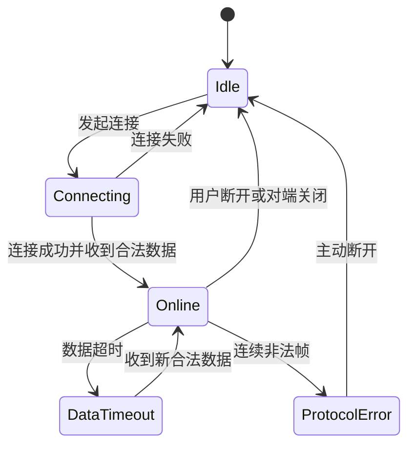

# 测风雷达通信协议文档

> 说明：本文描述当前 V1 TCP 联调协议。Zynq-7015 目标协议、板内记录、V2 会话、浏览器接口和安全要求以 [ZYNQ7015_RADAR_DATA_AND_COMMUNICATION_SPEC.md](ZYNQ7015_RADAR_DATA_AND_COMMUNICATION_SPEC.md) 为准。

## 1. 文档目的

本文件单独描述通信协议本身，重点覆盖连接方式、会话行为、帧格式、命令交互、异常处理与联调规则。它比数据格式文档更偏“通信过程”，比接口文档更偏“协议细节”。

## 2. 物理与网络层约定

| 项目 | 约定 |
| --- | --- |
| 传输协议 | TCP |
| IP 版本 | IPv4 优先 |
| 默认端口 | `5000` |
| 默认角色 | 客户端主动连雷达端，雷达端被动监听 |
| 组网方式 | 同一网段直连或交换机互联 |
| 测试阶段 | 客户端运行在个人电脑，连接雷达或仿真端 IP |
| 最终部署 | 雷达端程序运行在工业主板，客户端运行在用户电脑 |

## 3. 会话模型

### 3.1 连接发起

1. 客户端输入雷达 IP。
2. 客户端发起 TCP 连接。
3. 雷达端接受连接后进入会话状态。

### 3.2 会话初始化

建议初始化顺序固定为：

1. `0x0100` 查询设备信息。
2. `0x0200` 开始测量。
3. `0x0101` 查询首帧风场。

这样做的原因：

1. 能先确认对端是否为兼容设备。
2. 能明确让雷达进入推送状态。
3. 能避免界面长时间空白等待下一轮周期推送。

### 3.3 会话运行

会话运行期间，客户端需要持续处理：

1. 主动查询响应。
2. 雷达端主动推送。
3. 粘包。
4. 半包。
5. 错帧重同步。

### 3.4 会话结束

结束条件可以是：

1. 用户主动断开。
2. 雷达端主动关闭连接。
3. 网络超时。
4. 协议异常达到退出阈值。

## 4. 帧协议

### 4.1 帧封装

```text
AA55 + Length + Command + Sequence + Payload + CRC16 + 55AA
```

### 4.2 固定字段

| 字段 | 值 |
| --- | --- |
| 帧头 | `0xAA55` |
| 帧尾 | `0x55AA` |
| CRC | CRC-16/IBM 兼容 |

### 4.3 长度规则

`length` 字段覆盖 `command + sequence + payload + crc16`，不包含帧头、长度字段本身和帧尾。

### 4.4 序列号规则

1. 由客户端递增生成。
2. 响应帧尽量回显同一序列号。
3. 推送帧可由雷达端维护独立递增序列号。

## 5. 命令交互规范

### 5.1 已实现主链路命令

| 命令字 | 作用 | 交互特征 |
| --- | --- | --- |
| `0x0100` | 查询设备信息 | 请求后返回 `0x0000` |
| `0x0200` | 开始测量 | 请求后返回 `0x0000` |
| `0x0101` | 查询风场 | 请求后直接返回 `0x8100` |
| `0x0106` | 查询径向扫描 | 返回同一序列号的 5 条 `0x8105` 固定波束射线 |
| `0x0201` | 停止测量 | 请求后返回 `0x0000` |
| `0x8100` | 风场推送 | 主动或被动返回业务数据 |
| `0x8105` | 径向射线推送 | 5 条固定波束组成一组扫描，上位机完成三分量反演 |

### 5.2 保留命令

保留命令建议后续按模块逐步补齐：

1. `0x0102` / `0x8101`：波束状态。
2. `0x0103` / `0x8102`：设备健康。
3. `0x0104`：参数查询。
4. `0x0105` / `0x8104`：告警查询与推送。
5. `0x8103`：频谱数据。

固定五波束与扫描 VAD 共用 `0x8105` 载荷，但通过 `beamId/rayCount` 区分：`beamId=0..4, rayCount=5` 使用五波束加权最小二乘；扫描天线使用 `beamId=255`，有效射线不少于 16 条时才进入 Py-ART VAD。

## 6. 状态机建议



## 7. 客户端实现要求

1. 使用接收缓冲区累积字节流。
2. 不假设一次 `read` 对应一帧。
3. 解析失败时从下一个可能的帧头继续同步。
4. 连接中的 socket 不应再次重复发起连接。
5. 连接错误与协议错误应分开上报。
6. 应关闭系统代理影响，直接访问指定雷达 IP。

## 8. 雷达端实现要求

1. 启动后监听固定端口。
2. 对每一帧执行头、尾、长度、CRC 校验。
3. 对合法命令返回确定性响应。
4. 在开始测量后周期性推送业务数据。
5. 不得修改现有风场 payload 字段含义而不升级协议版本。

## 9. 超时与重连建议

| 项目 | 建议值 |
| --- | --- |
| 连接超时 | `5 s` |
| 数据超时 | `3 s ~ 5 s` |
| 自动重连间隔 | `5 s` |
| 协议异常日志节流 | `1 s` 内合并输出 |

## 10. 诊断日志建议

日志至少应包含：

1. 时间戳。
2. 目标 IP 与端口。
3. 连接状态变化。
4. 命令字与序列号。
5. 帧长度。
6. CRC 错误次数。
7. 数据超时事件。

不建议默认打印完整高频原始帧，以免刷屏影响排障。

## 11. 联调检查清单

1. 雷达端 `5000/tcp` 端口已放通。
2. 客户端与雷达端处于同一网段或路由可达。
3. 设备信息命令可返回正确文本。
4. 开始测量后能持续收到 `0x8100`。
5. 风速、风向、置信度数据为有效非零样本。
6. 波束页、总览页、风场页引用的是同一份风场数据源。

## 12. 后续演进建议

1. 增加应用层登录认证，满足浏览器维护端需要账号密码登录的场景。
2. 增加协议版本号、设备序列号、算法版本号。
3. 增加心跳帧或保活帧。
4. 增加独立错误码与告警码表。
5. 为浏览器维护端补充 WebSocket 或 HTTP API 网关层。
