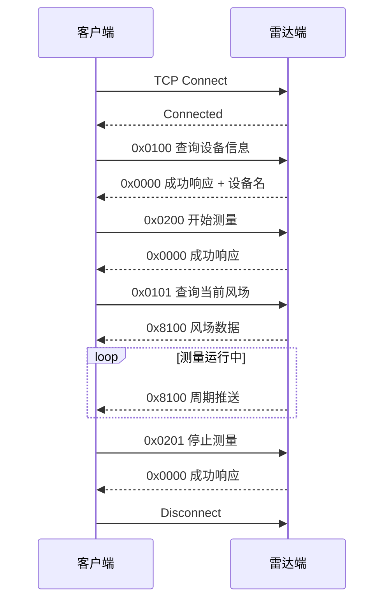

# 测风雷达数据接口文档

> 说明：本文保留当前 V1 联调接口。Zynq-7015 板卡数据来源、板内链路、V2 命令及完整产品格式以 [ZYNQ7015_RADAR_DATA_AND_COMMUNICATION_SPEC.md](ZYNQ7015_RADAR_DATA_AND_COMMUNICATION_SPEC.md) 为准。

## 1. 文档信息

| 项目 | 内容 |
| --- | --- |
| 文档版本 | 1.1.0 |
| 适用范围 | Windows 客户端、Linux 雷达端仿真程序、后续真实雷达协议适配 |
| 传输层 | TCP |
| 默认地址 | `192.168.201.29:5000` |
| 字符编码 | UTF-8 |
| 配套文档 | [DATA_FORMAT.md](DATA_FORMAT.md)、[COMM_PROTOCOL.md](COMM_PROTOCOL.md) |

## 2. 接口目标

本接口用于实现上位机客户端与雷达端之间的数据通信，完成以下业务：

1. 建立 TCP 会话。
2. 查询设备基础信息。
3. 下发开始测量与停止测量命令。
4. 获取当前风场数据。
5. 接收周期性风场推送。
6. 为后续波束状态、设备健康、告警记录等扩展接口预留命令空间。

## 3. 系统边界

### 3.1 客户端职责

客户端负责：

1. 主动连接雷达端 IP 与端口。
2. 将业务命令封装为统一二进制帧。
3. 对接收到的帧进行拆包、校验、解析与分发。
4. 将风场数据转换为 UI 页面所需的数据模型。
5. 在连接异常、超时、CRC 错误、数据超时时向界面反馈状态。

### 3.2 雷达端职责

雷达端负责：

1. 监听固定 TCP 端口。
2. 校验收到的协议帧是否合法。
3. 根据命令字执行对应业务。
4. 返回确认帧、设备信息帧或风场推送帧。
5. 在测量状态下周期性推送 `0x8100` 风场数据。

### 3.3 当前实现边界

当前仿真联调阶段已实现：

1. `0x0100` 查询设备信息。
2. `0x0101` 查询当前风场。
3. `0x0200` 开始测量。
4. `0x0201` 停止测量。
5. `0x8100` 风场数据推送。

当前仍为占位或空响应：

1. `0x0102` 查询波束状态。
2. `0x0103` 查询设备健康。
3. `0x0104` 查询参数。
4. `0x0105` 查询告警历史。
5. `0x0202` 重启。
6. `0x0203` 应用配置。
7. `0x0204` 校准。

## 4. 会话流程

## 5. 命令字定义

| 命令字 | 方向 | 名称 | 当前状态 | 说明 |
| --- | --- | --- | --- | --- |
| `0x0000` | 雷达端 -> 客户端 | 成功响应 | 已实现 | 通用确认命令 |
| `0x0001` | 雷达端 -> 客户端 | 错误响应 | 已实现 | 当前仅表示失败，未定义细分错误码 |
| `0x0100` | 客户端 -> 雷达端 | 查询设备信息 | 已实现 | 返回设备名称文本 |
| `0x0101` | 客户端 -> 雷达端 | 查询风场 | 已实现 | 返回一帧 `0x8100` 数据 |
| `0x0102` | 客户端 -> 雷达端 | 查询波束状态 | 预留 | 当前为空成功响应 |
| `0x0103` | 客户端 -> 雷达端 | 查询设备健康 | 预留 | 当前为空成功响应 |
| `0x0104` | 客户端 -> 雷达端 | 查询参数 | 预留 | 当前为空成功响应 |
| `0x0105` | 客户端 -> 雷达端 | 查询告警历史 | 预留 | 当前为空成功响应 |
| `0x0200` | 客户端 -> 雷达端 | 开始测量 | 已实现 | 进入推送状态 |
| `0x0201` | 客户端 -> 雷达端 | 停止测量 | 已实现 | 停止推送 |
| `0x0202` | 客户端 -> 雷达端 | 重启 | 预留 | 当前未执行真实重启 |
| `0x0203` | 客户端 -> 雷达端 | 应用配置 | 预留 | 当前未解析配置 payload |
| `0x0204` | 客户端 -> 雷达端 | 校准 | 预留 | 当前未执行真实校准 |
| `0x8100` | 雷达端 -> 客户端 | 风场数据推送 | 已实现 | 当前核心业务数据 |
| `0x8101` | 雷达端 -> 客户端 | 波束状态推送 | 预留 | 后续建议补齐 |
| `0x8102` | 雷达端 -> 客户端 | 设备健康推送 | 预留 | 后续建议补齐 |
| `0x8103` | 雷达端 -> 客户端 | 频谱推送 | 预留 | 后续建议补齐 |
| `0x8104` | 雷达端 -> 客户端 | 告警推送 | 预留 | 后续建议补齐 |
| `0x0106` | 客户端 -> 雷达端 | 查询径向速度扫描 | 已实现 | 请求当前固定五波束扫描；不得用 `0x8100` 替代 |
| `0x8105` | 雷达端 -> 客户端 | 径向速度射线推送 | 已实现 | 固定五波束为 5 条同序列射线；扫描 VAD 模式至少 16 条 |

## 6. 请求与响应规则

### 6.1 请求规则

1. 客户端为每个请求分配单调递增序列号。
2. 请求帧必须包含合法帧头、长度、命令字、序列号、CRC 和帧尾。
3. 未定义 payload 的命令应发送空 payload。

### 6.2 响应规则

1. `0x0000` 为通用成功响应。
2. `0x0001` 为通用失败响应。
3. 对 `0x0101` 的响应不是 `0x0000`，而是直接返回 `0x8100` 风场业务帧。
4. 响应帧应尽量保留触发请求的序列号。

### 6.3 推送规则

1. 雷达端在测量运行中可主动推送业务帧。
2. 当前仿真端默认以约 `100 ms` 周期推送风场数据。
3. 客户端必须支持粘包、拆包与多帧连续到达场景。

## 7. 连接状态定义

建议客户端对外统一暴露以下状态：

| 状态 | 含义 |
| --- | --- |
| 未连接 | 尚未建立 TCP 会话 |
| 正在连接 | 已发起连接，等待结果 |
| 在线 | 已连接且收到合法业务数据 |
| 协议异常 | 已连接但收到持续非法帧、CRC 错误或长度异常 |
| 数据超时 | 会话仍在，但超出预定时间未收到新业务数据 |

## 8. 异常处理约定

| 场景 | 处理建议 |
| --- | --- |
| TCP 连接失败 | 返回未连接，不标记为协议异常 |
| 重复发起连接 | 应拒绝新连接请求，避免并发 socket 冲突 |
| CRC 校验失败 | 丢弃当前候选帧并继续同步下一帧头 |
| 帧长度超限 | 放弃当前无效数据并重新同步 |
| payload 长度不足 | 不更新业务模型，仅记录诊断日志 |
| 数据长时间不更新 | UI 显示数据超时，保留最后一帧并提示时间戳 |

## 9. 联调验收条件

1. 客户端可连接 `192.168.201.29:5000`。
2. `0x0100` 可返回设备名，例如 `RadarSim v1.0`。
3. `0x0200` 下发后可收到成功响应。
4. `0x0101` 下发后可收到 `0x8100` 风场数据。
5. 连续接收过程中无 CRC 刷屏。
6. `0x0106` 下发后收到同一 `sequence` 的 5 条 `0x8105`，波束编号无重复且几何参数完整。
7. 客户端可由 5 条径向观测反演非零 `uEast`、`vNorth`、`wUp`，并显示有效波束数与拟合残差。
6. 风速、风向、置信度不应全部为零。
7. 客户端总览页、风场页、波束页可同步刷新数据。

## 10. 后续扩展建议

1. 为 `0x8101` 到 `0x8104` 定义正式 payload。
2. 增加设备唯一标识、算法版本、协议版本字段。
3. 增加应用层认证、权限分级与审计日志。
4. 增加心跳机制与断线重连策略。
5. 在真实雷达版本中明确时间同步来源与质量标志。
