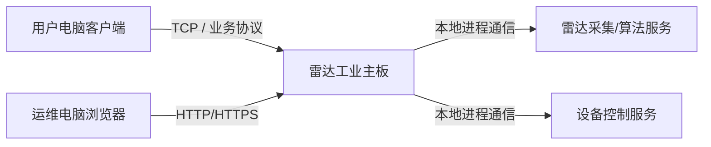

# 测风雷达部署与组网技术文档

## 1. 目标架构

当前项目建议分成两类上位机形态：

1. 电脑客户端：面向最终用户，负责日常查看、分析、导出、运维入口。
2. 雷达端维护上位机：运行在雷达工业主板，面向运维人员，通过浏览器访问。

## 2. 部署分层

### 2.1 客户端侧

| 项目 | 建议 |
| --- | --- |
| 运行环境 | Windows 10/11 |
| 交互方式 | 本地安装客户端程序 |
| 主要职责 | 风场查看、历史回放、导出报表、用户登录、权限控制 |
| 通信方式 | 直连雷达 TCP 协议，或经网关服务中转 |

### 2.2 雷达端侧

| 项目 | 建议 |
| --- | --- |
| 运行环境 | Linux 工业主板 |
| 交互方式 | 浏览器输入雷达 IP 访问 |
| 主要职责 | 调试、诊断、参数配置、日志查看、设备维护 |
| 对外形式 | 本机 Web 服务 + 后端设备服务 |

## 3. 推荐网络拓扑

## 4. 端口建议

| 端口 | 用途 | 建议 |
| --- | --- | --- |
| `5000/tcp` | 雷达业务协议端口 | 客户端连接雷达 |
| `80/tcp` 或 `8080/tcp` | 雷达端维护页面 | 浏览器访问 |
| `443/tcp` | HTTPS 运维页面 | 正式环境优先 |
| 内部自定义端口 | 服务间通信 | 不对外开放 |

## 5. 安全建议

### 5.1 当前联调阶段

1. 可先使用局域网明文 TCP。
2. 可先使用账号密码登录浏览器维护端。
3. 通过防火墙限制来源网段。

### 5.2 正式部署阶段

1. 浏览器维护端优先启用 HTTPS。
2. 增加用户、角色、权限分级。
3. 操作日志、告警日志、参数变更日志必须可追溯。
4. 设备控制类接口应增加二次确认。
5. 建议将运维入口与用户入口权限隔离。

## 6. 账号体系建议

| 角色 | 建议能力 |
| --- | --- |
| 普通用户 | 查看实时数据、历史数据、导出报表 |
| 运维人员 | 查看诊断页、波束状态、日志、设备健康 |
| 管理员 | 参数配置、用户管理、系统升级、校准操作 |

## 7. 服务拆分建议

雷达端建议至少拆成以下服务：

1. `radar-device-service`：直接对接硬件、采集和控制。
2. `radar-algorithm-service`：承接 Py-ART 或其他风场算法。
3. `radar-gateway-service`：对外提供 TCP、HTTP、WebSocket 等统一接口。
4. `radar-web-ui`：浏览器维护界面。

## 8. 客户端与雷达端的接口分工

### 8.1 客户端

更适合：

1. 面向用户的风场总览。
2. 趋势分析。
3. 历史查询与导出。
4. 多雷达管理。

### 8.2 雷达端浏览器维护页面

更适合：

1. 网络配置。
2. 参数调试。
3. 波束监视。
4. 原始数据和日志查看。
5. 软件升级与故障诊断。

## 9. 开发环境建议

| 模块 | 建议技术 |
| --- | --- |
| Windows 客户端 | Qt 6 + C++ |
| 雷达端后端服务 | C++ 或 Rust 主服务，Python 算法服务 |
| 雷达端维护前端 | Vue/React + TypeScript |
| 算法模块 | Python + Py-ART |
| 服务编排 | `systemd` 或容器化部署 |

## 10. 文档化建议

后续随着开发推进，建议继续补齐：

1. 接口错误码文档。
2. 告警码文档。
3. 配置项文档。
4. 用户权限矩阵文档。
5. 升级发布文档。
6. 现场联调手册。
