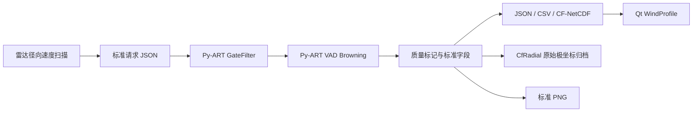

# Py-ART 风场反演集成文档

## 1. 集成定位

Py-ART 作为独立科学计算进程接入共享核心库，不进入 Qt UI 线程，也不替代 FPGA/ARM 实时信号处理。上位机通过 `PyArtWindService` 提交标准任务，并将结果映射为现有 `WindProfile` 和 `RangeGate`。

## 2. 数据链路

## 3. 必要输入

1. 同一仰角扫描的方位角数组，至少 16 条有效射线。
2. 每条射线对应的仰角。
3. 距离门中心位置，单位米。
4. 二维径向速度，单位 `m s-1`，形状为 `[ray][gate]`。
5. 推荐提供同形状 CNR，单位 dB，用于质量控制。
6. UTC 时间、设备位置和海拔。

当前 `0x8100` 只传输反演后的风速风向，不能作为 Py-ART VAD 输入。真实雷达协议必须新增原始径向速度扫描帧或归档文件接口。

### 3.1 与固定五波束反演的边界

当前硬件的常规观测由 1 条垂直波束和 4 条偏离天顶 `15°` 的倾斜波束组成。该模式仅有 5 条固定射线，客户端使用带质量权重的几何最小二乘直接求解 ENU 三分量 `u/v/w`，不得调用需要充分方位覆盖的 Py-ART VAD。只有扫描模式提供 `beamId=255`、不少于 16 条有效方位射线时，才进入本章所述 Py-ART 流程。

## 4. 输出规范

| 产品 | 规范 | 用途 |
|---|---|---|
| 结果 JSON | `radar.wind-profile/1.0` | C++ 领域模型交换 |
| 风廓线 NetCDF | CF-1.11 profile | 科学归档与第三方分析 |
| 极坐标 NetCDF | CfRadial | 原始量复算与审计 |
| CSV | UTF-8 BOM、显式单位列名 | Excel 与业务交换 |
| PNG | 1600 × 1000、150 DPI | 报告、客户端预览 |

方向采用气象学约定：0 度为真北，顺时针，表示风的来向。高度同时提供 MSL 和 AGL。无效科学量使用空值/NetCDF FillValue，不使用零值冒充缺测。

## 5. 质量控制

1. 非有限径向速度直接掩膜。
2. CNR 小于 `minimumCnrDb` 的距离门不参与反演。
3. 每层有效射线少于 `validRayMin` 时标记无效。
4. `qualityFlag=0` 表示有效，`qualityFlag=1` 表示数据不足。
5. `confidencePct` 根据该高度有效射线比例计算，不等同于算法精度。

## 6. 环境

- 开发环境已验证 Py-ART 2.2.0。
- 正式环境建议 Python 3.11 和 Py-ART 2.2.x。
- 使用独立虚拟环境，避免与雷达主服务依赖冲突。
- `python -m radar_pyart_service.worker --health` 用于部署自检。
- 默认结果目录位于上位机可执行文件同级的 `data/pyart-output`，不写入 Windows 用户文档目录。正式部署时可将该目录挂载到雷达数据盘。

## 7. 代码位置

- Python 算法：`pyart-service/src/radar_pyart_service`
- C++ 适配器：`src/core/algorithms/PyArtWindService.*`
- 输入输出 Schema：`pyart-service/schemas`
- 合成验证数据：`pyart-service/examples`
- 自动测试：`pyart-service/tests`

## 8. 参考依据

1. Py-ART 官方 VAD Browning API：<https://arm-doe.github.io/pyart/API/generated/pyart.retrieve.vad_browning.html>
2. Py-ART 官方 VAD 风廓线示例：<https://arm-doe.github.io/pyart/examples/retrieve/plot_vad.html>
3. Py-ART 官方 CfRadial 写出接口：<https://arm-doe.github.io/pyart/API/generated/pyart.io.write_cfradial.html>
4. CF Conventions：<https://cfconventions.org/>
