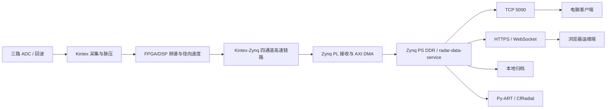

# Zynq-7015 测风雷达数据接口与通信协议详细设计

> 文档编号：RUCS-IF-001  
> 版本：V1.1-draft  
> 日期：2026-07-14  
> 适用范围：雷达信号处理板、Zynq-7015 雷达端、电脑客户端、浏览器运维端、Py-ART 服务  
> 状态：接口冻结前评审稿

## 1. 目的与约束

本文定义测风雷达板卡到上位机的完整数据边界：硬件数据来源、板内数据交付、外部 TCP 二进制协议、浏览器 REST/WebSocket 接口、原始径向观测、频谱、风廓线、健康状态、告警、配置和标准产品格式。

本文是 FPGA、DSP、Zynq、算法、桌面客户端和浏览器端联合开发的接口基线。协议冻结后，不得在不升级版本的情况下改变字段偏移、类型、单位、方向定义或质量语义。

### 1.1 规范状态约定

本文使用以下状态，Zynq 开发必须按状态理解，不能把“目标设计”当成“当前客户端已支持”：

| 状态 | 含义 |
| --- | --- |
| **现行基线** | 当前桌面客户端和仿真雷达已经实现，可直接用于联调 |
| **部分实现** | 命令字或模型存在，但 payload 解析、业务处理或页面尚未完成 |
| **目标设计** | 下一版协议方案，必须完成版本协商和客户端升级后才能启用 |
| **硬件待确认** | 依赖原理图、BOM、FPGA、射频或现场标定结果，不得直接固化 |

V1.1 的对外联调基线为外层帧、`0x8100` 和固定五波束 `0x8105`。其中 `0x8105` 是为当前客户端增加的兼容扩展，**不包含 24 字节 V2 通用前缀**。`0x0110`、`0x8000`、`0x8106..0x810B` 仍属于目标设计。

### 1.2 V1.1 修订摘要

1. 冻结当前固定五波束 `0x8105` 的直接 payload 格式，消除与 V2 通用前缀的歧义。
2. 更新当前实现状态：客户端已实现五波束聚合和 WLS 三分量反演。
3. 明确扫描 VAD 和雷达实时 Py-ART 尚未接入，当前 Py-ART 为 36 方位合成数据自检。
4. 将硬件运行状态、数据质量和业务风场数据的界面职责分离。
5. 将 CRC 算法名称修正为 `CRC-16/MODBUS`，并增加联调约束。

## 2. 资料审查与可信度

### 2.1 已确认存在的资料

| 资料 | 内容 | 结论 |
| --- | --- | --- |
| `SIG_PROC_BRD_V4(2).pdf/.txt` | 信号处理板原理图导出 | 含 Zynq-7015、Kintex-7、双 DSP、DDR/eMMC、RGMII、GTP、UART/RS422/GPIO |
| `BOARD_v1.pdf/.txt` | 新版信号处理板原理图导出 | 35 页级板卡资料，可用于网络、时钟、存储和互联复核 |
| `board.pdf/.txt` | 早期板卡原理图导出 | 含 Kintex、时钟、配置和 PHY，作为历史参考 |
| `数字信号处理板硬件架构设计文档.md` | FPGA + 双 DSP 架构说明 | 描述 3 路 ADC、XC7K325T、双 C6678、SRIO/HyperLink、千兆网 |
| `雷达系统接口接线详细文档.md` | 整机模块和线缆清单 | 多个连接器型号、长度和引脚仍标记待确认 |
| `MYD-C7Z015/.../MYD-c7z015-sch-20170721.pdf` | MYD 参考底板原理图 | 13 页，含 RGMII/RJ45、RS232/JTAG、USB、CAN、SFP、PCIe 和扩展口 |
| `MYD-C7Z015/.../*.DSN/*.DXF/*.xls` | ORCAD、机械尺寸、差分线长度 | 用于硬件复核，不作为业务协议唯一依据 |
| `ug585-Zynq-7000-TRM.pdf` | Zynq-7000 技术参考 | 用于 GEM、DDR、DMA、PS 外设开发 |

### 2.2 从信处板原理图确认的信息

| 类别 | 已确认信息 |
| --- | --- |
| Zynq | `XC7Z015-2CLG485I` |
| 存储 | 32-bit DDR3；eMMC 信号及 `KLM8G1GEME-B041` 器件标识 |
| 千兆网 | PS `ETH0_TXD/RXD[3:0]`、`TXCK/RXCK`、`TXCTL/RXCTL`、`MDC/MDIO`，即 RGMII 接口 |
| 高速互联 | `GTH_FPGA2ZYNQ_0..3`、`GTH_ZYNQ2FPGA_0..3` 和 125 MHz 参考时钟 |
| 低速互联 | `FPGA_ZYNQ_GPIO00..07`、`ZYNQ_GPIO00..03` |
| 串行控制 | `PL_UART0_TXD0/RXD0`，经 RS422 收发器引出 |
| 主控通信 | `ZYNQ_RS422_MainCrl_TXD/RXD` 及主控 UART 信号 |
| 信号处理 | `XC7K325T`、DSP0/DSP1 `TMS320C6678`、ADC 和时钟网络 |

### 2.3 不能混用的资料

`MYD-C7Z015` 是通用参考开发板；`SIG_PROC_BRD_V4/BOARD_v1` 才是本项目更直接相关的信处板资料。MYD 资料证明 Zynq-7015 可运行 Linux 并提供千兆网等资源，但不能把 MYD 底板全部接口认定为量产雷达接口。

### 2.4 仍需硬件确认

1. 投产原理图、PCB、BOM 的正式版本号。
2. 实际以太网 PHY 型号、PHY 地址和 RGMII 延时配置。
3. Kintex-Zynq 四通道链路采用 Aurora、SRIO、自定义 8b/10b 或其他协议。
4. Zynq PL 到 PS 使用 AXI DMA、HP 端口或其他方式。
5. 风场反演最终运行于 DSP、Zynq ARM 还是 Py-ART 服务。
6. ADC 实际工作采样率。草案代码出现 125 MSPS，硬件说明出现 AD9613 250 MSPS 能力。
7. 载频。草案代码使用 25 GHz，必须由射频设计确认。
8. 五波束名义几何已由天线资料确认；各通道安装误差矩阵和现场标定值仍待提供。
9. 接口板连接器的最终引脚定义。

本文对这些事项使用“建议”或“待确认”，不把推测写成已实现事实。

## 3. 系统边界与数据链路

| 层 | 运行位置 | 责任 |
| --- | --- | --- |
| L0 采集 | ADC + Kintex | 采样、触发、距离门、脉压、基础预处理 |
| L1/L2A 处理 | Kintex + DSP | FFT、谱峰、CNR、径向速度、质量量 |
| 雷达端服务 | Zynq PS/Linux | 板内接收、聚合、封装、存储、网络、运维服务 |
| 算法产品 | Zynq/Py-ART | VAD、风廓线、质量控制、标准产品 |
| 用户端 | 电脑客户端 | 实时业务监控、风场展示、导出 |
| 运维端 | 浏览器 | 登录、状态、参数、诊断、日志、升级 |



`AXI-Stream + AXI DMA` 是推荐的软件边界，最终 PL/PS 通道由 FPGA 工程确认。上位机数据源统一定义为“信处板 ADC/FPGA/DSP 产生、由 Zynq 汇聚并发布的雷达数据”。

## 4. 数据产品分级

| 级别 | 产品 | 内容 | 使用方 |
| --- | --- | --- | --- |
| L0 | 原始采样 | ADC I/Q 或实采样、触发和采样时钟 | FPGA/DSP 离线诊断 |
| L1A | 距离门复数数据 | 脉压后 I/Q | 算法研发 |
| L1B | Doppler 频谱 | 功率谱、噪声底、峰值、CNR | 频谱诊断 |
| L2A | 径向观测 | 每射线每距离门径向速度、CNR、谱宽、质量 | Py-ART、波束监视 |
| L2B | 风廓线 | 高度、风速、风向、ENU 分量及质量字段 | 总览、风场页；质量字段进入数据质量诊断 |
| L3 | 派生产品 | 风切变、湍流、阵风、告警、真实二维网格 | 用户业务 |

数据真实性规则：

1. V1 `0x8100` 是已反演 L2B，不能作为 Py-ART 原始输入。
2. Py-ART VAD 使用 L2A 径向观测，至少 16 个有效方位射线。
3. 五波束结果可标记为专用五波束反演，不得标记为标准 36 方位 VAD。
4. 单个垂直风廓线不得平铺成二维风场。
5. 二维图的热力颜色表示风速大小，箭头表示矢量方向，低质量区域必须掩膜。
6. 风场页面只展示业务测量结果；综合置信度、质量标志和淘汰原因归入“设备状态 > 数据质量”。
7. `0x8101/0x8102` 表示波束和硬件运行状态，不能用分层数据质量代替硬件状态。

## 5. 坐标、时间、角度和单位

### 5.1 坐标与角度

采用局部 ENU：X 正东、Y 正北、Z 向上，距离单位 m。

| 字段 | 定义 |
| --- | --- |
| `azimuthDeg` | 真北起顺时针，`[0,360)` |
| `elevationDeg` | 水平为 0，向上为正，`[-90,90]` |
| `windDirectionDeg` | 气象学来向；0 北风、90 东风 |
| `radialVelocityMps` | 正值远离雷达，负值朝向雷达 |

若 FPGA/DSP 内部符号相反，必须在 Zynq 出口统一转换。

```text
uEast  = -speed * sin(direction)
vNorth = -speed * cos(direction)
speed  = sqrt(uEast^2 + vNorth^2)
direction = atan2(-uEast, -vNorth)，归一化到 [0,360)
```

### 5.2 时间

1. V2 网络时间统一为 UTC Unix Epoch 微秒 `uint64`。
2. V1 `0x8100` 为兼容现状，使用 UTC Unix Epoch 毫秒。
3. 现行 `0x8105` 不携带独立观测时间；客户端暂以完整五波束扫描的接收时间记时，这是兼容限制，不满足量产时间追溯要求。
4. 文件保存 UTC；界面按本地时区显示。
5. 时间源：`0=NTP`、`1=GPS`、`2=北斗`、`3=RTC`、`4=人工`、`255=未知`。
6. 正式 V2 产品必须携带观测时间和时间质量，不能只使用接收时间。

### 5.3 单位

| 物理量 | 单位/范围 |
| --- | --- |
| 距离、高度、位置 | m |
| 风速、径向速度、垂直速度 | m/s |
| 角度 | degree |
| 频率 | Hz |
| CNR/SNR/谱功率 | dB；dBm 必须在字段名中注明 |
| 温度 | degC |
| 电压/电流 | V / A |
| 湍流、占用率 | 0..1 |
| 综合置信度 | 0..100 整数百分比；质量诊断字段，不代表硬件状态 |

## 6. 网络和端口

| 端口 | 协议 | 用途 |
| --- | --- | --- |
| `5000/tcp` | 自定义二进制 | 电脑客户端实时业务数据 |
| `443/tcp` | HTTPS/WSS | 浏览器运维端 |
| `22/tcp` | SSH | 受限维护，生产环境限制来源或关闭 |
| `123/udp` | NTP | 时间同步 |
| `319/320 udp` | PTP，可选 | 高精度时间同步 |

当前联调地址是 `192.168.201.29:5000`，正式软件不得将该地址硬编码为唯一设备地址。

TCP 会话要求：

1. 雷达监听，客户端主动连接。
2. 至少支持 2 个只读连接和 1 个控制连接。
3. keepalive 建议：空闲 10 s、间隔 3 s、失败 3 次断开。
4. 业务心跳 1 s；3 s 无有效帧进入数据超时，10 s 断开重连。
5. 重连采用 1、2、5、10、30 s 退避，并加 0..500 ms 抖动。
6. 必须处理粘包、半包、多帧、非法长度和错误后重同步。

## 7. 外部 TCP 帧协议

### 7.1 兼容封装

```text
AA55 + Length + Command + Sequence + Payload + CRC16 + 55AA
```

| 偏移 | 字段 | 长度 | 字节序 | 说明 |
| ---: | --- | ---: | --- | --- |
| 0 | `sync` | 2 | 大端 | `0xAA55` |
| 2 | `length` | 2 | 大端 | command 到 crc16 的字节数 |
| 4 | `command` | 2 | 大端 | 命令字 |
| 6 | `sequence` | 4 | 大端 | 请求/响应序列号 |
| 10 | `payload` | N | 按命令 | 负载 |
| 10+N | `crc16` | 2 | 大端存放 | CRC-16/MODBUS |
| 12+N | `tail` | 2 | 大端 | `0x55AA` |

```text
length = 2(command) + 4(sequence) + payloadLength + 2(crc)
totalFrameLength = 14 + payloadLength
```

CRC 参数：`CRC-16/MODBUS`，初值 `0xFFFF`，反射多项式 `0xA001`，右移，`xorout=0x0000`。校验范围从帧头到 payload 末尾，不包含 CRC 和帧尾；计算结果按大端顺序写入外层帧。

接收端必须分别校验帧头 `0xAA55`、长度范围、CRC 和帧尾 `0x55AA`。任一项失败均丢弃当前候选帧并重新搜索帧头。接口冻结时必须提供至少一组完整帧十六进制黄金样例，供 Zynq、仿真器和客户端交叉验证。

当前外层帧黄金样例：

| 场景 | 完整帧十六进制 | CRC |
| --- | --- | --- |
| 请求固定五波束，`command=0x0106`、`sequence=1`、空 payload | `AA 55 00 08 01 06 00 00 00 01 27 54 55 AA` | `0x2754` |
| 成功响应，`command=0x0000`、`sequence=1`、空 payload | `AA 55 00 08 00 00 00 00 00 01 F6 DD 55 AA` | `0xF6DD` |

以上 CRC 均只对前 10 字节（帧头、长度、命令和序列号）计算。实现方必须按字节计算，不得对 C/C++ 结构体内存直接计算。

实时帧总长保持不超过 4096 字节。文件和固件按块发送，每块 payload 建议不超过 3072 字节。

### 7.2 V2 通用 payload 前缀

本节为**目标设计**，仅适用于完成 `0x0110` 会话协商后启用的正式 V2 命令。现行 `0x8100` 和固定五波束 `0x8105` 均不包含该前缀，Zynq 不得在现行 `0x8105` 前自行增加 24 字节。

正式 V2 payload 前 24 字节统一小端：

| 偏移 | 字段 | 类型 | 说明 |
| ---: | --- | --- | --- |
| 0 | `schemaMajor` | `uint8` | 当前 2 |
| 1 | `schemaMinor` | `uint8` | 当前 0 |
| 2 | `messageFlags` | `uint16` | 消息标志 |
| 4 | `deviceIdHash` | `uint32` | 设备 ID 的 CRC32 |
| 8 | `timestampUs` | `uint64` | UTC 微秒 |
| 16 | `scanId` | `uint32` | 扫描/产品关联号，无则 0 |
| 20 | `payloadBodyLength` | `uint32` | body 长度 |

`messageFlags` 位定义：0 要求 ACK、1 响应、2 错误、3 压缩、4 历史、5 仿真、6 校准、7 扫描结束；其余置 0。

## 8. 板内 FPGA/PL 到 PS/Linux 记录格式

本章为**目标设计/硬件待确认**。该格式独立于外部 TCP，可承载 Aurora、自定义 GTP、AXI-Stream、AXI DMA 或共享内存；在 Kintex-Zynq 物理链路和 PL-PS 通道确认前不得视为已实现格式。

固定头 32 字节，全部小端：

| 偏移 | 字段 | 类型 | 说明 |
| ---: | --- | --- | --- |
| 0 | `magic` | `uint32` | `0x52414452`，ASCII `RADR` |
| 4 | `headerVersion` | `uint8` | 当前 1 |
| 5 | `recordType` | `uint8` | 数据类型 |
| 6 | `headerLength` | `uint16` | 当前 32 |
| 8 | `payloadLength` | `uint32` | 负载长度 |
| 12 | `recordSequence` | `uint32` | 单调递增，可回卷 |
| 16 | `timestampUs` | `uint64` | UTC/硬件时钟换算微秒 |
| 24 | `sourceId` | `uint16` | ADC/FPGA/DSP 来源 |
| 26 | `flags` | `uint16` | 仿真、校准、溢出、时间有效等 |
| 28 | `headerCrc16` | `uint16` | 头部前 28 字节 CRC16 |
| 30 | `reserved` | `uint16` | 置 0 |
| 32 | `payload` | `byte[]` | 按类型解释 |
| 32+N | `payloadCrc32c` | `uint32` | Castagnoli CRC32C |

`recordType`：`0x01 RAW_ADC_BLOCK`、`0x02 RANGE_IQ_BLOCK`、`0x03 SPECTRUM_BLOCK`、`0x04 RADIAL_RAY`、`0x05 WIND_PROFILE`、`0x06 HEALTH`、`0x07 ALARM`、`0x08 CALIBRATION`、`0x09 LOG`。

DMA 要求：

1. 推荐 4..16 个环形缓冲区，每块 1 MiB，按实测吞吐调整。
2. 禁止单缓冲覆盖生产数据。
3. FPGA FIFO、DMA 环或用户态队列溢出必须递增丢块计数并设置 `DATA_LOSS`。
4. Linux 驱动交付完整记录，业务服务负责解析、聚合和发布。
5. L0 原始 ADC 只允许限时诊断抓取，默认不持续外发。

## 9. 命令字

### 9.1 请求/控制

| 命令 | 名称 | 状态 | 说明 |
| --- | --- | --- | --- |
| `0x0100` | 查询设备信息 V1 | 现行基线 | 空 payload；当前仿真端返回通用成功 |
| `0x0101` | 查询风廓线 V1 | 现行基线 | 返回 `0x8100` |
| `0x0102` | 查询波束状态 | 部分实现 | 命令字存在，body 尚未联调 |
| `0x0103` | 查询设备健康 | 部分实现 | 命令字存在，body 尚未联调 |
| `0x0104` | 查询参数 V1 | 部分实现 | 当前客户端参数读写未接入 |
| `0x0105` | 查询告警 V1 | 部分实现 | 当前客户端告警 payload 未接入 |
| `0x0106` | 订阅固定五波束径向数据 | 现行基线 | 返回/推送 `0x8105` |
| `0x0110` | V2 会话协商 | 目标设计 | 版本、帧长、压缩、订阅 |
| `0x0111` | 心跳/时间查询 | 目标设计 | V2 前缀 |
| `0x0112` | 查询能力集 | 目标设计 | 返回 `0x810A` |
| `0x0113` | 查询配置 | 目标设计 | 返回 `0x8108` |
| `0x0114` | 查询日志 | 目标设计 | 返回 `0x8109` |
| `0x0200` | 开始测量 | 现行基线 | 控制操作 |
| `0x0201` | 停止测量 | 现行基线 | 控制操作 |
| `0x0202` | 重启服务/设备 | 部分实现 | 命令字存在，鉴权未实现 |
| `0x0203` | 应用配置 | 部分实现 | 命令字存在，事务协议未实现 |
| `0x0204` | 校准 | 部分实现 | 命令字存在，payload 未冻结 |
| `0x0205` | 设置时间 | 目标设计 | 管理员操作 |
| `0x0206` | 原始数据抓取 | 目标设计 | 限时诊断 |

### 9.2 响应/推送

| 命令 | 名称 | 状态 | 说明 |
| --- | --- | --- | --- |
| `0x0000` | V1 成功 | 现行基线 | 兼容 |
| `0x0001` | V1 错误 | 现行基线 | 兼容 |
| `0x8000` | V2 通用响应 | 目标设计 | 状态码、细分码、文本 |
| `0x8100` | 风廓线 V1 | 现行基线 | 当前客户端已实现 |
| `0x8101` | 波束状态 | 部分实现 | 命令字存在，body 尚未解析 |
| `0x8102` | 设备健康 | 部分实现 | 命令字存在，body 尚未解析 |
| `0x8103` | 频谱 | 部分实现 | 页面存在，实时 payload 尚未解析 |
| `0x8104` | 告警 | 部分实现 | 事件模型存在，实时 payload 尚未解析 |
| `0x8105` | 固定五波束径向射线兼容扩展 | 现行基线 | 无 V2 前缀；五束聚合后执行 WLS，不直接送入 Py-ART |
| `0x8106` | 风廓线 V2 | 目标设计 | 标准化 L2B |
| `0x8107` | 二维风场网格 V2 | 目标设计 | 仅真实网格存在时发送 |
| `0x8108` | 配置快照 V2 | 目标设计 | 查询/变更返回 |
| `0x8109` | 日志 V2 | 目标设计 | 分页/流式 |
| `0x810A` | 能力集 V2 | 目标设计 | 硬件、协议和算法能力 |
| `0x810B` | 产品清单 V2 | 目标设计 | 文件和图像索引 |

## 10. 会话协商和响应

`0x0110` body：`clientMajor u8`、`clientMinor u8`、`clientType u8`、`compressionMask u8`、`maxFrameSize u32`、`subscriptionMask u32`、`clientNameLength u16`、UTF-8 `clientName`。

`0x8000` body：

| 偏移 | 字段 | 类型 | 说明 |
| ---: | --- | --- | --- |
| 0 | `requestCommand` | `uint16` | 被响应命令 |
| 2 | `statusCode` | `uint16` | 0 成功 |
| 4 | `detailCode` | `uint32` | 模块细分错误 |
| 8 | `messageLength` | `uint16` | 文本字节数 |
| 10 | `message` | `byte[]` | UTF-8，仅供显示 |

## 11. V1 风廓线 `0x8100`

| payload 偏移 | 字段 | 类型 | 字节序 | 说明 |
| ---: | --- | --- | --- | --- |
| 0 | `timestampMs` | `uint64` | 小端 | UTC 毫秒 |
| 8 | `timeQuality` | `uint8` | - | 时间质量 |
| 9 | `gateCount` | `uint16` | 大端 | 距离门数 |
| 11 | `rangeResolutionM` | `float32` | 小端 | 分辨率 |
| 15 | `maxRangeM` | `float32` | 小端 | 最大距离 |
| 19 | `reserved` | 3 byte | - | 置 0 |
| 22 | `windSpeed[N]` | `float32[]` | 小端 | 水平风速 |
| `22+4N` | `windDirection[N]` | `float32[]` | 小端 | 气象学来向 |
| `22+8N` | `verticalSpeed[N]` | `float32[]` | 小端 | 向上为正 |
| `22+12N` | `confidence[N]` | `uint8[]` | - | 0..100 |
| `22+13N` | `snrDb` | `float32` | 小端 | 公共值 |
| `26+13N` | `turbulence` | `float32` | 小端 | 公共值 |

`N=30` 时 payload 420 字节，总帧 434 字节。V1 存在混合端序、公共 SNR、无独立高度、无每层质量位等限制；新增功能使用 `0x8106`，不改 V1 偏移。

## 12. 固定五波束径向射线 `0x8105`（现行基线）

每帧代表同一次固定五波束观测中的一条波束射线，避免整组数据超过 4096 字节。本命令是当前客户端兼容扩展，payload 直接从下表的 `rayIndex` 开始，**不包含第 7.2 节的 V2 通用前缀**。

外层帧的 `sequence` 字段直接作为 `scanId`。同一组五条射线必须使用相同 `sequence`，下一组观测递增；不得在五条射线之间改变 `gateCount`、距离门定义或标定版本。

`0x8105` body 内所有多字节整数和浮点数均为**小端**，外层帧字段仍按第 7.1 节使用大端。浮点数采用 IEEE 754 binary32/binary64。

### 12.1 body 头

| 偏移 | 字段 | 类型 | 说明 |
| ---: | --- | --- | --- |
| 0 | `rayIndex` | `uint16` | 0 起始 |
| 2 | `rayCount` | `uint16` | 计划射线数 |
| 4 | `gateCount` | `uint16` | 1..256 |
| 6 | `beamId` | `uint8` | 当前只允许 0..4 |
| 7 | `timeQuality` | `uint8` | 保留时间质量；当前客户端读取但尚未用于产品时间 |
| 8 | `azimuthDeg` | `float32` | 真北顺时针 |
| 12 | `elevationDeg` | `float32` | 向上为正 |
| 16 | `startRangeM` | `float32` | 第一门中心 |
| 20 | `gateSpacingM` | `float32` | 门间距 |
| 24 | `prfHz` | `float32` | 当前 PRF |
| 28 | `nyquistVelocityMps` | `float32` | Nyquist 速度 |
| 32 | `frequencyHz` | `float64` | 实际载频 |
| 40 | `calibrationVersion` | `uint32` | 标定版本 |
| 44 | `fieldMask` | `uint32` | 数组存在位 |
| 48 | `rayQualityFlags` | `uint32` | 射线级质量 |
| 52 | `reserved` | `uint32` | 置 0 |

### 12.2 门数组

按 `fieldMask` 从低位到高位排列：

| bit | 字段 | 类型 | 缩放/无效值 |
| ---: | --- | --- | --- |
| 0 | `radialVelocity` | `int16[N]` | `/100 m/s`，`-32768` 无效 |
| 1 | `cnr` | `int16[N]` | `/100 dB`，`-32768` 无效 |
| 2 | `spectrumWidth` | `uint16[N]` | `/100 m/s`，`65535` 无效 |
| 3 | `reflectivityOrPower` | `int16[N]` | `/100 dB`，`-32768` 无效 |
| 4 | `confidence` | `uint8[N]` | 0..100，255 无效 |
| 5 | `gateQualityFlags` | `uint16[N]` | 位域 |
| 6 | `peakFrequency` | `float32[N]` | Hz，NaN 无效 |

现行联调 `fieldMask=0x37`，即 bit0、1、2、4、5。bit0 `radialVelocity` 必须存在；其余字段缺失时客户端只按可用字段处理。该掩码下每门 9 字节，`payloadLength=56+9N`，`totalFrameLength=70+9N`。`N=30` 时 payload 为 326 字节、总帧为 340 字节；`N=256` 时 payload 为 2360 字节、总帧为 2374 字节。

相同外层 `sequence`、`rayCount` 和距离门定义组成一组观测。现行格式没有 `END_OF_SCAN` 位，客户端以收齐 `rayCount=5` 且 `beamId=0..4` 判断完整。缺射线不得复制伪造；超过等待时限的残组必须丢弃并累计丢组计数。

固定五波束模式的名义几何为：`beamId=0` 垂直波束（方位 `0°`、仰角 `90°`）；`beamId=1..4` 分别为东北、东南、西南、西北（方位 `45°/135°/225°/315°`、仰角均为 `75°`）。五条射线必须使用同一 `scanId`，按质量权重执行三分量 LSQ，输出 `uEast/vNorth/wUp`。仿真载频暂按 `23.8/23.9/24.0/24.1/24.2 GHz` 映射，量产通道与频点对应关系必须以射频标定表为准。

当前客户端拒绝 `beamId=255` 和 `rayCount!=5`。扫描 VAD 属于后续 V2 扩展，必须使用带观测时间的正式 V2 径向扫描消息并升级客户端后启用。Py-ART 只处理不少于 16 条有效射线且方位覆盖充分的真实扫描，不能把固定五波束补点或复制成 16/36 条射线。

### 12.3 现行格式限制与升级规则

1. `0x8105` 没有独立观测时间，客户端当前使用完整五波束组的接收时间。
2. `timeQuality` 当前仅保留，不参与客户端时间判定。
3. 当前客户端解析谱宽、质量标志等数组长度，但尚未把全部字段用于业务模型。
4. 不允许在同一 `0x8105` 命令下静默增加 V2 前缀或改变偏移。正式扫描径向协议应分配新命令字，或在 `0x0110` 协商成功后切换到明确的 V2 schema。
5. 量产协议必须补充雷达观测时间、设备标识、扫描结束标志和丢射线统计。

## 13. V2 风廓线 `0x8106`

本章为目标设计，当前客户端尚未解析。以下 body 偏移均相对于第 7.2 节 24 字节 V2 通用前缀之后计算。

### 13.1 body 头

| 偏移 | 字段 | 类型 | 说明 |
| ---: | --- | --- | --- |
| 0 | `algorithmId` | `uint16` | 1 五波束 LSQ，2 Py-ART VAD |
| 2 | `algorithmMajor` | `uint8` | 主版本 |
| 3 | `algorithmMinor` | `uint8` | 次版本 |
| 4 | `gateCount` | `uint16` | 层数 |
| 6 | `timeQuality` | `uint8` | 时间质量 |
| 7 | `coordinateSystem` | `uint8` | 1 ENU |
| 8 | `siteAltitudeM` | `float32` | MSL |
| 12 | `instrumentHeightM` | `float32` | AGL |
| 16 | `rollDeg` | `float32` | 安装滚转 |
| 20 | `pitchDeg` | `float32` | 安装俯仰 |
| 24 | `headingDeg` | `float32` | 安装航向 |
| 28 | `sourceScanId` | `uint32` | 输入扫描号 |
| 32 | `profileQualityFlags` | `uint32` | 产品质量 |
| 36 | `fieldMask` | `uint32` | 数组存在位 |

### 13.2 层数组

| bit | 字段 | 类型 | 单位 |
| ---: | --- | --- | --- |
| 0 | `heightAgl` | `float32[N]` | m，必选 |
| 1 | `heightMsl` | `float32[N]` | m |
| 2 | `windSpeed` | `float32[N]` | m/s，必选 |
| 3 | `windDirection` | `float32[N]` | 气象学来向，必选 |
| 4 | `uEast` | `float32[N]` | m/s |
| 5 | `vNorth` | `float32[N]` | m/s |
| 6 | `wUp` | `float32[N]` | m/s |
| 7 | `cnrMean` | `float32[N]` | dB |
| 8 | `turbulenceIntensity` | `float32[N]` | 0..1 |
| 9 | `verticalShear` | `float32[N]` | (m/s)/m |
| 10 | `veer` | `float32[N]` | degree/m |
| 11 | `confidence` | `uint8[N]` | 0..100，必选 |
| 12 | `gateQualityFlags` | `uint16[N]` | 位域，必选 |
| 13 | `validRayCount` | `uint8[N]` | 参与反演的射线数，必选 |

## 14. 波束、频谱和二维网格

本章 payload 均为目标设计。当前客户端只有对应页面或模型，尚未完成独立消息解析；Zynq 基线联调阶段不得假定客户端已经支持。正式启用时应在 `0x0110` 协商后携带第 7.2 节 V2 通用前缀。

### 14.1 波束状态 `0x8101`

body 开头：`beamCount u8`、`gateCount u16`、`reserved u8`。随后每个波束包含：`beamId u8`、`enabled u8`、`status u16`、`azimuthDeg f32`、`elevationDeg f32`、`phaseErrorDeg f32`、`cnrDb int16[N]/100`、`radialVelocity int16[N]/100`、`confidence u8[N]`、`qualityFlags u16[N]`。

### 14.2 频谱 `0x8103`

| 字段 | 类型 | 说明 |
| --- | --- | --- |
| `beamId` | `uint8` | 波束 |
| `windowType` | `uint8` | 0 none，1 Hann，2 Hamming，3 Blackman |
| `gateIndex` | `uint16` | 距离门 |
| `fftSize` | `uint16` | FFT 点数 |
| `averageCount` | `uint16` | 谱平均数 |
| `sampleRateHz` | `float32` | 慢时间采样率 |
| `prfHz` | `float32` | PRF |
| `noiseFloorDb` | `float32` | 噪声底 |
| `peakBin` | `uint16` | 主峰 |
| `qualityFlags` | `uint16` | 质量位 |
| `magnitudeDb` | `int16[fftSize]` | `/100 dB` |

频谱只在诊断订阅时推送，不默认持续发送所有门。

### 14.3 二维风场网格 `0x8107`

只有真实空间网格存在时发送。body 头：`nx u16`、`ny u16`、`heightAgl f32`、`originEastM f32`、`originNorthM f32`、`spacingEastM f32`、`spacingNorthM f32`、`fieldMask u32`。数组可含 `uEast f32[nx*ny]`、`vNorth`、`speed`、`direction`、`confidence u8[]`、`qualityFlags u16[]`。

发送端不得把单廓线重复填充为二维网格。显示端使用固定、可比较的专业色标表示风速，并用箭头表示方向。

## 15. 设备健康 `0x8102`

本章为目标设计，当前客户端尚未解析该 body。正式启用时应携带 V2 通用前缀。

| 字段 | 类型 | 说明 |
| --- | --- | --- |
| `workMode/timeSource/timeLocked/fanStatus` | 各 `uint8` | 状态 |
| `faultBits` | `uint32` | 故障位 |
| `uptimeS` | `uint64` | 运行秒数 |
| `cpuLoadPermille` | `uint16` | 0..1000 |
| `memoryUsedPermille` | `uint16` | 0..1000 |
| `storageUsedPermille` | `uint16` | 0..1000 |
| `dataDropPermille` | `uint16` | 0..1000 |
| `zynqCpuTempC` | `float32` | ARM 温度 |
| `zynqPlTempC` | `float32` | PL 温度 |
| `kintexTempC` | `float32` | Kintex 温度 |
| `dsp0TempC/dsp1TempC` | 各 `float32` | DSP 温度 |
| `inputVoltageV/inputCurrentA` | 各 `float32` | 电源测量 |
| `timeOffsetUs` | `float32` | 时间偏差 |
| `fpgaLinkErrorCount` | `uint32` | 高速链路累计错误 |
| `dmaDropCount` | `uint32` | DMA 丢块 |
| `networkDropCount` | `uint32` | 网络队列丢弃 |
| `crcErrorCount` | `uint32` | 协议 CRC 错误 |

无法测量的传感器值必须使用 NaN 并设置 `SENSOR_UNAVAILABLE`，不能填 0 冒充有效值。

`faultBits`：bit0 ADC、1 时钟未锁、2 Kintex、3 DSP0、4 DSP1、5 Kintex-Zynq 链路、6 DMA、7 队列溢出、8 时间未锁、9 存储不足、10 存储错误、11 过温、12 电压、13 风扇、14 校准、15 网络。

## 16. 告警 `0x8104`

本章为目标设计，当前客户端尚未解析该 body。正式启用时应携带 V2 通用前缀。

| 字段 | 类型 | 说明 |
| --- | --- | --- |
| `alarmId` | `uint64` | 全局唯一 ID |
| `eventTimeUs` | `uint64` | 发生时间 |
| `severity` | `uint8` | 0 信息、1 警告、2 重要、3 严重 |
| `source` | `uint8` | 设备、波束、算法、通信、存储、配置、环境 |
| `state` | `uint8` | 0 产生、1 更新、2 恢复、3 确认 |
| `reserved` | `uint8` | 0 |
| `alarmCode` | `uint32` | 稳定机器码 |
| `relatedScanId` | `uint32` | 无则 0 |
| `messageLength` | `uint16` | UTF-8 字节数 |
| `message` | `byte[]` | 描述 |

恢复事件必须复用原 `alarmId`。

## 17. 配置协议

本章为目标设计，当前客户端参数读取、事务写入、鉴权和回滚尚未实现。

采用“读取版本 -> 提交候选 -> 校验 -> 应用 -> 返回新版本”的事务，不直接传输 C 结构体。

TLV：`key u16`、`valueType u8`、`flags u8`、`length u16`、`value byte[]`。类型：1 u32、2 i32、3 f32、4 f64、5 bool、6 UTF-8、7 bytes。

| key | 名称 | 类型 | 约束 |
| ---: | --- | --- | --- |
| `0x0001..03` | IPv4 地址/掩码/网关 | UTF-8 | 合法 IPv4 |
| `0x0010` | `radar.carrierFrequencyHz` | f64 | 硬件确认 |
| `0x0011` | `radar.prfHz` | f32 | 硬件范围 |
| `0x0012` | `radar.pulseWidthNs` | u32 | 硬件范围 |
| `0x0013` | `radar.gateCount` | u32 | 1..256 |
| `0x0014` | `radar.gateSpacingM` | f32 | >0 |
| `0x0015` | `radar.fftSize` | u32 | 2 的幂 |
| `0x0016` | `radar.accumulationCount` | u32 | 能力范围 |
| `0x0020..22` | 站点经纬度/海拔 | f64/f64/f32 | 合法地理范围 |
| `0x0023..25` | heading/pitch/roll | f32 | 角度范围 |
| `0x0030` | `quality.minCnrDb` | f32 | 可配置 |
| `0x0031` | `quality.minConfidence` | u32 | 0..100 |
| `0x0040` | `algorithm.mode` | u32 | 五波束/Py-ART/对比 |
| `0x0041` | `algorithm.pyart.minRays` | u32 | >=16 |
| `0x0050` | `storage.retentionDays` | u32 | 容量约束 |
| `0x0060` | `time.source` | u32 | 时间源枚举 |

网络、射频、升级等敏感配置只允许管理员修改，并记录审计日志。

## 18. 质量标志和数值校验

门级 `qualityFlags`：bit0 VALID、1 LOW_CNR、2 OUT_OF_RANGE、3 SPECTRAL_AMBIGUITY、4 VELOCITY_FOLDED、5 CLUTTER、6 OCCLUDED、7 INTERPOLATED、8 INSUFFICIENT_RAYS、9 TIME_INVALID、10 CALIBRATION_INVALID、11 DATA_LOSS、12 ALGORITHM_FAILED、13 SIMULATED。

建议校验：风速 `0..75 m/s`、风向 `[0,360)`、CNR `-100..100 dB`、置信度 `0..100`、温度 `-60..150 degC`。超范围不得静默截断，必须标记质量位并累计诊断计数。

质量语义必须与硬件状态分离：

1. `qualityFlags`、CNR、反演残差和综合置信度描述观测或算法产品是否可用于业务计算，不代表雷达硬件故障。
2. 风场页和分层风场表不显示“低置信度”“数据异常”等硬件式状态；无效层由质量控制掩膜，不进入代表性风速和风向计算。
3. 综合置信度及淘汰原因只在“设备状态 > 数据质量”中诊断展示。
4. 雷达连接、供电、温度、时钟、存储和采集链路状态来自 `0x8102`；单波束硬件/信号状态来自 `0x8101`。
5. 告警必须指明来源是硬件、通信、波束、算法、存储还是配置，禁止把普通质量淘汰直接上升为硬件故障告警。

## 19. 浏览器运维接口

本章为雷达端目标设计，当前仓库尚未提供可部署的 HTTPS/WSS 运维服务。

### 19.1 认证和权限

使用 HTTPS/WSS。密码存储采用 Argon2id 或等价强哈希。角色：`viewer`、`operator`、`maintainer`、`admin`。失败登录限速；改参、校准、重启、升级写审计日志。

### 19.2 REST

| 方法/路径 | 权限 | 功能 |
| --- | --- | --- |
| `POST /api/v1/auth/login` | 匿名 | 登录 |
| `POST /api/v1/auth/logout` | 已登录 | 注销 |
| `GET /api/v1/device` | viewer | 设备和版本 |
| `GET /api/v1/health` | viewer | 健康状态 |
| `GET /api/v1/config` | maintainer | 配置快照 |
| `PATCH /api/v1/config` | admin | 事务式改参 |
| `POST /api/v1/measurement/start` | operator | 开始测量 |
| `POST /api/v1/measurement/stop` | operator | 停止测量 |
| `GET /api/v1/alarms` | viewer | 告警分页 |
| `POST /api/v1/alarms/{id}/ack` | operator | 确认告警 |
| `GET /api/v1/products` | viewer | 产品列表 |
| `GET /api/v1/products/{id}` | viewer | 下载产品 |
| `GET /api/v1/logs` | maintainer | 日志查询 |
| `POST /api/v1/calibration` | maintainer | 校准 |
| `POST /api/v1/update` | admin | 签名升级 |

统一 JSON 包含 `requestId`、ISO 8601 UTC `timestamp`、稳定 `code`、`message` 和 `data`。

### 19.3 WebSocket

`wss://<radar-ip>/api/v1/stream`，订阅主题包括 `wind-profile`、`health`、`alarm`。消息必须包含 `schema`、`topic`、`deviceId`、`timestamp`、`sequence`、`simulated` 和 `data`。

频谱和径向射线不向浏览器默认全量推送，只提供降采样诊断或服务端生成图像。

## 20. Py-ART 与标准文件

### 20.1 当前实现

当前客户端的 Py-ART 功能是算法环境和产品链路自检：由 C++ 适配器生成 36 方位合成径向速度，Python 服务执行 VAD，并输出 JSON、CSV、NetCDF、CfRadial 和 PNG。该结果必须标记为“算法自检/合成扫描”，不代表现场雷达实测。

现行固定五波束 `0x8105` 由客户端执行专用 WLS 三分量反演，不直接送入 Py-ART，也不能扩充成 16/36 条伪射线。

### 20.2 实时扫描目标

真实扫描径向消息到 CfRadial/Py-ART 的目标映射为：`timestampUs -> time`、`azimuthDeg -> azimuth`、`elevationDeg -> elevation`、距离参数 -> `range`、`radialVelocity -> velocity`、`cnr -> signal_to_noise_ratio/CNR 扩展`、`spectrumWidth -> spectrum_width`。该链路需要硬件提供不少于 16 个真实方位以及带观测时间的 V2 扫描消息，当前尚未完成。

若仪器不是天气雷达，不能为了字段名兼容而伪造反射率，必须在元数据中写明真实物理量。

VAD 输入要求：不少于 16 条有效射线，推荐 36 条；方位覆盖充分；仰角固定或在容差内；每门有径向速度和质量/CNR；先完成杂波、解模糊和异常值屏蔽；输出记录 Py-ART 版本、参数、扫描号和质量统计。

| 产品 | 格式 | 命名 |
| --- | --- | --- |
| 原始扫描 | CfRadial2 NetCDF | `<device>_<utc>_<scanId>_radial.nc` |
| 风廓线 | CF-1.11 NetCDF | `..._wind_profile.nc` |
| 表格 | UTF-8 BOM CSV | `..._wind_profile.csv` |
| 元数据 | JSON | `..._metadata.json` |
| 标准图 | PNG 1600x1000、150 dpi | `..._wind.png` |

结果写入雷达数据盘或程序所在盘的受控目录，不默认写入用户 C 盘文档目录。

## 21. 性能预算

36 射线、256 门，每门速度/CNR/谱宽/置信度/质量约 9 字节：每射线约 2.4 KiB，每扫描约 86.5 KiB，1 Hz 约 0.71 Mbit/s，10 Hz 约 7.1 Mbit/s。千兆网足够承载 L2A/L2B；L0 ADC 可达数 Gbit/s，不能无选择地实时外发。

目标：L2A DMA 到 TCP 附加延迟 P95 <100 ms；L2B 页面端到端 P95 <1 s；7x24 h；正常链路 CRC 错误为 0；正常负载扫描丢失率 <0.01%；24 h 压测无持续内存增长。

## 22. 安全、错误码和升级

1. `5000/tcp` 第一阶段限受控局域网，生产环境增加会话认证、TLS 或专用 VLAN。
2. 浏览器必须 HTTPS/WSS + 账号密码。
3. 升级包必须验签和校验 SHA-256，保留当前和上一版本，失败自动回滚。
4. SSH 优先密钥登录，量产后禁用密码或限制来源。
5. 日志不得记录密码、令牌和完整敏感配置。

通用错误码：0 OK、1 INVALID_COMMAND、2 INVALID_PAYLOAD、3 UNSUPPORTED_VERSION、4 UNAUTHORIZED、5 FORBIDDEN、6 BUSY、7 INVALID_STATE、8 CONFIG_CONFLICT、9 HARDWARE_FAULT、10 ALGORITHM_FAILURE、11 DATA_UNAVAILABLE、12 TIMEOUT、13 STORAGE_FULL、14 NOT_SUPPORTED、15 INTERNAL_ERROR。

## 23. 当前代码兼容和迁移

### 23.1 2026-07-14 实现矩阵

| 能力 | 状态 | 说明 |
| --- | --- | --- |
| TCP 5000、粘包/半包和错误后重同步 | 已实现 | 外层帧最大 4096 字节 |
| CRC-16/MODBUS | 已实现 | 文档已给出黄金向量；当前代码尚需补充独立帧尾校验 |
| `0x8100` 风廓线 | 已实现 | 兼容既有混合端序 payload |
| `0x0106/0x8105` 固定五波束 | 已实现 | 无 V2 前缀；按相同外层 sequence 聚合五束 |
| 五波束 WLS 三分量反演 | 已实现 | 输出 U/V/W、风速、气象学风向、CNR 和残差 |
| Py-ART VAD | 部分实现 | 仅36方位合成数据自检，未连接实时雷达扫描 |
| `0x8101` 波束状态 | 部分实现 | 模型和页面存在，独立 payload 尚未解析 |
| `0x8102` 设备健康 | 部分实现 | 页面存在，独立 payload 尚未解析 |
| `0x8103/0x8104` 频谱和告警 | 部分实现 | 页面/模型存在，实时 payload 尚未解析 |
| `0x0110/0x8000/0x8106..0x810B` | 未实现 | 目标 V2 协议 |
| 浏览器 HTTPS/WSS、认证和配置事务 | 未实现 | 雷达端后续阶段 |

迁移顺序：

1. Zynq 先按现行基线发送 `0x8100` 或固定五波束 `0x8105`，完成真实板卡联调。
2. 实现并联调 `0x8102` 设备健康和 `0x8101` 波束状态，形成真实硬件状态来源。
3. 为当前外层帧补齐帧尾校验，把本文黄金向量加入 Zynq/客户端自动测试，并提供抓包样例。
4. 冻结带观测时间的正式 V2 径向扫描 schema，再实现真实扫描到 Py-ART。
5. 加入 `0x0110` 协商和 `0x810A` 能力集后，启用 `0x8106` 标准风廓线。
6. V2 稳定后逐步降低 V1 依赖，但至少保留一个大版本周期。

## 24. 联调验收

必须覆盖：

1. 半帧、两帧、帧前噪声、错误 CRC、非法长度后的重同步。
2. 现行固定五波束缺任意一束时不得执行完整五束反演，不静默补齐。
3. 时间跳变时设置 `TIME_INVALID`，趋势图不错误连线。
4. DMA 溢出时计数增加并产生告警。
5. 仿真数据设置 `SIMULATED`，所有页面显式标识。
6. Py-ART 合成或未来真实扫描少于 16 射线时明确拒绝；固定五波束不得送入 Py-ART VAD。
7. 单廓线时二维网格显示不可用，不生成伪热力图。
8. 24 h 连续运行，内存、句柄、线程稳定。
9. 角色越权、会话过期、弱密码、升级签名和审计测试。

## 25. 接口冻结清单

| 编号 | 确认项 | 建议 | 责任方 |
| --- | --- | --- | --- |
| H-01 | 投产原理图/BOM | 以实际生产版本为准 | 硬件 |
| H-02 | PHY 型号/RGMII 延时 | BOM + 寄存器确认 | 硬件/驱动 |
| H-03 | Kintex-Zynq 协议 | 明确协议和 lane 速率 | FPGA |
| H-04 | PL-PS 通路 | AXI-Stream + AXI DMA | FPGA/Zynq |
| H-05 | ADC/采样率 | 明确 125/250 MSPS | 硬件/FPGA |
| H-06 | 载频/PRF/脉宽 | 射频和算法冻结 | 射频/算法 |
| H-07 | 五波束角度矩阵 | 提供标定值 | 天线/算法 |
| H-08 | 径向速度符号 | 对外远离为正 | FPGA/算法 |
| H-09 | 风向 | 气象学来向 | 算法/客户端 |
| H-10 | 温度/电源传感器 | 给出器件和驱动路径 | 硬件/驱动 |
| S-01 | 算法运行位置 | 固定五波束采用 WLS；真实扫描满足方位覆盖后采用 Py-ART | 软件/算法 |
| S-02 | 扫描射线数 | >=16，推荐 36 | 算法/控制 |
| S-03 | 数据保留周期 | 按数据盘容量测算 | 项目/运维 |
| S-04 | 二进制认证 | 会话令牌或 TLS | 软件/安全 |

## 26. 编码规范

1. 禁止 `send(sizeof(struct))`，禁止依赖编译器填充和本机端序。
2. 使用显式 `read/writeU16LE/U32LE/U64LE/FloatLE`。
3. 先校验长度再分配，数组乘法检查溢出。
4. 检查 NaN/Infinity；允许 NaN 时必须有质量位。
5. 未知枚举映射为 Unknown，不崩溃。
6. 每个命令包含编码、解码、边界、截断和错误 CRC 测试。
7. FPGA、Zynq、客户端共享同一组黄金测试向量。
8. 文本统一 UTF-8，不带 `\0`，长度按字节。
9. 生产日志记录命令、序列、长度、耗时、错误码，不默认打印高频 payload。
10. 新增字段必须先更新本文档和 schema，再修改代码。

## 27. 原始资料定位

以下路径是本次设计审查使用的主要原始资料。评审和接口冻结时应保留文件哈希或纳入受控文档库，避免桌面文件被覆盖后无法追溯。

下表路径仅用于说明本次审查时的资料来源，**不是交付路径，也不得写入 Zynq 或客户端程序**。正式交付前应把资料复制到项目受控文档库，使用项目相对路径，并为每个文件登记版本、日期和 SHA-256；未完成受控归档的资料不得作为冻结接口的唯一依据。

| 资料 | 本机路径 |
| --- | --- |
| 信处板原理图 PDF | `C:\Users\刘庆腊\Desktop\雷达文档\SIG_PROC_BRD_V4(2).pdf` |
| 信处板原理图文本导出 | `C:\Users\刘庆腊\Desktop\雷达文档\SIG_PROC_BRD_V4.txt` |
| 新版板卡原理图 PDF | `C:\Users\刘庆腊\Desktop\雷达文档\BOARD_v1.pdf` |
| 新版板卡文本导出 | `C:\Users\刘庆腊\Desktop\雷达文档\BOARD_v1.txt` |
| 早期板卡原理图 | `C:\Users\刘庆腊\Desktop\雷达文档\board.pdf` |
| 数字信号处理板架构 | `C:\Users\刘庆腊\Desktop\雷达文档\数字信号处理板硬件架构设计文档.md` |
| 整机接线资料 | `C:\Users\刘庆腊\Desktop\雷达文档\雷达系统接口接线详细文档.md` |
| MYD-C7Z015 底板 PDF 原理图 | `C:\Users\刘庆腊\Desktop\雷达文档\MYD-C7Z015\MYD-C7Z015_V3.0_20210812\MYD-C7Z015_V3.0_20210812\HardwareFiles\Schematic\MYD-c7z015-sch-20170721.pdf` |
| MYD-C7Z015 ORCAD 原理图 | `C:\Users\刘庆腊\Desktop\雷达文档\MYD-C7Z015\MYD-C7Z015_V3.0_20210812\MYD-C7Z015_V3.0_20210812\HardwareFiles\Schematic\MYB-C7Z010_20-SCH-V13-20200818.DSN` |
| Zynq-7000 TRM | `C:\Users\刘庆腊\Desktop\雷达文档\MYD-C7Z015\MYD-C7Z015_V3.0_20210812\MYD-C7Z015_V3.0_20210812\HardwareFiles\Datasheet\SoC\ug585-Zynq-7000-TRM.pdf` |
| MYD 参考板 PHY 资料 | `C:\Users\刘庆腊\Desktop\雷达文档\MYD-C7Z015\MYD-C7Z015_V3.0_20210812\MYD-C7Z015_V3.0_20210812\HardwareFiles\Datasheet\Ethernet PHY\KSZ9031RNXC.pdf` |
| 现有雷达 C 草案源码 | `C:\Users\刘庆腊\Desktop\雷达文档\测风雷达软件开发\radar` |

注意：`现有雷达 C 草案源码` 中的数据传输函数仍以 GPT/占位接口为主，并出现 MQTT 1883 默认配置和重复实现，不能视为已经冻结的量产通信协议。

## 28. 结论

现有资料已经包含可审查的 Zynq-7015、信处板和原理图信息，足以确定目标架构：ADC/FPGA/DSP 产生雷达数据，Zynq 汇聚并通过板载千兆网对外提供服务。当前 Zynq 联调应严格使用 V1 `0x8100` 或本版冻结的固定五波束 `0x8105` 直接 payload，不得自行添加 V2 通用前缀。

固定五波束 `0x8105` 支撑当前客户端的 WLS 三分量风廓线，不等同于扫描 VAD。真实 Py-ART 必须依赖后续带观测时间、真实方位覆盖和明确 V2 schema 的扫描径向数据；在该协议及硬件扫描能力确认前，Py-ART 仅作为合成数据算法自检能力。

完成第 25 章硬件、FPGA 和算法确认后，应将本文从 draft 升级为正式冻结版本，并同步生成 C/C++ 协议头文件、JSON Schema、Wireshark dissector 和跨平台黄金测试数据。
