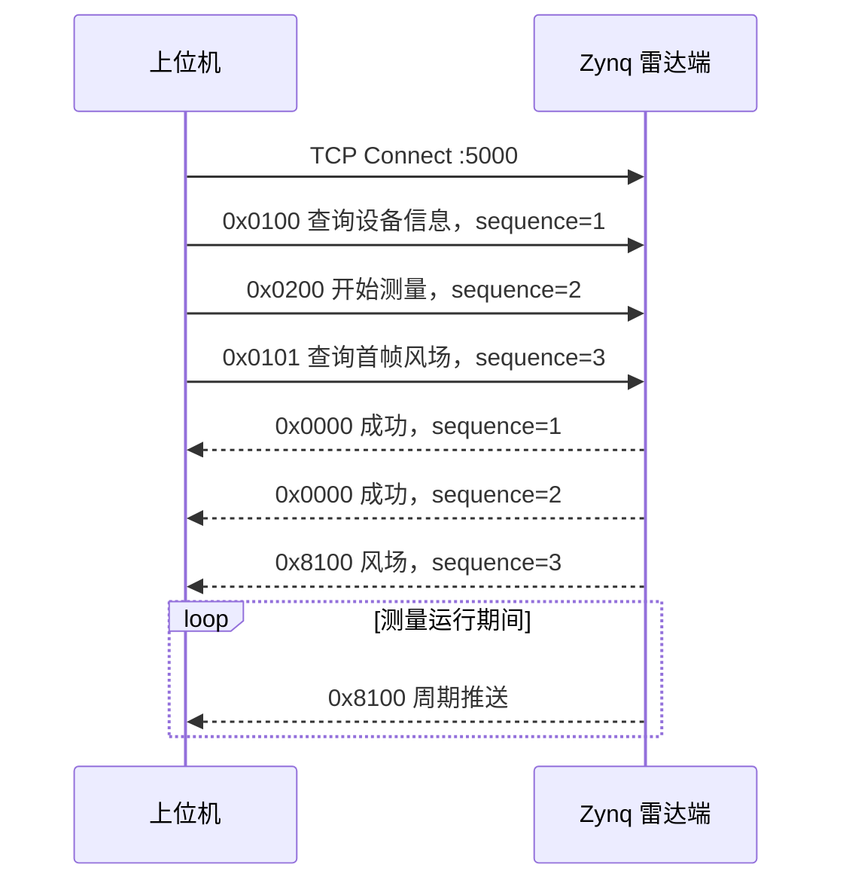

# Zynq 雷达端对接上位机数据接口与通信协议说明

> 文档编号：RUCS-ZYNQ-IF-001  
> 版本：V1.0  
> 日期：2026-07-13  
> 目标读者：Zynq Linux、FPGA、DSP、雷达算法和上位机联调开发人员  
> 对接基线：当前 `RadarUpperComputer` 桌面客户端源码

## 1. 文档用途

本文用于指导后续 Zynq-7015 雷达端开发，使雷达端输出的数据能够被当前上位机直接连接、校验、解析和显示。

本文优先描述“当前必须实现的 V1 联调接口”，而不是要求 Zynq 团队一次完成所有未来功能。第二阶段的原始径向射线、Py-ART、频谱、健康状态等接口在本文末尾给出边界，并以 [ZYNQ7015_RADAR_DATA_AND_COMMUNICATION_SPEC.md](ZYNQ7015_RADAR_DATA_AND_COMMUNICATION_SPEC.md) 为详细依据。

发生描述冲突时，当前联调行为按以下优先级判断：

1. 当前上位机 `FrameParser.cpp` 和 `DeviceService.cpp` 的实际行为。
2. 本文给出的黄金测试帧。
3. 本文的数据表和伪代码。
4. 早期仿真程序和历史说明文档。

## 2. 当前硬件和软件边界

根据现有信处板资料，雷达数据链路建议为：

```text
ADC/射频回波
    -> Kintex-7 采集、时序、脉压
    -> FPGA/DSP FFT、谱峰、CNR、径向速度或五波束反演
    -> Kintex-Zynq 板内高速链路
    -> Zynq PL/PS 数据缓冲
    -> Zynq Linux radar-data-service
    -> TCP 5000
    -> 电脑上位机
```

Zynq 雷达端是网络协议服务端，上位机是客户端。FPGA/DSP 如何将结果送到 Zynq 属于板内实现，但进入网络协议前必须转换为本文规定的显式字节格式。

禁止把 C 结构体直接通过 `send()` 发送，因为 ARM/FPGA/DSP 的端序、对齐和编译器填充可能不同。

## 3. 第一阶段必须实现的功能

### 3.1 最小可用范围

Zynq 第一阶段必须实现：

1. IPv4 TCP 服务端。
2. 默认监听 `5000/tcp`。
3. 接收并解析 `0x0100`、`0x0200`、`0x0101`、`0x0201`。
4. 返回 `0x0000` 成功响应或 `0x0001` 错误响应。
5. 发送 `0x8100` 风廓线数据。
6. 正确处理 TCP 粘包和半包。
7. 使用与上位机相同的 CRC-16/IBM 算法。
8. 开始测量后周期推送 `0x8100`，建议 1 Hz。

### 3.2 第一阶段暂不要求

以下命令已经规划，但当前上位机尚未完整解析其 payload，不应阻塞第一阶段联调：

| 命令 | 功能 | 当前状态 |
| --- | --- | --- |
| `0x8101` | 波束状态 | 类型已预留，payload 未接入 |
| `0x8102` | 设备健康 | 收到后会触发更新，但字段尚未解析 |
| `0x8103` | 频谱 | 类型已预留 |
| `0x8104` | 告警 | 类型已预留 |
| `0x8105` | 原始径向射线 | 第二阶段，用于真实 Py-ART |

## 4. 网络参数

| 项目 | 当前约定 |
| --- | --- |
| 传输层 | TCP |
| IP | IPv4 |
| 默认雷达地址 | 联调现场当前为 `192.168.201.29`，不得在固件中写死 |
| 服务端口 | `5000` |
| 角色 | Zynq 监听，上位机主动连接 |
| 最大单帧 | 4096 字节 |
| 推送周期 | 建议 1 s，可配置 |

Zynq 服务必须绑定实际业务网卡地址或 `0.0.0.0:5000`。若监听所有地址，应通过防火墙限制为雷达业务网段。

## 5. 上位机连接后的实际行为

TCP 连接成功后，当前上位机不等待前一条响应，会连续发送三帧：



因此 Zynq 必须：

1. 能在一次 `recv()` 中解析连续三帧。
2. 不得假设一次 `recv()` 只包含一帧。
3. 对查询响应尽量回显请求序列号。
4. 主动推送帧使用雷达端独立递增序列号。
5. `0x0101` 应直接返回 `0x8100`，不需要先返回 `0x0000`。

## 6. 通用帧格式

### 6.1 帧结构

```text
AA 55 | Length | Command | Sequence | Payload | CRC16 | 55 AA
 2 B      2 B      2 B       4 B       N B      2 B     2 B
```

| 绝对偏移 | 字段 | 长度 | 字节序 | 说明 |
| ---: | --- | ---: | --- | --- |
| 0 | `header` | 2 | 大端 | 固定 `0xAA55`，线上字节 `AA 55` |
| 2 | `length` | 2 | 大端 | command + sequence + payload + CRC 的长度 |
| 4 | `command` | 2 | 大端 | 命令字 |
| 6 | `sequence` | 4 | 大端 | 请求/响应关联号 |
| 10 | `payload` | N | 按业务定义 | 可以为空 |
| `10+N` | `crc16` | 2 | 大端存放 | CRC 数值 |
| `12+N` | `tail` | 2 | 大端 | 固定 `0x55AA`，线上字节 `55 AA` |

长度公式：

```text
length = 2 + 4 + payloadLength + 2
totalFrameSize = 2 + 2 + length + 2
               = 14 + payloadLength
payloadLength = length - 8
```

最小空 payload 帧：`length=8`、总长度 14 字节。

### 6.2 重要端序规则

| 范围 | 端序 |
| --- | --- |
| 帧头、长度、命令、序列号、CRC、帧尾 | 大端 |
| `0x8100.timestampMs` | 小端 |
| `0x8100.gateCount` | 大端 |
| `0x8100` 所有 `float32` | 小端 IEEE 754 |

这是一个混合端序的兼容协议。必须逐字段编码，不得对整个 payload 调用一次统一的 `htonl()`。

## 7. CRC-16/IBM

### 7.1 参数

| 参数 | 值 |
| --- | --- |
| 初值 | `0xFFFF` |
| 多项式 | `0xA001` |
| 移位 | 右移 |
| 输出异或 | 无 |
| 校验范围 | 从帧头 `AA` 开始，到 payload 最后一个字节 |
| 不参与 CRC | CRC 字段和帧尾 |
| 线上存放 | CRC 高字节在前 |

CRC 是 Modbus 风格计算过程，但最终数值在外层帧中按大端写入。不要使用 CRC-CCITT `0x1021`。

### 7.2 C 参考实现

```c
#include <stddef.h>
#include <stdint.h>
#include <string.h>

static uint16_t radar_crc16(const uint8_t *data, size_t length)
{
    uint16_t crc = 0xFFFFu;

    for (size_t i = 0; i < length; ++i) {
        crc ^= data[i];
        for (unsigned bit = 0; bit < 8; ++bit) {
            crc = (crc & 1u) ? (uint16_t)((crc >> 1) ^ 0xA001u)
                             : (uint16_t)(crc >> 1);
        }
    }
    return crc;
}
```

## 8. 第一阶段命令行为

| 命令 | 方向 | 请求 payload | Zynq 行为 | 响应 |
| --- | --- | --- | --- | --- |
| `0x0100` | 上位机 -> Zynq | 空 | 返回设备名称/版本 | `0x0000`，payload 可为 UTF-8 |
| `0x0200` | 上位机 -> Zynq | 空 | 切换到测量状态 | `0x0000` 空 payload |
| `0x0101` | 上位机 -> Zynq | 空 | 返回最近一帧有效风场 | `0x8100` |
| `0x0201` | 上位机 -> Zynq | 空 | 停止周期推送 | `0x0000` 空 payload |
| `0x0000` | Zynq -> 上位机 | 可空 | 通用成功 | 上位机忽略 payload |
| `0x0001` | Zynq -> 上位机 | 可空 | 通用错误 | 上位机显示“雷达端返回命令错误” |
| `0x8100` | Zynq -> 上位机 | 风廓线 | 查询返回或主动推送 | 核心业务数据 |

状态要求：

1. 重复收到 `0x0200` 时应幂等成功，不重复创建采集线程。
2. 重复收到 `0x0201` 时应幂等成功。
3. 尚无风场时收到 `0x0101`，可返回 `0x0001`，不能发送全零伪数据。
4. 算法暂不可用时保留最后有效结果必须设置真实时间戳，不得每次修改时间伪装为新数据。

## 9. `0x8100` 风廓线 payload

### 9.1 布局

设 `N = gateCount`：

| payload 偏移 | 字段 | 长度 | 端序 | 类型 | 说明 |
| ---: | --- | ---: | --- | --- | --- |
| 0 | `timestampMs` | 8 | 小端 | `uint64` | UTC Unix Epoch 毫秒 |
| 8 | `timeQuality` | 1 | - | `uint8` | 时间质量 |
| 9 | `gateCount` | 2 | 大端 | `uint16` | 1..256 |
| 11 | `rangeResolutionM` | 4 | 小端 | `float32` | 距离门间距 |
| 15 | `maxRangeM` | 4 | 小端 | `float32` | 最大测程 |
| 19 | `reserved` | 3 | - | byte[3] | 全部置 0 |
| 22 | `windSpeed[N]` | 4N | 小端 | `float32[]` | 各层水平风速 m/s |
| `22+4N` | `windDirection[N]` | 4N | 小端 | `float32[]` | 气象学来向 degree |
| `22+8N` | `verticalSpeed[N]` | 4N | 小端 | `float32[]` | 垂直速度 m/s，向上为正 |
| `22+12N` | `confidence[N]` | N | - | `uint8[]` | 0..100 |
| `22+13N` | `snrDb` | 4 | 小端 | `float32` | 当前 V1 为全帧公共 SNR/CNR |
| `26+13N` | `turbulence` | 4 | 小端 | `float32` | 当前 V1 为全帧公共湍流量 |

```text
payloadLength = 30 + 13 * N
frameLength   = 44 + 13 * N
```

当 `N=30`：payload 420 字节，总帧 434 字节，关键偏移为：

| 字段 | 偏移 |
| --- | ---: |
| 第 0 层风速 | 22 |
| 第 0 层风向 | 142 |
| 第 0 层垂直速度 | 262 |
| 第 0 层置信度 | 382 |
| `snrDb` | 412 |
| `turbulence` | 416 |

### 9.2 时间质量

当前上位机枚举值：

| 值 | 名称 | 含义 |
| ---: | --- | --- |
| 0 | `Synchronized` | 时间已同步 |
| 1 | `Interpolated` | 插值时间 |
| 2 | `LocalTime` | 本地时钟，未与外部源锁定 |
| 3 | `TimeAnomaly` | 时间异常 |

### 9.3 距离和高度解释

当前上位机按下式生成每层距离和高度：

```text
distanceM(i) = (i + 1) * rangeResolutionM
heightM(i)   = distanceM(i)
```

这只是 V1 平视兼容逻辑。若雷达存在仰角、安装高度和姿态修正，不能直接篡改 `rangeResolutionM`；应在第二阶段 V2 风廓线中提供独立高度数组。

### 9.4 当前界面使用方式

1. 第 0 距离门被当前客户端用作总览摘要风速和风向。
2. 全部距离门用于风场表格和趋势显示。
3. 上位机不得把 `confidence < 50` 直接显示为“低置信度”。分层状态必须优先依据 `qualityFlags`、有效波束数、CNR 和反演残差映射为“有效波束不足”“CNR 低”“拟合残差超限”“物理范围异常”或“质量标志无效”；综合置信度仅在“设备状态 > 数据质量”中展示。
4. V1 的 `snrDb` 会临时应用到所有距离门。
5. `maxRangeM` 当前被解析但尚未用于页面计算。

Zynq 应发送真实距离门数据。不得为了让总览显示更漂亮而把第 0 门替换成轮毂高度数据。后续客户端会增加显式轮毂高度选择。

### 9.5 数值要求

| 字段 | 要求 |
| --- | --- |
| `timestampMs` | 有效 UTC 毫秒，不使用编译时间或接收时间代替 |
| `gateCount` | 1..256；第一阶段推荐 30 |
| `rangeResolutionM` | >0；当前推荐 10.0 |
| `maxRangeM` | 推荐 `gateCount * rangeResolutionM` |
| `windSpeed` | 真实值，建议 0..75 m/s |
| `windDirection` | `[0,360)`，气象学来向 |
| `verticalSpeed` | 向上为正；无可靠结果时置信度应降低 |
| `confidence` | 0..100，不使用随机数 |
| 浮点数 | 不发送 NaN 或 Infinity |

## 10. Zynq 编码辅助函数

```c
static void put_u16_be(uint8_t *p, uint16_t v)
{
    p[0] = (uint8_t)(v >> 8);
    p[1] = (uint8_t)v;
}

static void put_u32_be(uint8_t *p, uint32_t v)
{
    p[0] = (uint8_t)(v >> 24);
    p[1] = (uint8_t)(v >> 16);
    p[2] = (uint8_t)(v >> 8);
    p[3] = (uint8_t)v;
}

static void put_u64_le(uint8_t *p, uint64_t v)
{
    for (unsigned i = 0; i < 8; ++i) {
        p[i] = (uint8_t)(v >> (8u * i));
    }
}

static void put_f32_le(uint8_t *p, float value)
{
    uint32_t bits;
    _Static_assert(sizeof(float) == 4, "float32 required");
    memcpy(&bits, &value, sizeof(bits));
    p[0] = (uint8_t)bits;
    p[1] = (uint8_t)(bits >> 8);
    p[2] = (uint8_t)(bits >> 16);
    p[3] = (uint8_t)(bits >> 24);
}
```

组帧步骤：

1. 逐字段构造 payload。
2. 计算 `length = payloadLength + 8`。
3. 写入帧头、长度、命令、序列号和 payload。
4. 对上述所有字节计算 CRC。
5. CRC 数值按大端写入。
6. 写入 `55 AA` 帧尾。
7. 使用循环 `send()`，直到整帧全部发送或连接失败。

## 11. TCP 接收状态机

Zynq 必须维护每连接独立接收缓冲区：

```text
append(recvBytes)
while true:
    查找 AA 55
    丢弃帧头前噪声
    不足 4 字节 -> 等待
    读取大端 length
    total = 2 + 2 + length + 2
    total < 14 或 total > 4096 -> 丢弃一个字节重新找帧头
    缓冲不足 total -> 等待
    检查尾 55 AA
    检查 CRC
    分发 command
    从缓冲移除完整帧
```

CRC 错误时不要关闭整个服务，也不要无限打印日志。建议累计计数，并对相同错误按 1 s 节流输出。

## 12. 黄金测试帧

以下十六进制由当前上位机 CRC 实现生成，可直接用于 Zynq 单元测试。

### 12.1 上位机请求

`0x0100`，sequence 1：

```text
AA 55 00 08 01 00 00 00 00 01 27 DC 55 AA
```

`0x0200`，sequence 2：

```text
AA 55 00 08 02 00 00 00 00 02 15 9C 55 AA
```

`0x0101`，sequence 3：

```text
AA 55 00 08 01 01 00 00 00 03 26 60 55 AA
```

`0x0201`，sequence 4：

```text
AA 55 00 08 02 01 00 00 00 04 D7 21 55 AA
```

### 12.2 成功响应

`0x0000`，sequence 2，空 payload：

```text
AA 55 00 08 00 00 00 00 00 02 F7 9D 55 AA
```

### 12.3 单距离门 `0x8100` 示例

示例数据：时间戳 0、时间质量 0、1 门、10 m、风速 5.5 m/s、风向 270 度、垂直速度 0.25 m/s、置信度 80、SNR 25 dB、湍流 0.1。

payload 43 字节，总帧 57 字节，CRC `A807`：

```text
AA 55 00 33 81 00 00 00 00 01
00 00 00 00 00 00 00 00 00 00 01 00 00 20 41 00 00 20 41 00 00 00
00 00 B0 40 00 00 87 43 00 00 80 3E 50 00 00 C8 41 CD CC CC 3D
A8 07 55 AA
```

Zynq 单元测试必须逐字节等于该结果，不能只比较解析后的浮点值。

## 13. 数据来源映射

Zynq 应将 FPGA/DSP 结果按以下规则映射：

| 上位机字段 | 建议来源 |
| --- | --- |
| `timestampMs` | Zynq 同步后的 UTC；或硬件时间戳经统一换算 |
| `windSpeed` | 五波束/径向速度反演后的水平风速 |
| `windDirection` | 反演矢量转换后的气象学来向 |
| `verticalSpeed` | 反演 W 分量，向上为正 |
| `confidence` | 有效波束数、CNR、残差、杂波和时间质量的综合评分 |
| `snrDb` | V1 临时使用全廓线平均或代表性 CNR/SNR |
| `turbulence` | 算法定义的湍流指标，需统一为无量纲或在版本中说明 |

如果 DSP 当前只能提供每波束径向速度，而不能提供最终风廓线，Zynq 不应随意平均得到 `windSpeed`。应先完成经过验证的五波束反演，或进入第二阶段 `0x8105` 由 Py-ART 处理。

## 14. 推送、缓存和断线

1. `0x0200` 后启动或加入数据订阅，不应阻塞命令线程。
2. 有新风场时推送；无新数据时不重复伪造时间戳。
3. 每个连接维护发送队列上限，慢客户端不得拖死采集线程。
4. 队列满时优先丢弃旧的实时风场，保留最新帧，并累计丢帧计数。
5. `send()` 返回 0 或不可恢复错误时关闭该客户端连接，不影响采集和其他连接。
6. `SIGPIPE` 必须忽略或使用 `MSG_NOSIGNAL`。
7. 雷达端至少支持一个控制连接；多客户端控制冲突需加互斥或控制权机制。

## 15. 日志要求

日志应记录：连接地址、命令字、序列号、帧长、解析结果、测量状态、数据时间戳、丢帧、CRC 错误和断线原因。

禁止在 1 Hz 高频路径中默认打印完整 434 字节帧。调试十六进制输出应可配置、限时和限速。

## 16. 第一阶段验收标准

Zynq 端通过以下项目才视为完成上位机适配：

1. `ss -lntp` 可看到 `0.0.0.0:5000` 或业务 IP 正在监听。
2. 上位机连接后无超时、无 CRC 刷屏。
3. 能连续处理初始化三帧，即使三帧在一次 `recv()` 中到达。
4. `0x0200` 返回成功并开始推送。
5. `0x0101` 立即返回最近有效 `0x8100`。
6. `0x0201` 后停止主动推送。
7. 30 门 payload 恰好 420 字节，总帧 434 字节。
8. 风速、风向和置信度来自真实算法结果，不是随机数或固定 0。
9. 连续运行 24 h 无内存、线程或文件描述符泄漏。
10. 断开再连接至少 100 次，服务不崩溃且状态正确。
11. 半包、粘包、错误 CRC 和错误长度测试均可恢复。
12. Zynq 编码结果通过本文黄金帧测试。

## 17. 第二阶段接口

第一阶段完成后，再按以下顺序扩展：

1. `0x8102`：Zynq CPU/PL、Kintex、DSP、时钟、DMA、存储和网络健康。
2. `0x8101`：五波束每门 CNR、径向速度、相位和质量。
3. `0x8103`：选定波束/距离门频谱诊断。
4. `0x8104`：结构化告警和恢复事件。
5. `0x8105`：每射线径向速度、CNR、谱宽、方位、仰角和扫描号。
6. Py-ART VAD：至少 16 条有效方位射线，推荐 36 条。
7. V2 风廓线：独立高度数组、算法版本、每层质量和有效射线数。
8. 浏览器 HTTPS、REST、WebSocket 和账号权限。

第二阶段不得修改 `0x8100` 已有偏移，应增加新命令字实现。

## 18. 尚需项目方确认

以下参数目前资料不足，Zynq 开发前需要硬件/算法人员补充：

| 项目 | 当前处理 |
| --- | --- |
| 实际载频 | 不以草案 25 GHz 直接冻结 |
| ADC 实际采样率 | 确认 125 MSPS 或 250 MSPS |
| 五波束方位/仰角 | 提供标定矩阵 |
| 径向速度内部符号 | 对外统一远离雷达为正 |
| Kintex-Zynq 高速协议 | 明确 Aurora/自定义协议、lane 数和速率 |
| Zynq PHY 型号/RGMII 延时 | 以量产 BOM 和寄存器为准 |
| `confidence` 计算 | 算法团队给出正式公式和阈值 |
| `turbulence` 定义 | 明确单位、时间窗口和算法 |
| 推送周期 | 当前建议 1 Hz，按整机指标冻结 |

这些待确认项不影响 TCP 帧、CRC 和 `0x8100` 端序的第一阶段开发。

